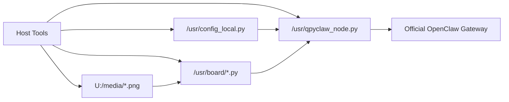

# qpyclaw

> 面向 QuecPython 蜂窝设备的 OpenClaw Node 项目，聚焦 `qpyclaw-node -> Official OpenClaw Gateway` 的真实接入、板级扩展与工程化落地。

## 项目简介

`qpyclaw` 的目标，不是做一个只能演示的极客样机，而是把 QuecPython 模组设备真正带入 OpenClaw 生态。

当前仓库以 `qpyclaw-node` 为主，已经打通：

1. QuecPython 设备作为 Node 接入 Official OpenClaw Gateway
2. 单文件运行时 `qpyclaw_node.py`
3. `config_local.py` 设备本地配置覆盖
4. `/usr` manifest 驱动恢复与同步
5. `EC800MCNLE` 音频板的板级 UI / 表情资源链路

## 为什么是 qpyclaw

`qpyclaw` 的价值不只在“能连上”，而在于它把 OpenClaw 从桌面和通用计算设备，延伸到了更贴近真实场景的蜂窝终端与边缘设备。

| 维度 | 价值 |
| --- | --- |
| OpenClaw 生态价值 | 让 QuecPython 设备成为真正可控、可调度、可接入的 OpenClaw Node |
| 工程价值 | 用单文件运行时、recover 工具链、board profile 降低上板与恢复成本 |
| 产品价值 | 适合做语音终端、显示终端、传感器节点、远程运维节点 |
| 商业价值 | 更适合蜂窝联网、无局域网、轻部署、低硬件门槛的设备接入场景 |

## 当前范围

当前仓库只默认面向一个主模式：

| 模式 | 说明 | 当前状态 |
| --- | --- | --- |
| `Mode B: qpyclaw-node -> Official OpenClaw Gateway` | QuecPython 设备作为 OpenClaw Node 接入官方网关 | 已打通 |

当前主交付物：

1. 单文件设备运行时 `qpyclaw_node.py`
2. QuecPython 设备本地配置机制 `config_local.py`
3. 宿主机恢复、同步、smoke、operator 工具
4. `EC800KCNLC` 无外设路径与 `EC800MCNLE` 音频板路径
5. 面向后续语音、显示、GPIO、外设扩展的板级骨架

## 系统概览



## 当前能力矩阵

| 能力域 | 当前状态 | 说明 |
| --- | --- | --- |
| Official Gateway 接入 | 已验证 | websocket 模式已打通 |
| 蜂窝网络自动恢复 | 已验证 | PDP 断开后可自动恢复并重连 |
| 设备信息与状态 | 已验证 | `qpy.device.info` / `qpy.device.status` |
| 文件系统 | 已验证 | `qpy.fs.*` |
| REPL 执行与文件推送 | 已验证 | `qpy.repl.run` / `qpy.push` |
| 板级状态工具 | 已验证 | `qpy.board.status` / `qpy.audio.status` / `qpy.power.status` / `qpy.ui.status` |
| 屏幕表情显示 | 已验证 | `qpy.ui.emotion.show` 已实测 |
| 正式冷启动自启动 | 开发态 | 当前默认不启用正式 `main.py` 自启动 |
| 语音通话全链路 | 进行中 | 板级基础已接入，但未作为稳定公开能力发布 |

## 已验证硬件矩阵

| 板卡 / 模组 | 状态 | 当前验证重点 |
| --- | --- | --- |
| `EC800KCNLC` 开发板 | 已验证 | 无外设、网络、文件系统、运行时、Gateway 联通 |
| `EC800MCNLE` 音频板 | 已验证 | 板级扩展、UI、表情、板级状态、Gateway 联通 |

## 快速开始

第一次上手，建议按这个顺序：

1. 阅读 [Quickstart](docs/public/00-quickstart.md)
2. 按 [配置样例](docs/public/01-config-sample.md) 准备 `config_local.py`
3. 使用 [Runtime 说明](embed/qpyclaw-node/runtime/README.md) 和 [Host Tools](tools/host/README.md) 完成 recover / smoke
4. 对照 [Alpha 发布说明](docs/public/02-release-notes-alpha.md) 理解当前边界

## 内置命令面

当前已实测打通的命令包括：

1. `qpy.runtime.status`
2. `qpy.tools.catalog`
3. `qpy.device.info`
4. `qpy.device.status`
5. `qpy.device.reboot`
6. `qpy.fs.ls`
7. `qpy.fs.tree`
8. `qpy.fs.read`
9. `qpy.fs.write`
10. `qpy.repl.run`
11. `qpy.push`
12. `qpy.board.status`
13. `qpy.audio.status`
14. `qpy.power.status`
15. `qpy.ui.status`
16. `qpy.ui.emotion.show`

## 仓库结构

```text
qpyclaw/
├─ boards/
│  ├─ ec800kcnlc-dev-board/
│  └─ ec800mcnle-audio-board/
├─ docs/
│  ├─ public/
│  ├─ architecture/
│  ├─ product/
│  └─ research/
├─ embed/
│  └─ qpyclaw-node/
│     ├─ deploy/
│     ├─ examples/
│     └─ runtime/
├─ tools/
│  └─ host/
└─ desktop/
```

## 文档入口

| 文档 | 用途 |
| --- | --- |
| [Quickstart](docs/public/00-quickstart.md) | 第一次把 `qpyclaw-node` 跑起来 |
| [配置样例](docs/public/01-config-sample.md) | 了解 `config_local.py` 字段与推荐写法 |
| [Alpha 发布说明](docs/public/02-release-notes-alpha.md) | 了解当前 release 范围、已验证板卡与已知限制 |
| [Runtime 说明](embed/qpyclaw-node/runtime/README.md) | 了解设备侧运行时与 `/usr` 分发边界 |
| [Host Tools](tools/host/README.md) | 了解宿主机恢复、smoke、probe、operator 工具 |
| [Examples](embed/qpyclaw-node/examples/README.md) | 了解板级样例与示例配置 |
| [CHANGELOG](CHANGELOG.md) | 查看版本变更与首版发布说明 |

## 开发板

项目当前开发与验证主要使用 `EC800M Audio` 核心板。

- 购买链接：[移远4G模块EC800M语音核心板支持mic喇叭可接入大模型语音交互](https://e.tb.cn/h.ijgT3oOm8AHuvXV?tk=7Th85cm5C7R)
- 购买渠道：淘宝，移远官方旗舰店
- 说明：该链接仅作为当前开发验证硬件参考，不构成唯一采购渠道

## 路线图

当前建议演进顺序：

1. 稳定 `qpyclaw-node` 的公开工程形态
2. 完成正式 `main.py` 启动策略
3. 扩展语音、显示、GPIO 与更多外设能力
4. 补齐权限、安全与更接近生产的控制面约束
5. 继续增强 OpenClaw 生态兼容性与设备侧商业落地能力

## 版本与发布

当前推荐的首个公开 tag：

1. `v0.1.0-alpha.1`

当前建议的发布级别：

1. `Alpha / Developer Preview`

说明：

1. 当前仓库已适合以开发者预览形式公开
2. 当前仍不是已冻结 API 的稳定 SDK
3. 首版公开仓库已移除内部 bring-up、review 与对话沉淀，仅保留适合公开的工程资料

## 开源许可

本仓库采用 [MIT License](LICENSE)。

<p align="center">
  <sub>感谢上海移远通信技术股份有限公司对 QuecPython 生态与全球物联网产业发展的持续推动与技术贡献，本项目谨以开源方式向生态反哺。</sub>
  <br>
  <sub>维护单位：芯寰云（上海）科技有限公司</sub>
</p>
