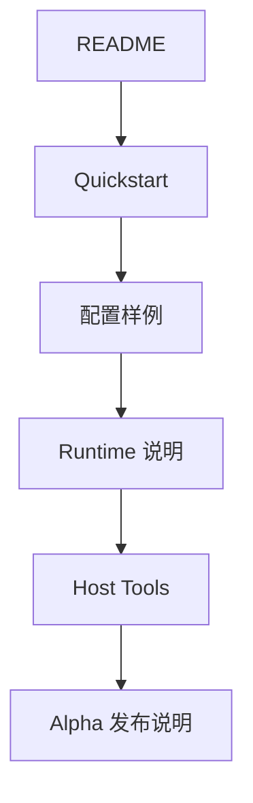

# qpyclaw

`qpyclaw` 是一个面向 QuecPython 蜂窝设备的 OpenClaw 生态项目。

当前仓库公开范围以 `qpyclaw-node` 为主，目标是让 QuecPython 设备以 Node 形态接入 Official OpenClaw Gateway，并逐步扩展到音频、显示、传感器与更多板级能力。

## 当前范围

本仓库当前只默认面向一个主模式：

| 模式 | 说明 | 当前状态 |
| --- | --- | --- |
| `Mode B: qpyclaw-node -> Official OpenClaw Gateway` | QuecPython 设备作为 OpenClaw Node 接入官方网关 | 已打通 |

当前主交付物：

1. 单文件设备运行时 `qpyclaw_node.py`
2. 面向 QuecPython 的 `config_local.py` 配置覆盖机制
3. manifest 驱动的 `/usr` 恢复与同步工具链
4. `EC800MCNLE` 音频板的板级扩展、UI 与媒体同步骨架
5. 宿主机侧 smoke、recover、gateway operator 工具

## 当前状态

| 项目 | 状态 | 说明 |
| --- | --- | --- |
| 单文件运行时 | 已完成 | `/usr/qpyclaw_node.py` 是当前 canonical runtime |
| 官方网关接入 | 已验证 | 已完成 websocket 模式接入与命令调用 |
| 蜂窝网络自动恢复 | 已验证 | PDP 断开后可自动恢复并重连网关 |
| `EC800KCNLC` 无外设路径 | 已验证 | 适合先做纯联网、文件系统、诊断能力 |
| `EC800MCNLE` 音频板 UI 表情 | 已验证 | 已可显示 `U:/media/*.png` 表情资源 |
| 冷启动 `main.py` 正式自启动 | 未默认启用 | 当前仍保留开发态调试方式 |
| 语音对话全链路 | 进行中 | 板级能力已开始接入，但未作为稳定公开能力发布 |

## 已验证能力

当前已实测打通的能力包括：

1. `qpy.runtime.status`
2. `qpy.tools.catalog`
3. `qpy.device.info`
4. `qpy.device.status`
5. `qpy.device.reboot`
6. `qpy.fs.ls` / `qpy.fs.tree` / `qpy.fs.read` / `qpy.fs.write`
7. `qpy.repl.run`
8. `qpy.push`
9. `qpy.board.status`
10. `qpy.audio.status`
11. `qpy.power.status`
12. `qpy.ui.status`
13. `qpy.ui.emotion.show`

## 快速入口

| 文档 | 用途 |
| --- | --- |
| [Quickstart](docs/public/00-quickstart.md) | 第一次把 `qpyclaw-node` 跑起来 |
| [配置样例](docs/public/01-config-sample.md) | 了解 `config_local.py` 字段与推荐写法 |
| [Alpha 发布说明](docs/public/02-release-notes-alpha.md) | 了解当前 release 范围、已验证板卡与已知限制 |
| [Runtime 说明](embed/qpyclaw-node/runtime/README.md) | 了解设备侧运行时与 `/usr` 分发边界 |
| [Host Tools](tools/host/README.md) | 了解宿主机恢复、smoke、probe、operator 工具 |
| [Examples](embed/qpyclaw-node/examples/README.md) | 了解板级样例与示例配置 |

## 公开仓库约定

为保持仓库可公开：

1. 仓库内只保留安全默认值与占位符，不提交真实 token、签名服务地址或设备私有配置。
2. 真实网关地址、鉴权 token、签名器配置应只放在设备本地 `/usr/config_local.py` 或未纳入版本控制的本地工作副本中。
3. 公开文档以 `docs/public/`、`embed/qpyclaw-node/runtime/README.md` 和 `tools/host/README.md` 为准。
4. `docs/bringup/` 更偏工程验证记录与证据留存，不应被视为稳定外部 API 文档。

## 系统视图


## 仓库结构

```text
qpyclaw/
├─ boards/
│  └─ ec800mcnle-audio-board/
├─ docs/
│  ├─ public/
│  ├─ architecture/
│  ├─ product/
│  ├─ research/
│  └─ bringup/
├─ embed/
│  └─ qpyclaw-node/
│     ├─ deploy/
│     ├─ examples/
│     └─ runtime/
├─ tools/
│  └─ host/
└─ discussion/
```

## 推荐阅读顺序



## 当前公开边界

当前仓库已经适合以“Alpha / 开发者预览”方式公开，定位应当是：

1. 一个可联通 Official OpenClaw Gateway 的 QuecPython Node 基础仓库
2. 一个以 `EC800KCNLC` 和 `EC800MCNLE` 为起点的板级扩展骨架
3. 一个强调恢复、调试、联调效率的工程型项目

它还不是：

1. 一个已冻结 API 的稳定 SDK
2. 一个默认开箱即用的量产固件
3. 一个已完成语音全链路与全部外设支持的正式版本
