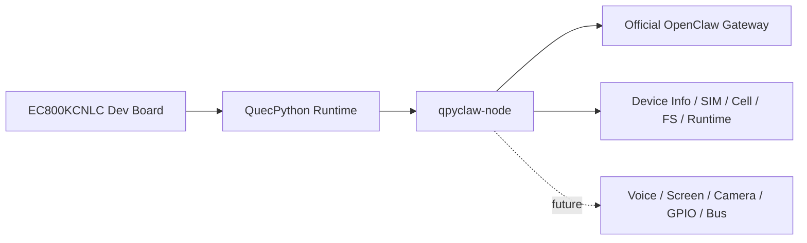
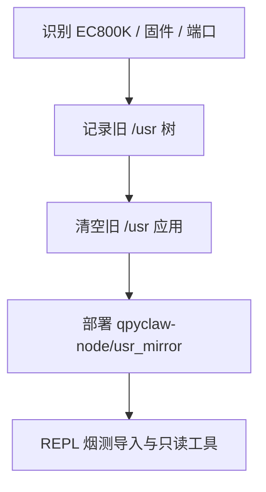

# EC800KCNLC Dev Board

当前正式板目录名为：

`boards/ec800kcnlc-dev-board/`

## 1. 目标

当前出差环境下，手头只有 `EC800KCNLC` 开发板，且没有任何外设。

因此这块板当前承担的角色不是“完整多模态 qpyclaw-node 演示板”，而是：

1. 先把 `qpyclaw-node -> Official OpenClaw Gateway` 这条主线跑通。
2. 先把所有“不依赖外设”的能力做完整。
3. 把后续音频、屏幕、摄像头、GPIO、I2C、SPI、UART 外设扩展位保留好。

## 2. 当前板级定位



## 3. 当前可落地能力

| 能力域 | 说明 | 当前状态 |
| --- | --- | --- |
| 连接会话 | WebSocket 连接、握手、鉴权、重连、ACK、去重 | 已实现 |
| 运行时状态 | 在线状态、重连次数、队列深度、执行状态、待重启状态 | 已实现 |
| 设备信息 | 型号、IMEI、固件、序列号、产品信息 | 已实现 |
| SIM 信息 | 卡状态、ICCID、IMSI、手机号、当前 SIM ID | 已实现 |
| 蜂窝网络 | 注册状态、运营商、CSQ、NITZ、服务小区 | 已实现 |
| PDP/IP 信息 | 数据上下文、IP 类型、IP 地址、DNS | 已实现 |
| 文件系统 | 列表、读取、写入、创建目录、删除 | 已实现 |
| 远程重启 | 结果回执后延迟重启 | 已实现 |
| 工具目录 | 上报所有 node tools 与 alias | 已实现 |

## 4. 当前明确不做

| 能力域 | 原因 |
| --- | --- |
| 语音采集 / 播放 | 当前没有麦克风、扬声器、音频板 |
| 屏幕显示 | 当前没有屏幕外设 |
| 摄像头 | 当前没有摄像头外设 |
| 传感器 / 电机 / 继电器 | 当前没有外挂器件 |
| GPIO / UART / I2C / SPI 实战工具 | 当前没有联调对象，先保留扩展位 |

## 5. 当前 runtime 对应路径

```text
qpyclaw/
└── embed/
    └── qpyclaw-node/
        └── runtime/
            └── usr_mirror/
                ├── _main.py
                └── app/
```

部署目标路径为设备端：

```text
/usr/_main.py
/usr/app/...
```

## 6. 当前实测板卡信息

| 项目 | 当前结果 |
| --- | --- |
| 实测日期 | `2026-03-27` |
| 模组识别 | `EC800K` |
| 固件版本 | `EC800KCNLCR07A03M04_OCPU_QPY` |
| AT 口 | `COM15` |
| REPL 口 | `COM14` |
| SIM 状态 | `READY` |
| 当前 `/usr` | 已切换为 `qpyclaw-node` runtime |
| 当前运营商 | `CHN-CT / CT / 460-11` |
| 当前 IPv4 | `10.132.66.100` |
| 当前 IPv6 | `240e:46c:a602:79e3:1:1:b7aa:6f83` |

> 说明：板目录名称使用的是更精确的板型命名 `ec800kcnlc-dev-board`，而模块在运行时探测里返回的是更泛化的 `EC800K`。

## 7. 当前已完成的板级动作



本次已经完成：

1. 清空开发板原有 `/usr` 旧项目。
2. 将本仓库 `embed/qpyclaw-node/runtime/usr_mirror/` 全量部署到设备 `/usr`。
3. 完成最小运行时烟测，证明 `app` 包和基础只读工具已成立。
4. 插卡后完成蜂窝驻网、PDP 和 IP 探测。
5. 完成 `qpy.net.ifconfig` 与 `qpy.net.diag` 实测。

相关联调证据已归档于内部 bring-up 记录，公开仓库不附带原始过程文件。

## 8.1 插卡后的板级判断

插卡后，这块板已经从“纯骨架验证板”升级为“可以继续做真实出站联网验证的开发板”。

当前需要注意两点：

1. 当前 IPv4 是运营商私网地址，不适合拿它当公网可直连地址使用。
2. 当前运行时两个网络工具的实测耗时已经超过 `12s` 默认值：
   `qpy.net.ifconfig` 约 `13.1s`，`qpy.net.diag` 约 `17.4s`。

## 8. 当前建议联调顺序

1. 先确认固件、AT 口、REPL 口、SIM 卡、蜂窝注册状态。
2. 下发 `usr_mirror` 到 `/usr`。
3. 配置 `app/config.py` 中的 Gateway 地址与认证信息。
4. 先验证 `device.info`、`device.status`、`sim.info`、`net.diag`。
5. 再验证 `fs.list`、`fs.read`、`fs.write`、`fs.remove`。
6. 最后验证 `device.reboot` 的结果回执和延迟重启。

## 9. 当前阶段结论

对当前这块 `EC800KCNLC` 板来说，最有价值的不是追求“花哨外设演示”，而是先把下面这件事做扎实：

```text
让 qpyclaw-node 作为一个真正稳定、可部署、可调试、可维护的蜂窝 OpenClaw Node 先成立。
```

这一步成立后，后续再接音频板、显示板、传感器板，都是在稳定 runtime 上增量扩展，而不是重新推倒重来。
