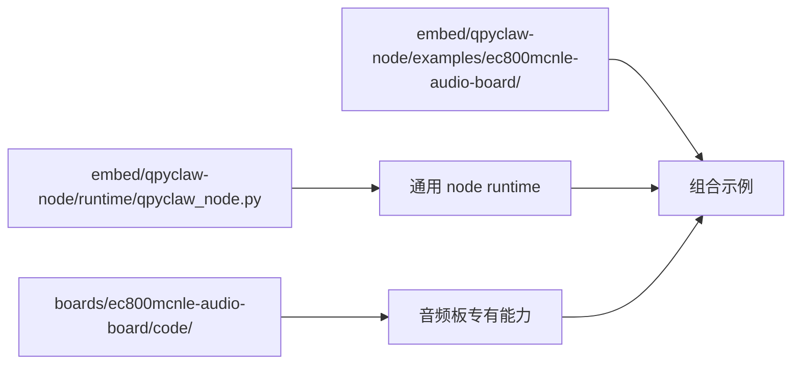

# EC800MCNLE Audio Board Code

这个目录专门放 `EC800MCNLE` 音频板独有的代码。

## 放这里的内容

1. 音频采集、播放、编解码、唤醒链路适配
2. 屏幕、触摸、按键、LED、背光、ADC、电池相关代码
3. 摄像头、电机、传感器、UART/I2C/SPI/GPIO 板级封装
4. 板级引脚映射、初始化、资源装配逻辑

## 不放这里的内容

1. 通用 `qpyclaw-node` runtime
2. 通用 WebSocket / OpenClaw Gateway 连接逻辑
3. 板型无关的基础工具实现

## 与 qpyclaw-node 的关系

建议按下面方式理解：



也就是说：

1. 通用 node runtime 在 `embed/qpyclaw-node/runtime/`
2. 音频板专有代码在这里
3. 把两者如何拼起来，写在 `embed/qpyclaw-node/examples/ec800mcnle-audio-board/`

## 当前骨架

当前已经建立的板级代码骨架：

1. `board_audio.py`
2. `board_power.py`
3. `board_display.py`
4. `board_ui.py`
5. `board_voice_controller.py`
6. `board_remote_asr.py`
7. `board_bootstrap.py`

## 当前板级扩展能力

当前已经通过 `EC800MCNLEBoardExtension` 接入：

1. 在线状态变化 -> 屏幕表情联动
2. `qpy.board.status`
3. `qpy.audio.status`
4. `qpy.audio.volume.get`
5. `qpy.audio.volume.set`

## 推荐设备端部署映射

建议把这个目录下的 `.py` 文件部署到设备：

```text
/usr/board/
```

然后由示例入口或你自己的 `main.py` 执行：

1. `import qpyclaw_node`
2. `from board_bootstrap import create_qpyclaw_extension`

这样可以保持：

1. `/usr/qpyclaw_node.py` 继续是通用 runtime
2. `/usr/board/*.py` 继续是板级专有层

## Host 侧同步入口

当前板级代码的 host 同步入口为：

1. `tools/host/qpy_board_code_sync.py --profile ec800mcnle-audio-board`
2. `tools/host/qpy_post_flash_recover.py --profile ec800mcnle-audio-board`

说明：

1. 当前 `qpy_post_flash_recover.py` 在发现该 profile 对应的 board manifest 时，会自动执行 board sync。
2. 如果你临时不想同步板级代码，再显式加 `--skip-board-sync`。
