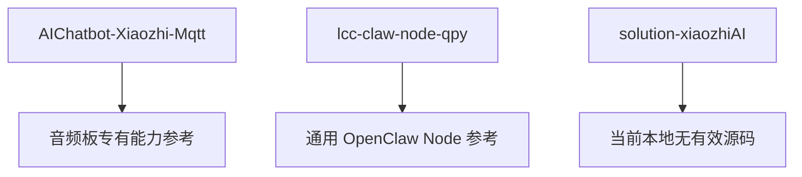
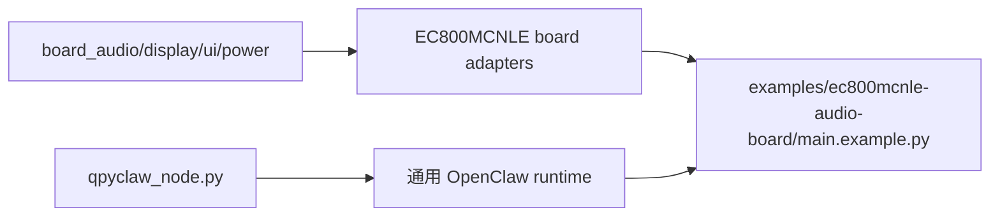

# EC800MCNLE Audio Board Open Source Reference And Intake Plan

## 1. 目的

这份文档只回答一个问题：

当前 `EC800MCNLE` 音频板开发，应该优先参考 `embed/opensource` 里的哪些项目，以及这些项目里的哪些代码适合进入板级层。

## 2. 当前结论

当前最值得参考的不是一整个项目，而是两类来源：

1. 板级能力参考源：
   `AIChatbot-Xiaozhi-Mqtt`
2. 通用 OpenClaw Node 参考源：
   `lcc-claw-node-qpy`

本地 `solution-xiaozhiAI` 目录当前是空仓状态，暂时没有可直接参考的源码。

## 3. 参考优先级



## 4. 项目级判断

### 4.1 `AIChatbot-Xiaozhi-Mqtt`

这个项目当前是最贴近 `EC800MCNLE` 音频板硬件形态的参考源。

原因：

1. 仓库 README 已明确说明案例采用 `EC800MCNLE` AI 开发板。
2. 仓库里同时有固件、基础语音版本和带 UI 的版本。
3. `src(UI)` 里已经落下了 LCD 初始化、LVGL、表情 UI、音频管理、KWS/VAD 回调等板级能力。

直接证据：

1. [README.md](C:/Users/kingd/Desktop/code/lcc-ai-team/embed/opensource/AIChatbot-Xiaozhi-Mqtt/README.md)
2. [src(UI)/_main.py](C:/Users/kingd/Desktop/code/lcc-ai-team/embed/opensource/AIChatbot-Xiaozhi-Mqtt/src(UI)/_main.py)
3. [src(UI)/lcd.py](C:/Users/kingd/Desktop/code/lcc-ai-team/embed/opensource/AIChatbot-Xiaozhi-Mqtt/src(UI)/lcd.py)
4. [src(UI)/ui.py](C:/Users/kingd/Desktop/code/lcc-ai-team/embed/opensource/AIChatbot-Xiaozhi-Mqtt/src(UI)/ui.py)
5. [src(UI)/utils.py](C:/Users/kingd/Desktop/code/lcc-ai-team/embed/opensource/AIChatbot-Xiaozhi-Mqtt/src(UI)/utils.py)

### 4.2 `lcc-claw-node-qpy`

这个项目不适合作为音频板专有能力来源，但非常适合作为 OpenClaw Node 主链路参考源。

原因：

1. 它解决的是 `QuecPython Device -> OpenClaw Gateway` 的通用连接、会话、命令执行和回执问题。
2. 它的 `usr_mirror/app/*` 本质上属于“通用 node runtime”，不属于某块板子的专有代码。
3. 因此它应该继续影响 `embed/qpyclaw-node/runtime/`，而不是进入 `boards/ec800mcnle-audio-board/code/`。

直接证据：

1. [README.md](C:/Users/kingd/Desktop/code/lcc-ai-team/embed/opensource/lcc-claw-node-qpy/README.md)
2. [_main.py](C:/Users/kingd/Desktop/code/lcc-ai-team/embed/opensource/lcc-claw-node-qpy/usr_mirror/_main.py)
3. [agent.py](C:/Users/kingd/Desktop/code/lcc-ai-team/embed/opensource/lcc-claw-node-qpy/usr_mirror/app/agent.py)

### 4.3 `solution-xiaozhiAI`

当前本地目录只有 `.git`，没有可读源码，所以暂时不能作为参考输入。

路径：

[solution-xiaozhiAI](C:/Users/kingd/Desktop/code/lcc-ai-team/embed/opensource/solution-xiaozhiAI)

结论：

1. 需要后续确认是不是 submodule 未初始化、clone 不完整，或者仓库本身为空。
2. 在它真正有源码之前，不纳入当前设计输入。

## 5. 哪些代码应该吸收进板级层

### 5.1 音频能力

建议来源：

1. [src(UI)/utils.py](C:/Users/kingd/Desktop/code/lcc-ai-team/embed/opensource/AIChatbot-Xiaozhi-Mqtt/src(UI)/utils.py)
2. [src/_main.py](C:/Users/kingd/Desktop/code/lcc-ai-team/embed/opensource/AIChatbot-Xiaozhi-Mqtt/src/_main.py)

适合吸收的内容：

1. `audio.Audio` 播放通道初始化
2. `audio.Record` 录音通道初始化
3. PA 控制与音量设置
4. Opus 打开、读写、关闭
5. KWS 回调注册
6. VAD 回调注册
7. 扬声器音量查询和设置

建议落点：

```text
boards/ec800mcnle-audio-board/code/board_audio.py
```

### 5.2 充电与板级电源控制

建议来源：

1. [src(UI)/utils.py](C:/Users/kingd/Desktop/code/lcc-ai-team/embed/opensource/AIChatbot-Xiaozhi-Mqtt/src(UI)/utils.py)

适合吸收的内容：

1. 充电使能 GPIO 控制
2. 板级上电后默认电源策略

建议落点：

```text
boards/ec800mcnle-audio-board/code/board_power.py
```

### 5.3 LCD 初始化与 LVGL 挂接

建议来源：

1. [src(UI)/lcd.py](C:/Users/kingd/Desktop/code/lcc-ai-team/embed/opensource/AIChatbot-Xiaozhi-Mqtt/src(UI)/lcd.py)

适合吸收的内容：

1. LCD 初始化参数
2. LCD invalid 区域配置
3. 开关屏命令
4. LVGL display driver 注册
5. 图片缓存参数

建议落点：

```text
boards/ec800mcnle-audio-board/code/board_display.py
```

### 5.4 UI 表情层

建议来源：

1. [src(UI)/ui.py](C:/Users/kingd/Desktop/code/lcc-ai-team/embed/opensource/AIChatbot-Xiaozhi-Mqtt/src(UI)/ui.py)

适合吸收的内容：

1. `lvglManager` 的屏幕对象创建方式
2. 表情图片切换逻辑
3. 默认状态和 fallback 表情策略

建议落点：

```text
boards/ec800mcnle-audio-board/code/board_ui.py
```

### 5.5 板级启动编排

建议来源：

1. [src(UI)/_main.py](C:/Users/kingd/Desktop/code/lcc-ai-team/embed/opensource/AIChatbot-Xiaozhi-Mqtt/src(UI)/_main.py)

适合吸收的内容：

1. 音频、充电、UI 初始化顺序
2. KWS/VAD 事件驱动关系
3. 音频读写线程的职责划分

不建议照搬的内容：

1. `MqttClient`
2. `mqtt + udp` 协议流程
3. 业务消息处理里的小智私有协议

建议落点：

```text
boards/ec800mcnle-audio-board/code/board_bootstrap.py
```

## 6. 哪些代码不要吸收到板级层

### 6.1 不要把通用 OpenClaw 运行时塞进 `boards/`

不要从 `lcc-claw-node-qpy` 吸收下面这些文件到板级目录：

1. `usr_mirror/app/agent.py`
2. `usr_mirror/app/command_worker.py`
3. `usr_mirror/app/runtime_state.py`
4. `usr_mirror/app/tool_runner.py`
5. `usr_mirror/app/transport_ws_openclaw.py`
6. `usr_mirror/app/ws_client.py`

原因：

这些文件解决的是通用 node 运行时问题，不是 `EC800MCNLE` 音频板专有问题。

### 6.2 不要把 `AIChatbot-Xiaozhi-Mqtt` 的协议栈直接照搬

不要直接沿用：

1. `protocol.py`
2. `_main.py` 中依赖 `MqttClient` 的业务流程

原因：

1. 该项目面向的是“小智 mqtt + udp”通路，不是 `OpenClaw Gateway`。
2. 我们当前主线是 `qpyclaw-node -> Official OpenClaw Gateway`。
3. 协议层如果照搬，会把板级层和云端协议耦合死。

## 7. 对当前 `qpyclaw-node` 的结构影响

当前 [qpyclaw_node.py](C:/Users/kingd/Desktop/code/lcc-ai-team/embed/project/qpyclaw/embed/qpyclaw-node/runtime/usr_mirror/qpyclaw_node.py) 还是纯运行时内核，没有真正的板级挂接点。

这意味着后续如果接入音频板能力，应该按下面方向做，而不是把板级代码直接揉进传输主循环：



结论：

1. 通用连接、命令、结果回执仍归 `qpyclaw_node.py`
2. 音频板能力先作为适配层存在
3. 示例层负责把两者拼起来

## 8. 推荐的板级代码源目录

当前建议后续在 `boards/ec800mcnle-audio-board/code/` 下按下面结构落代码：

```text
boards/ec800mcnle-audio-board/code/
├─ board_audio.py
├─ board_display.py
├─ board_ui.py
├─ board_power.py
└─ board_bootstrap.py
```

## 9. 推荐的下一步

按当前信息，最稳妥的下一步不是直接改 `qpyclaw_node.py` 主循环，而是先做两件事：

1. 从 `AIChatbot-Xiaozhi-Mqtt` 中抽出板级能力骨架，落到 `boards/ec800mcnle-audio-board/code/`
2. 在 `embed/qpyclaw-node/examples/ec800mcnle-audio-board/` 增加一个组合示例，把通用 node runtime 和板级适配层接起来

这样做的好处是：

1. 不污染通用 runtime
2. 方便后续继续推进“单文件 `qpyclaw_node.py`”目标
3. 方便未来替换或裁剪某块板的外设能力
