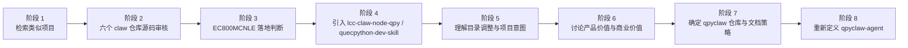
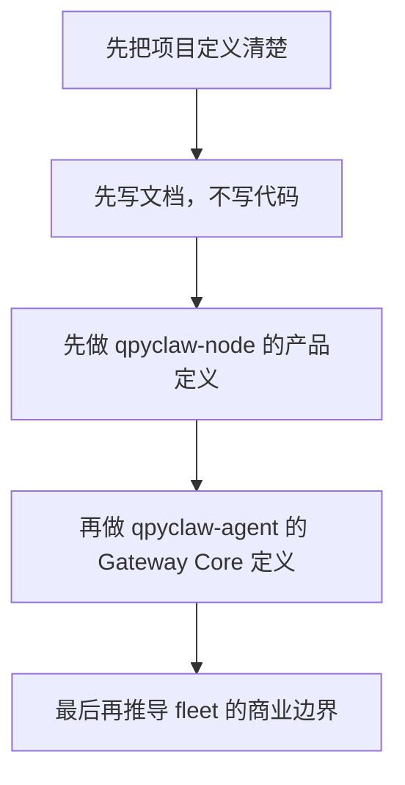

# qpyclaw Discussion Log

更新日期：`2026-03-26`

本文档用于详细记录当前阶段围绕 `qpyclaw` 的讨论、判断、分歧、决策和未决项，供后续复盘与继续设计参考。

## 1. 对话阶段总览



## 2. 阶段 1：检索类似项目

### 用户意图

用户希望先在 GitHub 范围内找到和 `openclaw` 类似、且运行在嵌入式设备上的项目，作为参考候选。

### 关键动作

1. 识别出一组候选项目名
2. 后续按用户确认的 6 个项目继续深入

### 当时的重要背景

用户并不是单纯想收藏仓库，而是希望：

1. 做项目比较
2. 找最像 OpenClaw 的参考
3. 未来选择性克隆

## 3. 阶段 2：六个 claw 仓库源码审核

### 审核对象

1. `pycoclaw`
2. `mimiclaw`
3. `microclaw`
4. `picoclaw`
5. `zeroclaw`
6. `nullclaw`

### 用户核心问题

“哪一个项目真正像 OpenClaw？”

### 审核结论

#### `pycoclaw`

1. 主要是站点、文档、图片等内容
2. 没有真正运行时骨架
3. 不是实际 runtime 候选

#### `microclaw`

1. 只是一个极小的 MCU demo
2. 没有 agent loop、tool system、memory、gateway
3. 不是 OpenClaw 形态

#### `mimiclaw`

1. 是真实的嵌入式 agent 项目
2. 有 `message_bus`、`tool_registry`、`agent_loop`
3. 适合当嵌入式裁剪版参考
4. 不是 OpenClaw 等价实现

#### `picoclaw`

1. 是完整的 OpenClaw 类重写
2. 有 CLI、agent、migration、security、subagent
3. 很像 OpenClaw

#### `zeroclaw`

1. 子系统最完整
2. 直接支持 OpenClaw memory migration
3. tooling / security / daemon / gateway 最齐
4. 是六个里最像 OpenClaw 的

#### `nullclaw`

1. 也是完整实现
2. 更像激进极简重构版
3. 不是“最贴脸”的 OpenClaw

### 当时给出的排序

1. `zeroclaw`
2. `picoclaw`
3. `nullclaw`
4. `mimiclaw`
5. `microclaw`
6. `pycoclaw`

## 4. 阶段 3：EC800MCNLE 落地判断

### 用户核心问题

“基于这几个项目，EC800MCNLE 应该怎么设计实现 OpenClaw？”

### 当时的初步判断

1. 不建议直接把 `zeroclaw / picoclaw / nullclaw` 搬到 EC800MCNLE 上
2. 推荐把 EC800MCNLE 做成 OpenClaw 的设备节点
3. 推荐用现有 QuecPython 语音/设备项目作为设备端参考

### 形成的关键结论

1. EC800MCNLE 更适合作设备端 runtime，而不是桌面型 agent host
2. EC800MCNLE 的音频、LCD、网络、板级能力，是价值点，不是限制点

## 5. 阶段 4：引入 LiteChipCloud 仓库

### 用户动作

用户要求额外克隆：

1. `quecpython-dev-skill`
2. `lcc-claw-node-qpy`

### 后续结果

1. 这两个仓库被成功放到 `embed/opensource` 侧作为参考源
2. `lcc-claw-node-qpy` 很快成为最关键的设备侧架构参考
3. `quecpython-dev-skill` 成为设备开发流程与交付规范参考

## 6. 阶段 5：理解目录调整与项目意图

### 用户动作

用户调整了工程目录，让主工作区从“泛参考区”收敛为：

1. `embed/opensource`：外部参考仓库区
2. `ec800m_audio_board/docs`：板级约束与资源认知区
3. `ec800m_audio_board/code/project/qpyclaw`：目标项目区

### 形成的关键判断

1. 参考项目和目标项目必须彻底分离
2. `qpyclaw` 是真正的新项目
3. `lcc-claw-node-qpy` 不是最终项目名，而是重要上游参考
4. `qpyclaw` 必须结合板级资源、OpenClaw 生态和未来商业化重新定义

## 7. 阶段 6：讨论项目价值

### 用户核心诉求

用户明确表示：

1. 不想只做极客项目
2. 希望吸引 OpenClaw 生态
3. 希望吸引部分 OpenClaw 用户使用
4. 希望有实际生产价值和商业价值

### 讨论形成的产品拆分

1. `qpyclaw-node`
2. `qpyclaw-agent`
3. `qpyclaw-fleet`

### 关键观点

#### 关于 `qpyclaw-node`

1. 应定义为零改 OpenClaw node 标准
2. 首先吃生态接入红利
3. 以协议兼容和可展示能力为核心

#### 关于 `qpyclaw-agent`

1. 最初曾被保守定义为设备型 Agent Runtime
2. 后续被修正为更明确的 Gateway 方向
3. 核心是会话、事件、工具、记忆、规则和路由

#### 关于 `qpyclaw-fleet`

1. 它是平台层，不是设备层
2. 它承载商业化价值更强
3. 但不应在第一阶段与开源 runtime 仓库混为一谈

## 8. 阶段 7：技术争论与方向修正

### 用户进一步追问

用户指出：

1. 不能因为 EC800MCNLE 资源有限，就否定 QuecPython 版 OpenClaw 的可能性
2. 还有更高资源模组，比如 `EC600M` 等
3. EC800 的语音、屏幕能力本身就是亮点
4. QuecPython 可接摄像头、电机、传感器，想象空间很大

### 随后的收束

经过继续讨论，形成如下更准确的判断：

1. `QuecPython 版 OpenClaw` 不是不可能
2. 问题不在“能不能做”，而在“怎么定义”
3. 如果定义为“桌面版 OpenClaw 全量移植”，不现实
4. 如果定义为“设备型 OpenClaw Runtime”，完全成立

## 9. 阶段 8：重新定义 `qpyclaw-agent`

### 用户最新明确意图

用户进一步明确表示：

1. 就是要把 `qpyclaw-agent` 做成 QuecPython 的 OpenClaw Gateway
2. 不要求一开始全量实现，但必须有核心骨架
3. 六个参考项目本身也不是都全量实现 gateway

### 当前修正后的结论

1. 这个方向完全成立
2. 需要把命名从“设备型 Agent Runtime”进一步收束到“`Gateway Core / Gateway-Lite`”
3. `qpyclaw-agent` 现在应被定义为：`QuecPython OpenClaw Gateway Core`
4. `qpyclaw-node` 则是它的下游设备 node 运行时
5. 官方 OpenClaw Gateway 不再是 `qpyclaw` 成立的前提，而是可选上游桥接目标

### 当前仍需保留的谨慎点

1. 首版不应承诺官方桌面 Gateway 的全量等价能力
2. 当前本地 QuecPython 模组能力索引文件缺失，所以除 `EC800MCNLE` 之外，更高资源模组的明确优先级还缺脚本化证据
3. 因此目前更准确的说法是：
   `EC800MCNLE` 用于首板和骨架验证，`EC600M` 等更高资源模组作为 richer gateway 能力扩展位

## 10. 当前已经形成的关键问题与答案

| 问题 | 当前答案 |
| --- | --- |
| 哪个 claw 最像 OpenClaw | `zeroclaw` |
| 哪个最适合做嵌入式参考 | `mimiclaw` |
| 设备侧最重要的参考仓库 | `lcc-claw-node-qpy` |
| 是否要继续把小智项目作为主项目 | 否，作为参考即可 |
| `qpyclaw-node` 和 `qpyclaw-agent` 是否同仓 | 是 |
| `qpyclaw-fleet` 是否同仓完整实现 | 否 |
| `qpyclaw-node` 能否接入 `qpyclaw-agent` | 能，`qpyclaw-agent` 可作为其 `Gateway Core / Gateway-Lite` |
| `qpyclaw-agent` 是不是可以叫 gateway | 可以，但更精确地叫 `Gateway Core / Gateway-Lite` |
| `qpyclaw-agent` 记忆存储怎么做 | 推荐 `Markdown + JSON + JSONL` 混合方案 |
| `qpyclaw-node` 能否做语音终端 | 能，而且应作为首批亮点能力 |

## 11. 当前未决项

1. `qpyclaw-node` 首批语音接口如何定义
2. `qpyclaw-agent` 的最小事件模型如何定义
3. `EC800MCNLE` 首板 profile 如何抽象
4. `EC600M` 等更高资源模组在架构上如何分层支持
5. `fleet` 未来是否开源部分接口或控制台壳层

## 12. 当前阶段建议



### 建议顺序

1. 先把 `qpyclaw-node` 的产品语义和能力面写清楚
2. 再把 `qpyclaw-agent` 的会话、事件、记忆、工具模型写清楚
3. 最后再写 `qpyclaw-fleet` 的商业化边界和平台接口

## 13. 当前补充判断

1. `edge` 不等于 `LAN only`
2. 蜂窝设备同样可以进入 edge 架构
3. 当前首板最现实的 edge 增强方案是外挂串口协处理器
4. `qpyclaw-agent` 可以直接按 `QuecPython OpenClaw Gateway Core / Gateway-Lite` 定义
5. `qpyclaw-node` 负责“接入和执行”，`qpyclaw-agent` 负责“接 node、事件、记忆、规则和编排”

## 14. 2026-03-27 新增收束

### 用户对 `qpyclaw-node` 的三条新要求

1. 先考虑开放所有能力，先把能力知道并做出来，再谈约束和安全
2. 当前只考虑 `qpyclaw-node -> Official OpenClaw Gateway`
3. 多个 node 既可以通过 Official OpenClaw Gateway 间接通信，也可以直接通信

### 当前修正后的 `qpyclaw-node` 方向

1. `qpyclaw-node` 不再按“只做少量安全能力”收敛
2. `qpyclaw-node` 先按“全能力目录”定义产品边界
3. 安全、权限、默认开放策略后置为下一层文档
4. 当前主线模式固定为：
   `qpyclaw-node -> Official OpenClaw Gateway`
5. 多 node 间接通信进入当前主线
6. 多 node 直接通信进入明确扩展位

## 15. 2026-03-27 目录结构进一步收口

### 用户新增判断

用户进一步确认了两件关键事：

1. `qpyclaw-node` 的代码都应放在 `qpyclaw-node` 目录下
2. `boards/` 只放板级资料，不放业务代码

### 随后形成的结构性结论

1. `C:\Users\kingd\Desktop\code\lcc-ai-team\embed\project\qpyclaw`
   被正式收敛为 canonical root
2. `embed/qpyclaw-node/`
   继续作为当前设备侧主线
3. `embed/qpyclaw/`
   保留为未来 QuecPython 侧 `qpyclaw` 本体目录
4. `embed/shared/`
   收敛共享协议、通道和工具
5. `boards/`
   只承载真实硬件实体的资料和 bring-up 记录

### 关于板目录命名的新增共识

用户明确提出：

1. 板目录名称不要只写模组型号

因此当前正式板目录命名规则被修正为：

```text
<module>-<board-type-or-purpose>
```

当前正式收敛为：

1. `boards/ec800kcnlc-dev-board`
2. `boards/ec800mcnle-audio-board`

旧的纯模组名目录仅作为兼容别名保留。

## 16. 2026-03-27 EC800K 开发板切换结果

### 新的设备侧约束变化

用户随后明确表示：

1. 当前接在本机上的就是开发板
2. 开发板里原有代码可以直接删除

这使得设备侧策略从“避免覆盖已有应用”变为：

```text
直接把开发板切换成 qpyclaw-node 专用开发板
```

### 本次已完成的实机动作

1. 自动识别到板卡：
   `EC800K`
2. 识别到当前固件：
   `EC800KCNLCR07A03M04_OCPU_QPY`
3. 识别到端口：
   `AT=COM15`，`REPL=COM14`
4. 记录了清板前 `/usr` 文件树
5. 清空了开发板原有 `/usr` 应用
6. 将 `embed/qpyclaw-node/runtime/usr_mirror/` 全量部署到设备 `/usr`
7. 完成最小 REPL 烟测：
   `app` 导入成功，`RuntimeState` 与 `ToolRunner` 初始化成功，
   `qpy.tools.catalog`、`qpy.runtime.status`、`qpy.device.info` 三项只读工具均成功

### 当前得到的关键判断

1. `EC800KCNLC` 已经可以作为 `qpyclaw-node` 的干净开发板继续推进
2. 当前阻塞点已经不再是目录结构或运行时骨架
3. 当前真实阻塞点变成了：
   `SIM 未插入，暂时无法验证真实蜂窝链路与 Official OpenClaw Gateway`

## 17. 2026-03-27 插卡后的联网验证结果

### 用户新增动作

用户随后明确表示：

1. 开发板已经插好 SIM 卡

### 本次追加完成的设备侧验证

1. 设备探测结果变为：
   `CPIN=READY`
2. 已成功驻网
3. 已成功激活 PDP
4. 已获取：
   `IPv4=10.132.66.100`
5. 已获取：
   `IPv6=240e:46c:a602:79e3:1:1:b7aa:6f83`
6. `qpy.net.ifconfig` 已实测成功
7. `qpy.net.diag` 已实测成功

### 当前新增判断

1. 这块 `EC800KCNLC` 板已经具备真实蜂窝出站连接条件
2. 当前 IPv4 是运营商私网地址，不应按“公网可主动入站”假设来设计
3. 但它同时拿到了全球 IPv6，这为后续 IPv6 能力预留了空间
4. 当前更现实的主线仍然是：
   `qpyclaw-node 主动出站连接 Official OpenClaw Gateway`

### 新暴露出的运行时风险

本次实测还暴露出一个配置层风险：

1. `qpy.net.ifconfig` 实测耗时约 `13.1s`
2. `qpy.net.diag` 实测耗时约 `17.4s`
3. 而当前配置默认值是：
   `MAX_CMD_EXEC_SEC = 12`

因此在真正接入 Official OpenClaw Gateway 前，需要重新评估这类网络工具的超时设计。
