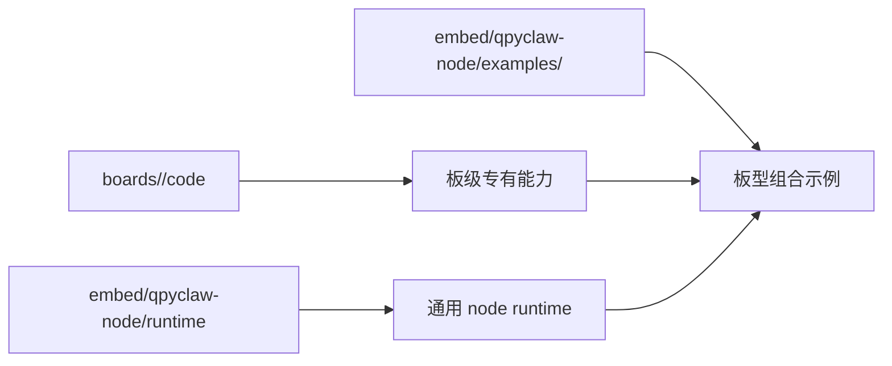

# 2026-03-29 Board Runtime Example Boundary

## 决策主题

明确 `boards/`、`embed/qpyclaw-node/runtime/`、`embed/qpyclaw-node/examples/` 三者边界。

## 最新结论

1. `boards/ec800mcnle-audio-board/code/` 放音频板特有代码。
2. `embed/qpyclaw-node/runtime/` 只放通用 runtime。
3. `embed/qpyclaw-node/examples/ec800mcnle-audio-board/` 放这块板的接入示例。

## 为什么这样定

如果把板级专有代码也塞进 `qpyclaw-node/runtime/`，后续做单文件 runtime 收敛时会越来越难。

如果把组合示例放进 `boards/`，又会让板级资料、板级代码、接入示例混成一层，不利于后续维护。

因此当前采用三层拆分：

## 对 EC800MCNLE 音频板的落点

| 类型 | 路径 |
| --- | --- |
| 板级专有代码 | `boards/ec800mcnle-audio-board/code/` |
| 板级资料 | `boards/ec800mcnle-audio-board/docs/` |
| 资源文件 | `boards/ec800mcnle-audio-board/resource/` |
| qpyclaw-node 示例 | `embed/qpyclaw-node/examples/ec800mcnle-audio-board/` |

## 对后续开发的影响

1. `qpyclaw-node` 单文件化时，目标只针对通用 runtime。
2. 音频板的 UI、语音、外设扩展不会污染通用 runtime。
3. 后续如果再接别的板，可以直接复制 `examples/<board>/` 模式。
