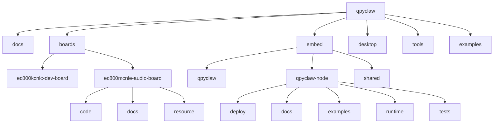

# Repo Layout And Migration

## 1. 目标

这份文档明确两件事：

1. `qpyclaw` 当前正式目录结构是什么。
2. 哪些内容属于通用 runtime，哪些内容属于板级专有代码，哪些内容属于示例。

## 2. 正式根目录

```text
C:\Users\kingd\Desktop\code\lcc-ai-team\embed\project\qpyclaw
```

旧目录：

```text
C:\Users\kingd\Desktop\code\lcc-ai-team\embed\ec800m_audio_board\code\project\qpyclaw
```

旧目录当前只作为迁移参考，不再作为继续开发的主目录。

## 3. 当前正式结构



## 4. 三层边界

### 4.1 通用 runtime

路径：

```text
embed/qpyclaw-node/runtime/
```

这里放通用的 `qpyclaw-node` 运行时代码，也就是最终要部署到设备 `/usr` 的内容。

这里不放：

1. 板型专有驱动
2. 板型示例
3. 板型接线说明

### 4.2 板级专有代码

路径：

```text
boards/<board>/code/
```

这里放某块板独有的代码。例如：

1. 音频链路适配
2. 屏幕驱动和 UI 适配
3. 按键、LED、电池、ADC
4. 摄像头、马达、传感器
5. 板级引脚映射与初始化

这里不放通用 `qpyclaw-node` runtime。

### 4.3 板型组合示例

路径：

```text
embed/qpyclaw-node/examples/<board>/
```

这里放“如何把通用 runtime 和某块板的专有代码组合起来”的示例。

适合放这里的内容：

1. `config_local.example.py`
2. 示例 `main.py`
3. 最小接入说明
4. 示例部署步骤

换句话说：

1. 能复用到多块板的代码，放 `runtime/`
2. 只属于某一块板的代码，放 `boards/<board>/code/`
3. 如何把二者拼起来，放 `examples/<board>/`

## 5. 当前迁移映射

| 旧路径 | 新路径 | 说明 |
| --- | --- | --- |
| `README.md` | `README.md` | 已迁入并重写 |
| `discussion/` | 不进入公开仓库 | 对话纪要与复盘改为私有协作资料 |
| `docs/product/` | `docs/product/` | 原样迁入 |
| `docs/architecture/` | `docs/architecture/` | 原样迁入并持续更新 |
| `docs/research/` | `docs/research/` | 原样迁入 |
| `boards/ec800kcnlc/` | `boards/ec800kcnlc-dev-board/` | 板目录改为“模组 + 板型”命名 |
| `boards/ec800mcnle/` | `boards/ec800mcnle-audio-board/` | 板目录改为“模组 + 用途”命名 |
| `runtimes/qpyclaw-node/` | `embed/qpyclaw-node/runtime/` | 通用运行时新位置 |
| `runtimes/qpyclaw-node/examples/` | `embed/qpyclaw-node/examples/` | 板型示例从 runtime 中抽离 |
| `runtimes/qpyclaw-agent/` | `embed/qpyclaw/runtime/` | 保留为后续 qpyclaw 本体能力目录 |
| `runtimes/shared/` | `embed/shared/` | 共用协议与工具 |

## 6. 为什么这样拆

### 6.1 `boards/`

`boards/` 表示真实硬件实体，因此这里既应该有板级资料，也应该允许放板级专有代码。

### 6.2 `embed/qpyclaw-node/runtime/`

这里要保持“可部署、可收敛、可做单文件 runtime”的纯度，所以不再混入板型示例。

### 6.3 `embed/qpyclaw-node/examples/`

这里负责告诉后续开发者：

1. 这块板怎么接入 `qpyclaw-node`
2. 用哪个 `board_profile`
3. 需要拉哪些板级代码

## 7. 板目录命名规则

板目录统一使用：

```text
<module>-<board-type-or-purpose>
```

原因：

1. 一个模组可能对应多块不同开发板或载板。
2. `boards/` 表示真实硬件，不应与软件 profile 混淆。
3. 软件能力画像保留在 runtime 配置中，例如 `BOARD_PROFILE`。

## 8. 后续开发的正式路径

后续继续开发时，统一使用：

1. `embed/qpyclaw/`
2. `embed/qpyclaw-node/runtime/`
3. `embed/qpyclaw-node/examples/`
4. `embed/shared/`
5. `boards/<board>/code/`
6. `boards/<board>/docs/`
