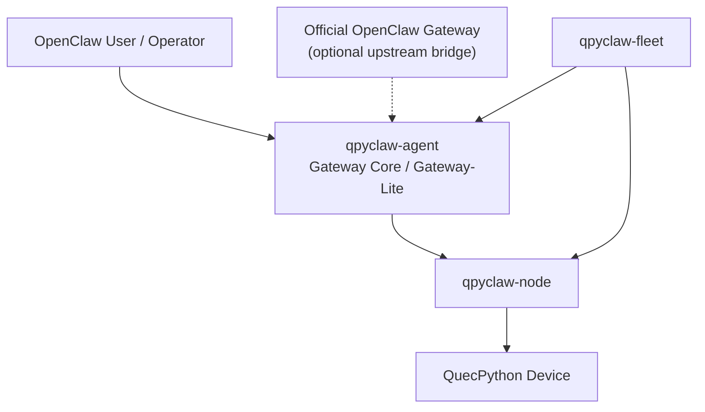
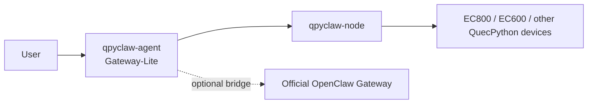
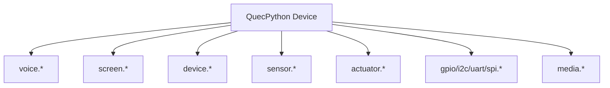

# qpyclaw System Architecture

## 1. 架构目标

当前架构需要同时回答 5 个问题：

1. `qpyclaw-node` 怎么零改接 OpenClaw
2. `qpyclaw-agent` 能不能直接定义成 QuecPython 版 OpenClaw Gateway
3. `qpyclaw-node` 与 `qpyclaw-agent` 的边界是什么
4. `EC800MCNLE` 和更高资源模组分别适合承接哪一层
5. `qpyclaw-fleet` 为什么不应该一开始混进开源 runtime 仓库

## 2. 四角色结构



### 含义

1. `qpyclaw-node` 是下游设备 node 运行时
2. `qpyclaw-agent` 是 QuecPython OpenClaw Gateway Core
3. `Official OpenClaw Gateway` 是可选上游生态桥接目标
4. `qpyclaw-fleet` 是未来管理平面

## 3. `qpyclaw-node` 的角色

`qpyclaw-node` 负责：

1. 对接上游 Gateway 或 Gateway Core
2. 声明设备能力
3. 接收 `node.invoke`
4. 调度本地工具
5. 返回结果
6. 承接语音、屏幕、设备状态、传感器、执行器这类设备能力

它的第一优先级不是“本地智能很强”，而是“上游兼容稳定、设备能力明确”。

## 4. `qpyclaw-agent` 的角色

`qpyclaw-agent` 负责：

1. 接收和维护下游 node 会话
2. 维护本地事件总线与路由
3. 维护工具注册与调度
4. 维护轻量记忆、会话状态、设备 profile / prompt / policy
5. 在需要时桥接到官方 OpenClaw Gateway

结论上，它可以直接被定义为：

`QuecPython 版 OpenClaw Gateway Core / Gateway-Lite`

但要明确：

1. 这不等于桌面版官方 Gateway 的全量等价移植
2. v1 只承诺最小可运行骨架
3. 先把连接、会话、工具、记忆、规则、路由打通，再谈全量扩展

## 5. `qpyclaw-node` 能不能接 `qpyclaw-agent`

能，而且这应该是 `qpyclaw` 主体系的一条标准链路。

### 推荐模式



在这个模式里：

1. `qpyclaw-agent` 是上游 Gateway Core
2. `qpyclaw-node` 是下游设备 node
3. 官方 Gateway 是可选上游桥接，而不是 `qpyclaw` 成立的前提

### 不推荐模式

```text
qpyclaw-node 直接作为另一个 node 的附属 node
```

这会导致角色混乱、状态重叠、协议边界不清。

## 6. 四种工作模式

| 模式 | 路径 | 适用场景 |
| --- | --- | --- |
| Mode A | `qpyclaw-node -> Official Gateway` | 生态兼容模式，便于接入现有 OpenClaw 用户 |
| Mode B | `qpyclaw-node -> qpyclaw-agent (Gateway-Lite)` | `qpyclaw` 主链路，形成 QuecPython 版 OpenClaw |
| Mode C | `qpyclaw-node -> qpyclaw-agent -> Official Gateway` | 混合模式，兼顾私有网关与官方生态桥接 |
| Mode D | `qpyclaw-agent standalone` | 单设备私有场景、弱联网场景、离线 fallback |

## 7. 共享底座

`qpyclaw-node` 和 `qpyclaw-agent` 共享：

1. 配置模型
2. 权限模型
3. 事件模型
4. 工具注册机制
5. 记忆抽象
6. 板级设备 profile
7. host tools

## 8. 板卡与模组分层

### `EC800MCNLE`

适合：

1. `qpyclaw-node` 首板
2. 语音 / 屏幕 / 状态终端
3. `qpyclaw-agent` 的最小 Gateway Core 骨架验证

### 更高资源模组

例如用户提出的 `EC600M` 方向，更适合承接：

1. 更复杂的记忆与规则
2. 多节点路由
3. 更重的离线能力
4. 更完整的 `gateway-lite` 功能

说明：

当前本地 QuecPython 模组能力索引文件缺失，以上“更高资源模组更适合 richer gateway core”是工程判断，不是脚本化实证结论。

## 9. `qpyclaw-fleet` 的位置

`qpyclaw-fleet` 不应该下沉到设备运行时仓库中。

原因：

1. 它是平台层，不是设备层
2. 它会引入租户、安全、审计、日志、OTA 等大量平台问题
3. 它会拖慢 node / gateway core 开源主线
4. 它更适合作为单独产品线演进

## 10. 设备能力图



这也是 `qpyclaw` 相对桌面 OpenClaw 最大的差异化来源。
