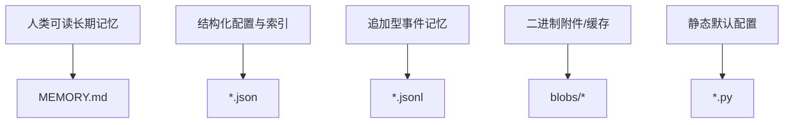
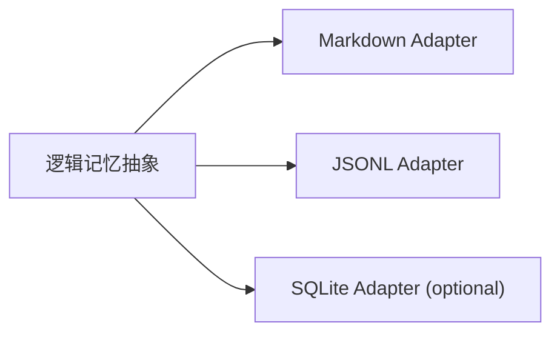
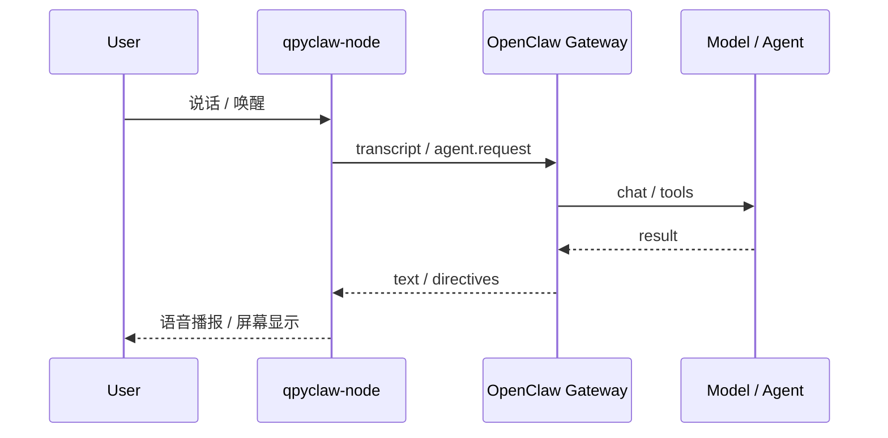

# Node, Agent And Memory Design

## 1. 先回答三个直接问题

### 1.1 `qpyclaw-node` 可以接入 `qpyclaw-agent` 作为其 node 吗

可以，但推荐解释为：

1. `qpyclaw-agent` 作为 `edge host / edge gateway`
2. `qpyclaw-node` 作为设备接入运行时

不推荐解释为“node 套 node”。

### 1.2 `qpyclaw-agent` 的记忆用什么存储

不建议单选 `py / json / binary` 中的某一个。  
建议采用 `分层混合存储`。

### 1.3 `qpyclaw-node` 能不能成为人与 OpenClaw 对话的语音终端

能，而且应该把它做成 `qpyclaw-node` 的首批亮点能力之一。

## 2. 建议的分层存储



## 3. 为什么不建议把记忆主存放在 `.py`

`.py` 适合：

1. 默认配置
2. 固定策略
3. 设备 profile

`.py` 不适合主记忆，因为：

1. 难做增量写入
2. 断电恢复差
3. 难做日志轮转
4. 不利于后续搜索与同步

## 4. 为什么不建议把记忆主存放在纯二进制

纯二进制适合：

1. 音频缓存
2. 图片缓存
3. 固件包
4. blob 内容

但不适合主记忆，因为：

1. 可读性差
2. 可恢复性差
3. 调试困难
4. 不利于后续做导出、审计、复盘

## 5. 推荐的混合方案

### 5.1 长期记忆

使用 `Markdown`。

建议：

1. `MEMORY.md`
2. `docs/profile.md` 或 `memory/identity.md`

适合存：

1. 设备角色
2. 安全边界
3. 稳定偏好
4. 人工维护知识
5. 重要固定上下文

### 5.2 结构化记忆

使用 `JSON`。

建议：

1. `memory/profile.json`
2. `memory/index.json`
3. `memory/checkpoints/*.json`

适合存：

1. profile
2. 索引
3. 快照
4. tool 能力注册表
5. 当前会话状态

### 5.3 事件性记忆

使用 `JSONL`。

建议：

1. `memory/episodes/2026-03-26.jsonl`
2. `spool/outbox/queue.jsonl`
3. `logs/runtime-2026-03-26.jsonl`

适合存：

1. 事件日志
2. 对话片段
3. 命令执行结果
4. 传感器事件
5. 告警与状态变化

`JSONL` 非常适合设备端，因为：

1. 追加写简单
2. 崩溃恢复友好
3. 便于分片和轮转
4. 便于上传和同步

## 6. 推荐目录

```text
memory/
├─ MEMORY.md
├─ profile.json
├─ index.json
├─ checkpoints/
│  └─ latest.json
├─ episodes/
│  ├─ 2026-03-26.jsonl
│  └─ 2026-03-27.jsonl
└─ blobs/
   ├─ audio/
   └─ image/
```

## 7. EC800MCNLE 基线方案

针对 `EC800MCNLE`，建议第一版只采用：

1. `Markdown + JSON + JSONL`

不把 `SQLite` 作为基线。

原因：

1. 设备资源预算有限
2. 设备端断电和异常重启更常见
3. 追加型日志模型更稳
4. 文本格式更适合人工排障

## 8. 更高资源模组的增强方案

对更高资源模组，例如你提到的 `EC600M` 方向，可以考虑第二层适配：

1. 在上层保留 `Markdown + JSONL`
2. 在下层增加可选 `SQLite memory adapter`

也就是说：



这样做的好处是：

1. 不把首版绑死在某个存储引擎上
2. 兼顾低端模组和高端模组
3. 未来可逐步把查询型能力迁到 SQLite

## 9. 推荐的记忆分层语义

| 层级 | 建议文件 | 作用 |
| --- | --- | --- |
| L0 固定身份与策略 | `MEMORY.md` / `profile.json` | 稳定记忆 |
| L1 会话态与索引 | `index.json` / `checkpoints/*.json` | 运行态 |
| L2 事件和经验 | `episodes/*.jsonl` | 追加型经验 |
| L3 二进制内容 | `blobs/*` | 音频、图片、缓存 |

## 10. `qpyclaw-node` 作为语音终端的建议模型

### 推荐链路



### 这条链路的价值

1. 用户能直接把设备当作 OpenClaw 语音终端
2. OpenClaw 生态用户一眼就能看懂价值
3. 这比纯状态查询更容易传播

### 第一版建议能力

1. `voice.capture`
2. `voice.push_to_talk`
3. `voice.play`
4. `screen.show_text`
5. `screen.show_status`

## 11. 当前建议

1. 记忆基线用 `Markdown + JSON + JSONL`
2. `.py` 只用于静态配置和默认策略
3. 二进制只用于附件和缓存
4. 更高资源模组再引入可选 SQLite adapter
5. `qpyclaw-node` 的首批亮点能力应该明确包含语音终端能力
