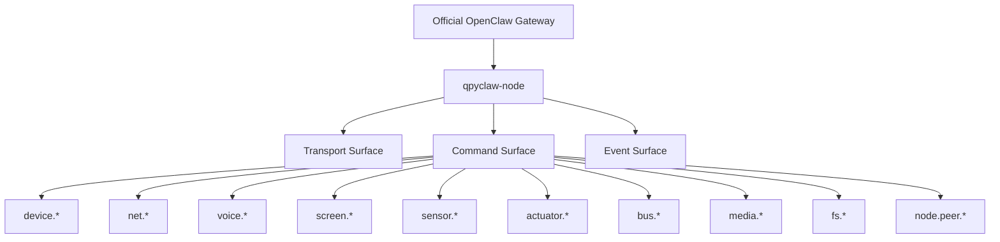
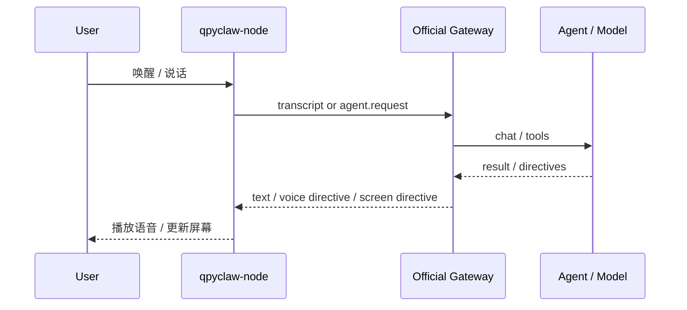
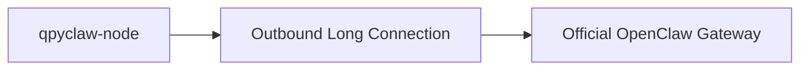
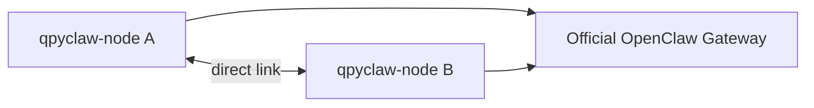

# qpyclaw-node Capabilities And Connectivity

## 1. 文档目标

回答 4 个问题：

1. `qpyclaw-node` 到底暴露什么能力面
2. `qpyclaw-node` 是否能成为人与 OpenClaw 对话的语音终端
3. 当前为什么只考虑 `qpyclaw-node -> Official OpenClaw Gateway`
4. 多个 node 之间如何经 Gateway 间接通信，或彼此直接通信

## 2. 先给结论

### 2.1 关于能力面

`qpyclaw-node` 当前不按“先裁剪”思路定义。  
当前思路是：

1. 先完整定义全能力目录
2. 先尽可能把能力做出来
3. 再在后续补权限、安全、默认启用策略

能力面至少覆盖：

1. `device.*`
2. `voice.*`
3. `screen.*`
4. `net.*`
5. `sensor.*`
6. `actuator.*`
7. `bus.*`
8. `media.*`
9. `fs.*`
10. `node.peer.*`

### 2.2 关于语音终端

可以，而且应该做成首批亮点能力。

OpenClaw 官方已经明确存在：

1. 节点概念
2. `node.invoke`
3. `Talk Mode`
4. `Voice Wake`

这说明“把 node 做成语音终端”是与 OpenClaw 方向一致的，而不是额外发明概念。  
参考：

1. [Nodes](https://docs.openclaw.ai/nodes)
2. [Talk Mode](https://docs.openclaw.ai/nodes/talk)
3. [Voice Wake](https://docs.openclaw.ai/nodes/voicewake)

### 2.3 关于连接主线

当前只考虑：

```text
qpyclaw-node -> Official OpenClaw Gateway
```

原因：

1. 先把 `qpyclaw-node` 的协议兼容和能力面做深
2. 先紧贴 OpenClaw 现有生态入口
3. 先避免把当前阶段问题扩散到更多上游模式

### 2.4 关于多 Node 通信

支持两种思路：

1. 多 node 经 Official OpenClaw Gateway 间接通信和交互
2. 多 node 之间直接通信和交互

当前优先级：

1. 间接通信是当前主线
2. 直接通信是明确保留的扩展位

## 3. `qpyclaw-node` 的能力全景



## 4. 能力目录建议

## 4.1 Device / Runtime

| 命名空间 | 示例命令 | 说明 |
| --- | --- | --- |
| `device.*` | `device.info`, `device.status`, `device.reboot` | 设备身份、状态、生命周期 |
| `runtime.*` | `runtime.status`, `runtime.logs`, `tools.catalog` | node 自身运行态 |

## 4.2 Network

| 命名空间 | 示例命令 | 说明 |
| --- | --- | --- |
| `net.*` | `net.diag`, `net.ifconfig` | 网络状态与诊断 |
| `sim.*` | `sim.info` | SIM 信息 |
| `cell.*` | `cell.info` | 蜂窝信息 |
| `mqtt.*` | `mqtt.publish`, `mqtt.subscribe` | MQTT 能力 |
| `http.*` | `http.get`, `http.post` | HTTP 能力 |
| `socket.*` | `socket.open`, `socket.send` | Socket 能力 |

## 4.3 Voice / Screen / UX

| 命名空间 | 示例命令 | 说明 |
| --- | --- | --- |
| `voice.*` | `voice.capture`, `voice.play`, `voice.stream` | 语音采集、播放、流式 |
| `screen.*` | `screen.show_text`, `screen.show_card` | 屏幕展示 |
| `notification.*` | `notification.show`, `notification.clear` | 本地通知 |

## 4.4 Sensor / Actuator / Bus / Media

| 命名空间 | 示例命令 | 说明 |
| --- | --- | --- |
| `sensor.*` | `sensor.list`, `sensor.read`, `sensor.stream` | 传感器采样 |
| `actuator.*` | `actuator.set`, `actuator.pulse` | 执行器动作 |
| `bus.*` | `uart.*`, `i2c.*`, `spi.*`, `gpio.*` | 总线与外设访问 |
| `media.*` | `camera.snap`, `media.record_clip` | 摄像头与多媒体 |
| `fs.*` | `fs.list`, `fs.read`, `fs.write` | 文件系统 |

## 4.5 Node Peer

| 命名空间 | 示例命令 | 说明 |
| --- | --- | --- |
| `node.peer.*` | `node.peer.list`, `node.peer.invoke`, `node.peer.send` | 多 node 通信与协作 |

## 5. 语音终端推荐链路



首批建议能力：

1. `voice.push_to_talk`
2. `voice.capture`
3. `voice.play`
4. `voice.interrupt`
5. `screen.show_text`
6. `screen.show_card`
7. `screen.clear`

## 6. 当前主线连接模型



特点：

1. 由 `qpyclaw-node` 主动发起连接
2. 不依赖公网入站访问 node
3. 最符合蜂窝设备与 CGNAT 现实

## 7. 多 Node 通信模型

## 7.1 模型 A：经 Gateway 间接通信


特点：

1. 当前主线
2. 不要求 node 之间直接可达
3. 最适合跨运营商、蜂窝网络、复杂网络环境

## 7.2 模型 B：Node 直接通信



特点：

1. 适合低时延协同
2. 适合局域网、专网、VPN、专用 APN、外挂协处理器网络
3. 不应作为当前主线前提

## 8. 当前 EC800MCNLE 首板的可行性判断

## 8.1 已知板级资源

从本地板图可确认：

1. `J4` 是外露 UART 口  
   参考：[board_map.py](/C:/Users/kingd/Desktop/code/lcc-ai-team/embed/ec800m_audio_board/docs/board_map.py#L8)
2. 主串口 `MAIN_RXD / MAIN_TXD` 存在  
   参考：[board_map.py](/C:/Users/kingd/Desktop/code/lcc-ai-team/embed/ec800m_audio_board/docs/board_map.py#L128)
3. 模组上还有 `AUX_RXD / AUX_TXD`  
   参考：[board_map.py](/C:/Users/kingd/Desktop/code/lcc-ai-team/embed/ec800m_audio_board/docs/board_map.py#L236)
4. 模组上有 `I2C_SDA / I2C_SCL`  
   参考：[board_map.py](/C:/Users/kingd/Desktop/code/lcc-ai-team/embed/ec800m_audio_board/docs/board_map.py#L206)

## 8.2 现实结论

### 可以做

1. 通过 `J4` 外接串口 WiFi / BLE 协处理器
2. 通过模组的 `AUX UART` 做第二串口外设接入
3. 通过 `I2C` 接近场传感器或低速外设
4. 通过官方 Gateway 完成多 node 间接协同

### 需要明确的限制

1. 当前板上明确外露的是 `J4` 主串口，不一定适合长期与 REPL / 调试口复用
2. `AUX UART` 和 `I2C` 在模组侧存在，但当前板卡是否已完整引出到方便接线的外部接口，还要继续核对
3. 当前板上没有现成的 WiFi / BLE 芯片，所以“node 直接通信”不是开箱即用，而是扩展实现

## 9. 当前判断

1. `qpyclaw-node` 完全可以做语音终端
2. 当前应先按“全能力目录”设计
3. 当前主线只考虑 `qpyclaw-node -> Official OpenClaw Gateway`
4. 多 node 经 Gateway 间接通信应进入当前主线
5. 多 node 直接通信应进入明确扩展位
