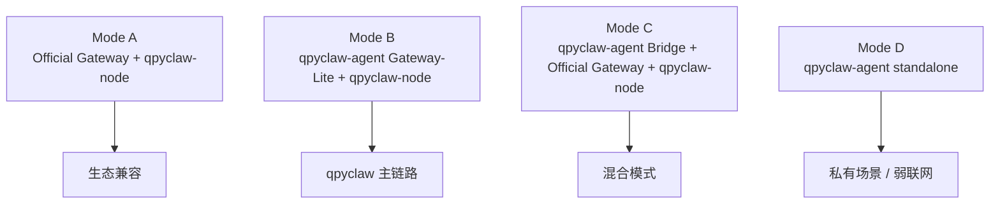
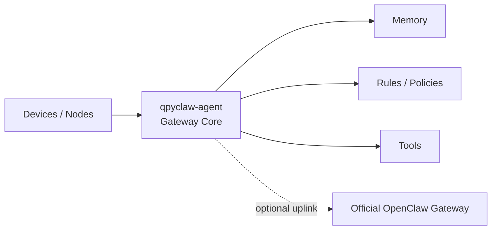
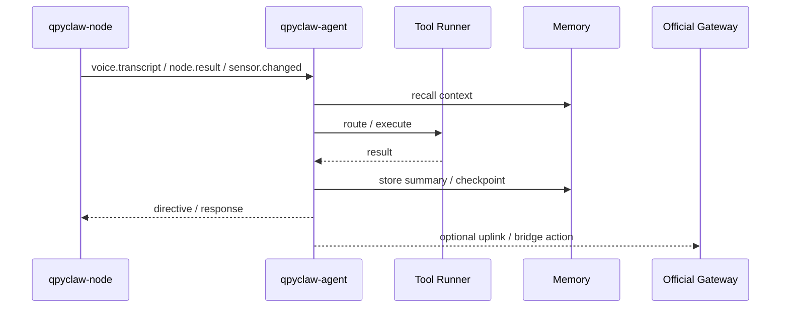
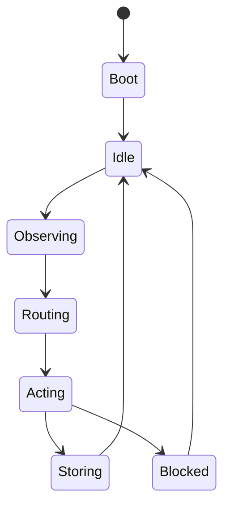

# qpyclaw-agent Event Model And Minimal Toolset

## 1. 先回答核心问题

### `qpyclaw-agent` 到底是什么

`qpyclaw-agent` 可以直接定义为：

`QuecPython 版 OpenClaw Gateway Core / Gateway-Lite`

这一定义是成立的。  
但它的成立方式不是“先达到官方 Gateway 全量功能”，而是“先把 gateway 的核心骨架做出来”。

### 这个定义为什么合理

1. 你要的是 `QuecPython OpenClaw`，不是桌面官方 Gateway 的逐项复刻
2. 之前审过的 6 个参考项目里，也并不是每个都全量实现了 gateway 全部能力
3. 对嵌入式设备来说，先实现 `gateway core`，再逐步补齐 richer feature，是合理路线

### 它和 `qpyclaw-node` 的区别

一句话：

- `qpyclaw-node` 负责“接入、暴露设备能力、执行命令”
- `qpyclaw-agent` 负责“接 node、维护会话、编排事件、执行工具、写入记忆、做策略和可选上游桥接”

## 2. 角色对比

| 维度 | `qpyclaw-node` | `qpyclaw-agent` |
| --- | --- | --- |
| 核心目标 | 零改接入 OpenClaw | 做 QuecPython OpenClaw Gateway Core |
| 主要角色 | 下游设备 node | 上游 Gateway-Lite |
| 是否维护下游 node 会话 | 否 | 是 |
| 是否重点维护本地记忆 | 否，轻量即可 | 是 |
| 是否重点维护事件系统 | 否，基础即可 | 是 |
| 是否重点做本地策略 / 规则 | 否 | 是 |
| 是否可聚合多个 node | 弱 | 强 |
| 是否可做离线 fallback | 弱 | 强 |
| 是否可桥接官方 Gateway | 否 | 是，作为可选模式 |

## 3. 四种模式



### Mode A

适合对接现有 OpenClaw 用户。

### Mode B

这是 `QuecPython 版 OpenClaw` 最清晰的成立方式。

### Mode C

适合商业化与现场部署，同时保留官方生态桥接。

### Mode D

适合单设备、本地控制、离线 fallback，但不是首版必须打满的范围。

## 4. 为什么需要 `qpyclaw-agent`

如果只有 `qpyclaw-node`，你能得到：

1. 设备接入
2. 远程调用
3. 基础状态查看
4. 语音 / 屏幕终端

但你很难得到：

1. 下游 node 管理
2. 本地会话和上下文
3. 本地策略和规则
4. 多设备协同
5. 事件驱动执行
6. 离线 fallback
7. 轻量记忆

这些正是 `qpyclaw-agent` 作为 Gateway Core 要补的。

## 5. `qpyclaw-agent` 的系统定位



## 6. 最小事件模型

`qpyclaw-agent` 应该是事件驱动的，而不是纯聊天驱动的。

## 6.1 事件类别

| 类别 | 示例 | 说明 |
| --- | --- | --- |
| `system.*` | `system.boot`, `system.tick` | 运行时系统事件 |
| `session.*` | `session.open`, `session.closed` | 会话生命周期 |
| `node.*` | `node.online`, `node.result` | 下游设备节点事件 |
| `uplink.*` | `uplink.connected`, `uplink.forward` | 上游桥接事件 |
| `voice.*` | `voice.wake`, `voice.transcript` | 语音触发与转写 |
| `screen.*` | `screen.action`, `screen.timeout` | 屏幕交互事件 |
| `sensor.*` | `sensor.changed`, `sensor.threshold` | 传感器变化 |
| `tool.*` | `tool.request`, `tool.result`, `tool.error` | 工具调用与结果 |
| `memory.*` | `memory.store`, `memory.recall` | 记忆读写 |
| `policy.*` | `policy.blocked`, `policy.approved` | 策略审计 |
| `schedule.*` | `schedule.fire` | 定时任务 |

## 6.2 事件总线形态

建议采用轻量对象 + JSONL 事件日志：

```json
{
  "ts_ms": 1770000000000,
  "event": "voice.transcript",
  "source": "node/ec800-demo-01",
  "session_key": "main",
  "payload": {
    "text": "请汇报当前网络状态"
  }
}
```

## 7. 推荐事件流



## 8. 最小工具集建议

## 8.1 Gateway Core

1. `session.open`
2. `session.close`
3. `memory.store`
4. `memory.recall`
5. `policy.check`
6. `schedule.add`
7. `schedule.remove`

## 8.2 Node Routing

1. `node.list`
2. `node.invoke`
3. `node.accept`
4. `node.profile.get`
5. `node.profile.set`

## 8.3 Voice / UX

1. `voice.route`
2. `screen.route`
3. `notification.route`

## 8.4 Rules / Uplink

1. `rule.match`
2. `rule.fire`
3. `rule.disable`
4. `uplink.connect`
5. `uplink.forward`

## 9. 最小状态机



### 含义

1. `Boot`：加载配置、工具、profile、记忆索引
2. `Idle`：等待事件
3. `Observing`：接收事件并构造上下文
4. `Routing`：决定走本地工具、下游 node、还是上游桥接
5. `Acting`：执行动作
6. `Storing`：写回记忆、状态、日志
7. `Blocked`：被策略阻止，等待人工或回退

## 10. 记忆与 agent 的关系

`qpyclaw-agent` 是记忆的主拥有者。  
`qpyclaw-node` 只需要轻量缓存和结果去重。

所以：

1. `node` 侧记忆偏短时
2. `agent / gateway core` 侧记忆偏中长期
3. `fleet` 侧记忆偏运维和审计

## 11. 为什么叫 Gateway Core，而不是 Full Gateway

### Gateway Core 负责

1. 下游 node 接入
2. 会话和事件路由
3. 工具调度
4. 轻量记忆
5. 规则与策略
6. 可选上游桥接

### Full Gateway 还会继续负责

1. 更完整的 CLI / UI / 配对与管理体验
2. 更重的插件、扩展、迁移能力
3. 更复杂的用户、权限、审计和后台能力
4. 更丰富的运维与桌面生态集成

所以：

1. 可以把 `qpyclaw-agent` 命名成 `QuecPython OpenClaw Gateway`
2. 但对外更精确的说法应该是 `Gateway Core` 或 `Gateway-Lite`
3. 这样既承认它就是 gateway 方向，又不把首版目标说满

## 12. 当前建议

1. `qpyclaw-agent` 直接按 `Gateway Core / Gateway-Lite` 定位推进
2. 首版优先打穿 `qpyclaw-node -> qpyclaw-agent`
3. 官方 OpenClaw Gateway 桥接是增强项，不是项目成立前提
4. 更高资源模组优先承接多节点、 richer memory、离线能力
