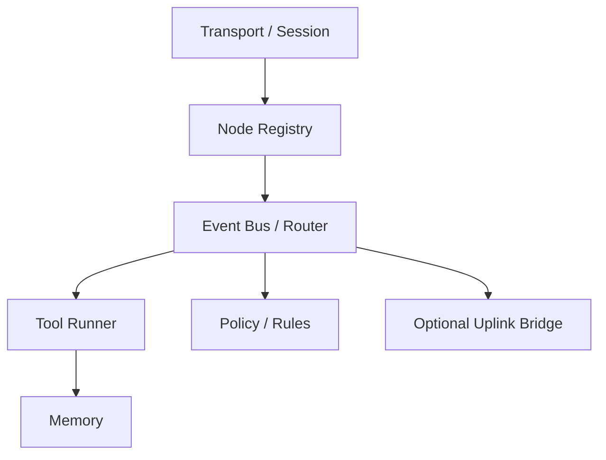
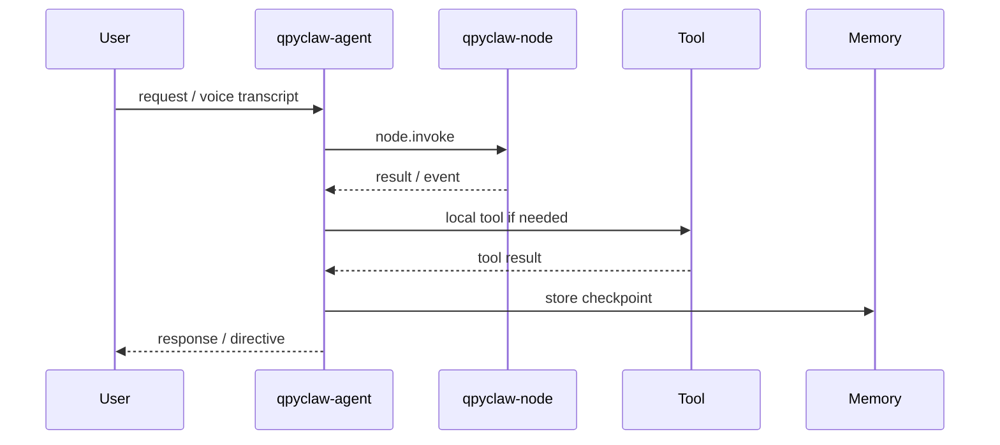

# qpyclaw-agent As QuecPython OpenClaw Gateway

## 1. 结论先行

`qpyclaw-agent` 可以直接定义成：

`QuecPython OpenClaw Gateway Core / Gateway-Lite`

这条路线是成立的。  
它不要求一开始实现官方 Gateway 的全部能力，但必须有核心骨架。

## 2. 为什么这条路线成立

### 2.1 从参考项目看

之前审过的 6 个项目里，真正有参考价值的并不是“谁最完整”，而是：

1. `zeroclaw` 证明了 OpenClaw 形态可以被重组
2. `mimiclaw` 证明了嵌入式 agent 可以先做 message bus、tool registry、agent loop
3. `lcc-claw-node-qpy` 证明了 QuecPython 设备侧 runtime 是可以组织起来的

所以，`qpyclaw-agent` 先做 Gateway Core，是一条合理的工程路径。

### 2.2 从 QuecPython 约束看

根据当前 `quecpython-dev` 规则基线：

1. 设备侧代码应该使用 `ujson`、`utime`、`uos`、`usocket`、`_thread`
2. 网络和 I/O 路径必须有超时、重试、异常边界
3. 入口文件、长循环、日志和文件写入都需要克制

这些约束并不会阻止 Gateway Core 成立。  
它们只是在提醒我们：

1. 不要照搬桌面实现
2. 要采用事件驱动、追加写入、轻量状态机
3. 要把 richer feature 放到后续分层

## 3. v1 必须具备的 Gateway Core 骨架

### 3.1 Transport / Session

1. 连接建立
2. 心跳
3. 断线重连
4. 会话识别

### 3.2 Node Registry

1. 下游 node 注册
2. node 在线状态
3. node 能力目录
4. node profile

### 3.3 Event Bus / Router

1. 把 node 事件转为内部事件
2. 决定走本地工具还是下游 node
3. 决定是否桥接到上游官方 Gateway

### 3.4 Tool Runner

1. 本地工具注册
2. 工具调用与回执
3. 失败边界

### 3.5 Memory

1. 会话状态
2. 轻量长期记忆
3. 事件日志

### 3.6 Policy / Rules

1. 白名单
2. 限流
3. 简单规则匹配
4. 审计日志

## 4. v1 不需要承诺的能力

1. 官方桌面 Gateway 的全量等价能力
2. 多租户控制台
3. 重型插件系统
4. 任意代码执行
5. 复杂 migration / daemon / security 子系统

这不是退让，而是范围控制。

## 5. 为什么 `EC800MCNLE` 仍然有价值

`EC800MCNLE` 不一定是最终的 richest target，但它非常适合做首板。

### 已知板级依据

1. 存在外露 UART `J4`  
   参考：[board_map.py](/C:/Users/kingd/Desktop/code/lcc-ai-team/embed/ec800m_audio_board/docs/board_map.py#L8)
2. 存在 `MAIN_RXD / MAIN_TXD`  
   参考：[board_map.py](/C:/Users/kingd/Desktop/code/lcc-ai-team/embed/ec800m_audio_board/docs/board_map.py#L128)
3. 存在 `I2C_SDA / I2C_SCL`  
   参考：[board_map.py](/C:/Users/kingd/Desktop/code/lcc-ai-team/embed/ec800m_audio_board/docs/board_map.py#L206)
4. 存在 `AUX_RXD / AUX_TXD`  
   参考：[board_map.py](/C:/Users/kingd/Desktop/code/lcc-ai-team/embed/ec800m_audio_board/docs/board_map.py#L236)

### 这意味着什么

1. 它能做蜂窝直连
2. 它能做语音 / 屏幕终端
3. 它有条件外挂 UART WiFi / BLE 协处理器
4. 它足以验证 Gateway Core 骨架是否成立

## 6. 模组分层建议

| 层级 | 目标 | 说明 |
| --- | --- | --- |
| Tier 1 | `EC800MCNLE` | 首板、语音终端、Gateway Core 骨架验证 |
| Tier 2 | `EC600M` 等更高资源方向 | richer memory、更多规则、多节点 |
| Tier 3 | 外部协处理器或 edge host | LAN / WiFi / BLE / 更复杂现场拓扑 |

说明：

当前本地 `query_module_capability.py` 所需数据文件缺失，因此 `EC600M` 这一层目前是工程上合理的扩展方向，不是已经通过本地能力库核实后的结论。

## 7. 推荐的首版链路

这个链路已经足以说明：

1. `qpyclaw-agent` 是 gateway
2. `qpyclaw-node` 是 node
3. 项目已经具备 OpenClaw 形态

## 8. 当前建议

1. 对内统一把 `qpyclaw-agent` 定义成 `Gateway Core / Gateway-Lite`
2. v1 先把 `node -> gateway core -> tool / memory / response` 打通
3. 官方 OpenClaw Gateway 桥接放在增强项
4. `EC800MCNLE` 先承担首板和骨架验证
5. `EC600M` 等更高资源模组承担 richer gateway 能力扩展
