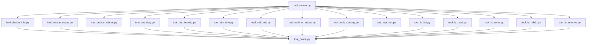
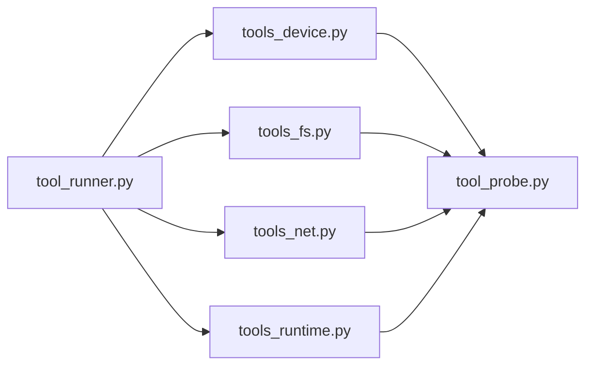
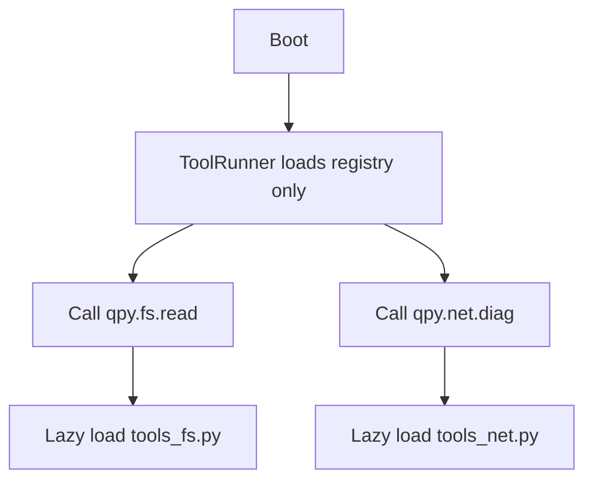

# qpyclaw-node Tools Consolidation Plan

## 1. 目标

这份文档只回答一件事:

在不改变 `qpyclaw-node` 对外命令面和协议行为的前提下, 如何把当前
`app/tools/` 的模块数量压下来, 并为下一步 lazy import 做准备。

## 2. 背景

当前运行时工具目录位于:

`project/qpyclaw/embed/qpyclaw-node/runtime/usr_mirror/app/tools`

当前事实:

1. `app/tools/` 一共有 `17` 个文件。
2. 其中 `14` 个小于 `1KB`。
3. `ToolRunner` 在启动时会全量导入这些工具模块。
4. 大量工具实现只是薄包装, 真正重逻辑集中在 `tool_probe.py`。

这意味着当前付出的不仅是“文件数量成本”, 还是“启动即全量 import 成本”。

## 3. 当前结构



## 4. 迁移原则

1. 不改命令名。
2. 不改返回结构。
3. 不改 `OPENCLAW_COMMANDS` 暴露面。
4. 先合并薄包装模块, 后做 lazy import。
5. 保留运行时关键边界, 不做“大一统单文件”。

## 5. 不动的边界

当前阶段不建议优先合并这些文件:

1. `transport_ws_openclaw.py`
2. `ws_client.py`
3. `runtime_state.py`
4. `command_worker.py`
5. `device_auth.py`
6. `config.py`
7. `config_local.*`

原因:

1. 它们承担的是传输、状态机、并发、认证和配置边界。
2. 它们不是当前“超小包装模块过多”的主战场。
3. 过早合并会显著降低调试可读性。

## 6. 目标结构

## 6.1 Phase 1 目标结构

第一轮只收敛 `app/tools/`。

```text
app/
  tool_runner.py
  tools/
    __init__.py
    tool_probe.py
    tools_device.py
    tools_fs.py
    tools_net.py
    tools_runtime.py
```

## 6.2 新文件职责

| 文件 | 承载内容 |
| --- | --- |
| `tools_device.py` | `qpy.device.info` `qpy.device.status` `qpy.device.reboot` |
| `tools_fs.py` | `qpy.fs.list` `qpy.fs.read` `qpy.fs.write` `qpy.fs.mkdir` `qpy.fs.remove` |
| `tools_net.py` | `qpy.net.diag` `qpy.net.ifconfig` `qpy.sim.info` `qpy.cell.info` |
| `tools_runtime.py` | `qpy.runtime.status` `qpy.tools.catalog` `qpy.repl.run` |
| `tool_probe.py` | 探针、解析、FS 公共函数、运行态聚合函数 |

## 6.3 类名兼容策略

第一轮建议保留现有类名, 只改变它们所在文件。

也就是:

1. `ToolDeviceInfo` 仍然叫 `ToolDeviceInfo`
2. `ToolFsWrite` 仍然叫 `ToolFsWrite`
3. `ToolNetDiag` 仍然叫 `ToolNetDiag`
4. `ToolReplRun` 仍然叫 `ToolReplRun`

这样做的好处:

1. `ToolRunner` 的注册逻辑几乎不需要重写。
2. 回归问题更容易定位。
3. 第一轮收益集中在减少模块数, 而不是改抽象。

## 7. 命令到文件映射

### 7.1 Device

| 命令 | 当前文件 | 目标文件 |
| --- | --- | --- |
| `qpy.device.info` | `tool_device_info.py` | `tools_device.py` |
| `qpy.device.status` | `tool_device_status.py` | `tools_device.py` |
| `qpy.device.reboot` | `tool_device_reboot.py` | `tools_device.py` |

### 7.2 Filesystem

| 命令 | 当前文件 | 目标文件 |
| --- | --- | --- |
| `qpy.fs.list` / `qpy.fs.ls` / `qpy.fs.tree` | `tool_fs_list.py` | `tools_fs.py` |
| `qpy.fs.read` | `tool_fs_read.py` | `tools_fs.py` |
| `qpy.fs.write` / `qpy.push` | `tool_fs_write.py` | `tools_fs.py` |
| `qpy.fs.mkdir` | `tool_fs_mkdir.py` | `tools_fs.py` |
| `qpy.fs.remove` | `tool_fs_remove.py` | `tools_fs.py` |

### 7.3 Network

| 命令 | 当前文件 | 目标文件 |
| --- | --- | --- |
| `qpy.net.diag` | `tool_net_diag.py` | `tools_net.py` |
| `qpy.net.ifconfig` | `tool_net_ifconfig.py` | `tools_net.py` |
| `qpy.sim.info` | `tool_sim_info.py` | `tools_net.py` |
| `qpy.cell.info` | `tool_cell_info.py` | `tools_net.py` |

### 7.4 Runtime

| 命令 | 当前文件 | 目标文件 |
| --- | --- | --- |
| `qpy.runtime.status` | `tool_runtime_status.py` | `tools_runtime.py` |
| `qpy.tools.catalog` / `qpy.help` | `tool_tools_catalog.py` | `tools_runtime.py` |
| `qpy.repl.run` | `tool_repl_run.py` | `tools_runtime.py` |

## 8. ToolRunner 改造边界

## 8.1 第一轮

第一轮只改 import 来源, 不改注册表模型。



这轮不引入新抽象:

1. 不引入动态注册器
2. 不引入元类
3. 不引入自动扫描目录

原因:

1. QuecPython 运行时更适合静态、直接、低魔法的结构。
2. 当前目标是少模块、少导入, 不是搞复杂框架。

## 8.2 第二轮

第二轮再改成按域懒加载。

目标形态:



建议做法:

1. `ToolRunner` 启动时只构造命令元数据。
2. 每个 entry 先只绑定 `domain` 与 `factory`。
3. 第一次命中该域命令时, 再执行 `__import__`。
4. 域模块加载后缓存实例。

## 9. 建议迁移顺序

## 9.1 Step 1

先新增:

1. `tools_device.py`
2. `tools_fs.py`
3. `tools_net.py`
4. `tools_runtime.py`

并把现有类实现复制过去, 保持类名不变。

## 9.2 Step 2

修改 `tool_runner.py` import, 切到新文件。

这一步完成后:

1. 老文件还可以先保留一个短暂兼容窗口
2. 方便快速回滚

## 9.3 Step 3

跑一轮设备回归:

1. `qpy.runtime.status`
2. `qpy.device.status`
3. `qpy.net.diag`
4. `qpy.fs.read`
5. `qpy.fs.write`
6. `qpy.repl.run`

## 9.4 Step 4

确认回归稳定后, 再删除旧的薄包装文件:

1. `tool_device_*`
2. `tool_fs_*`
3. `tool_net_*`
4. `tool_runtime_status.py`
5. `tool_tools_catalog.py`
6. `tool_repl_run.py`

## 9.5 Step 5

第二轮再做 lazy import。

## 10. 风险

## 10.1 低风险

1. 类名不变, 风险较低。
2. 命令注册名不变, 风险较低。
3. `tool_probe.py` 不动, 风险较低。

## 10.2 中风险

1. 合并后 import 路径变化, 可能引入循环依赖。
2. 个别工具如果隐含模块级初始化逻辑, 合并后可能改变执行顺序。
3. `qpy.repl.run` 这类动态执行工具, 需要特别做回归。

## 10.3 当前最大风险

第一轮如果同时做“模块合并 + lazy import”, 排障会变复杂。

所以建议:

1. Phase 1 只做模块合并
2. Phase 2 再做 lazy import

## 11. 验收口径

迁移完成后至少满足:


具体验收项:

1. `app/tools/` 目录总文件数从 `17` 下降到 `6`
2. 薄包装 `tool_*` 文件从 `15` 个下降到 `0`
3. `OPENCLAW_COMMANDS` 不变
4. 命令别名不变
5. 现有云端已验证命令全部通过回归
6. 设备可继续从 `COM11` 调试

## 12. 当前建议

当前最合理的执行路线是:

1. 先按 `device/fs/net/runtime` 四组收敛工具模块
2. 第一轮只改文件组织, 不改对外行为
3. 回归稳定后, 再做 `ToolRunner` 的 lazy import
4. 最后再评估是否处理 `json_codec.py` 这类低收益小文件

这条路线能同时满足:

1. 设备内存优化
2. 文件数量收敛
3. 调试边界保留
4. 后续语音、屏幕、外设功能继续扩展
