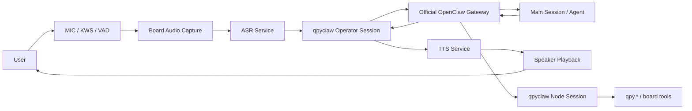
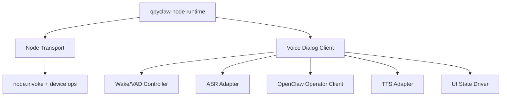

# qpyclaw-node Voice Dialog V1

## 1. 文档目标

回答 3 个问题：

1. 现在是否已经可以开始做 `qpyclaw-node <-> OpenClaw` 语音对话
2. `OpenClaw` 当前是否必须改造
3. `qpyclaw-node` 语音对话 `V1` 的最短落地路径是什么

## 2. 截止判断日期

本文判断基于：

1. 本地仓库代码状态：`2026-03-30`
2. OpenClaw 官方文档在线状态：`2026-03-30`

## 3. 先给结论

### 3.1 是否可以开始

可以开始。

当前不是“语音对话已经完成”，而是“已经具备进入语音对话实现阶段的前提条件”。

### 3.2 是否必须先改 OpenClaw

`V1` 不需要先改 `OpenClaw` Core / Gateway 协议。

推荐优先做法是：

1. 保留现有 `qpyclaw-node` 的 `role: node` 能力面
2. 为语音对话新增一条 `role: operator` 会话
3. 设备本地完成：
   - 唤醒 / VAD
   - 音频采集
   - ASR
   - TTS 播放
4. 向 OpenClaw 发送文本 transcript，而不是原始音频流

### 3.3 什么情况下需要改 OpenClaw

只有在下面目标成立时，才建议改 OpenClaw：

1. 希望 `qpyclaw-node` 与 Gateway 之间传输原始 `PCM / Opus` 音频流
2. 希望 Gateway 负责服务端 VAD、缓存、打断、混音或媒体转发
3. 希望把“语音会话”从客户端能力升级为“协议级媒体面”

换句话说：

1. `V1` 做“文本会话驱动的语音终端”，不必改 Gateway
2. `V2+` 做“原生媒体流节点”，才需要改 Gateway

## 4. 当前已具备的本地能力

## 4.1 板级音频骨架已经到位

`EC800MCNLE` 音频板本地已经具备：

1. 本地 Opus 音频流打开 / 关闭
2. 本地音频帧读 / 写
3. 本地 KWS 启停
4. 本地 VAD 启停
5. 本地音量控制
6. 本地音频播放

对应代码：

1. [board_audio.py](C:\Users\kingd\Desktop\code\lcc-ai-team\embed\project\qpyclaw\boards\ec800mcnle-audio-board\code\board_audio.py#L60)
2. [board_bootstrap.py](C:\Users\kingd\Desktop\code\lcc-ai-team\embed\project\qpyclaw\boards\ec800mcnle-audio-board\code\board_bootstrap.py#L186)
3. [boards/ec800mcnle-audio-board/README.md](C:\Users\kingd\Desktop\code\lcc-ai-team\embed\project\qpyclaw\boards\ec800mcnle-audio-board\README.md#L28)

## 4.2 当前运行时仍是控制面，不是媒体面

当前 `qpyclaw-node` 运行时：

1. WebSocket 仍然按“文本帧 + JSON”工作
2. 当前只实现了命令控制面和结果回传
3. 当前主要消费 `node.invoke.request`
4. 默认角色仍然是 `node`

对应代码：

1. [qpyclaw_node.py](C:\Users\kingd\Desktop\code\lcc-ai-team\embed\project\qpyclaw\embed\qpyclaw-node\runtime\usr_mirror\qpyclaw_node.py#L32)
2. [qpyclaw_node.py](C:\Users\kingd\Desktop\code\lcc-ai-team\embed\project\qpyclaw\embed\qpyclaw-node\runtime\usr_mirror\qpyclaw_node.py#L149)
3. [qpyclaw_node.py](C:\Users\kingd\Desktop\code\lcc-ai-team\embed\project\qpyclaw\embed\qpyclaw-node\runtime\usr_mirror\qpyclaw_node.py#L3155)
4. [qpyclaw_node.py](C:\Users\kingd\Desktop\code\lcc-ai-team\embed\project\qpyclaw\embed\qpyclaw-node\runtime\usr_mirror\qpyclaw_node.py#L3169)

## 4.3 项目自身也还未宣布语音会话已完成

发布说明当前仍明确写着：

1. 完整语音会话能力还在推进中
2. 当前还不是稳定公开承诺能力

对应文件：

1. [CHANGELOG.md](C:\Users\kingd\Desktop\code\lcc-ai-team\embed\project\qpyclaw\CHANGELOG.md#L35)

## 5. OpenClaw 官方文档给出的边界

截至 `2026-03-30`，官方文档给出的关键信号是：

## 5.1 Gateway 协议是控制面

官方 Gateway Protocol 说明：

1. Gateway WS 是统一控制面与 node 传输面
2. 传输是 `WebSocket text frames with JSON payloads`
3. 节点与 operator 都在同一 WS 协议下，以 `role + scopes` 区分

来源：

1. [Gateway Protocol](https://docs.openclaw.ai/gateway/protocol)

### 5.2 Nodes 主要暴露命令面

官方 Nodes 文档说明：

1. `node` 连接到 Gateway WS
2. 节点通过 `node.invoke` 暴露命令面

来源：

1. [Nodes](https://docs.openclaw.ai/nodes)

### 5.3 Talk Mode 是“语音前端 + 文本会话”

官方 Talk Mode 文档说明：

1. 先听音
2. 把 transcript 发给模型
3. 等待回复
4. 本地播放 TTS

文档中明确写了：

1. `Send transcript to the model (main session, chat.send)`
2. `Speak it via ElevenLabs (streaming playback)`

来源：

1. [Talk Mode](https://docs.openclaw.ai/nodes/talk)
2. [Talk Mode](https://docs.openclaw.ai/talk)

### 5.4 Voice Wake 是客户端局部体验 + Gateway 全局配置

官方 Voice Wake 文档说明：

1. 唤醒词列表由 Gateway 统一维护
2. 设备本地仍各自负责启停与体验

来源：

1. [Voice Wake](https://docs.openclaw.ai/nodes/voicewake)

## 6. 核心判断

## 6.1 直接判断

OpenClaw 当前已经支持我们做：

1. 设备作为 `node` 暴露本地能力
2. 设备作为“语音终端”把 transcript 送入 `main session`
3. 设备本地做 TTS 回放

OpenClaw 当前没有直接承诺的，是：

1. 节点与 Gateway 之间的二进制音频媒体流协议
2. 基于 Gateway 的服务端音频会话编排
3. `PCM / Opus` 原始流的标准 node transport

## 6.2 推导结论

下面这个结论是基于官方文档和当前本地代码的工程推导：

1. `qpyclaw-node` 应该实现成“OpenClaw Talk Mode 的 QuecPython 终端形态”
2. `V1` 采用“文本驱动语音对话”而不是“媒体流驱动语音对话”
3. 为了不破坏当前 `node.invoke` 模式，推荐使用双连接模型

这是推导，不是 OpenClaw 文档里的逐字定义。

## 7. 推荐 V1 架构

## 7.1 双连接模型

推荐让设备同时维持两条逻辑连接：

| 连接 | 角色 | 用途 |
| --- | --- | --- |
| `Node Session` | `role: node` | 继续承接 `node.invoke`、设备运维、板级工具 |
| `Operator Session` | `role: operator` | 负责把语音 transcript 发到 `main`，并收回回复文本 |

## 7.2 为什么不把两者混成一条连接

因为当前 `node` 路径已经稳定承接：

1. 工具调用
2. 运维命令
3. 板级能力扩展

如果把语音对话也强塞进 `node.invoke`：

1. 会让“语音聊天”和“设备运维”耦合
2. 会把 Gateway 现有聊天能力绕开
3. 会迫使我们自己发明新的 node 内部聊天协议

## 7.3 为什么推荐先做半双工

推荐 `V1` 先做：

1. 唤醒
2. 录音
3. 静音窗口判定
4. 一次性发送 transcript
5. 等待回复
6. TTS 播放

也就是标准半双工 `Listening -> Thinking -> Speaking`。

原因：

1. 蜂窝网络抖动对连续全双工更敏感
2. QuecPython 资源预算更适合先做半双工
3. 本地回声消除、打断恢复、流式重采样、媒体缓存都不适合首批一起上

## 8. V1 模块拆分建议

## 8.1 Node Transport

职责：

1. 保持当前 `role: node`
2. 不动当前 `node.invoke` 和结果回传模型
3. 继续承接 `qpy.*` 与板级工具

## 8.2 Voice Dialog Client

职责：

1. 管理一次语音会话生命周期
2. 调用本地 KWS / VAD / audio stream
3. 对接 ASR / TTS
4. 管理 UI 三态
5. 与 OpenClaw `main` session 做文本轮转

## 8.3 ASR Adapter

`V1` 推荐外部服务化，不放进 OpenClaw Gateway：

1. 设备采集音频
2. 直接调用 ASR 云服务
3. 返回文本 transcript

原因：

1. 与官方 Talk Mode 方向一致
2. 不需要修改 Gateway 协议
3. 可以独立更换供应商

## 8.4 TTS Adapter

`V1` 同样推荐外部服务化：

1. 从 OpenClaw 收到文本
2. 设备调用 TTS 服务生成音频
3. 本地喇叭播放

## 8.5 UI State Driver

至少先支持 3 态：

1. `Listening`
2. `Thinking`
3. `Speaking`

`EC800MCNLE` 上可直接利用现有屏幕 / 表情资源做反馈。

## 9. V1 与 OpenClaw 的边界

## 9.1 `V1` 不要求 OpenClaw 改造的部分

1. Gateway WS 基础连接
2. 设备 pairing / auth
3. `role: node` 设备能力暴露
4. `main session` 文本聊天入口
5. Voice Wake 全局触发词配置

## 9.2 `V1` 可能需要的只是配置与接入，不是 Core 改造

1. 给设备分配合适的 operator token / scope
2. 明确设备使用的目标 session
3. 明确 transcript 的发送入口与回复读取入口
4. 明确设备在 Gateway 中的配对 / 命名 / 展示策略

这些更偏接入与权限配置，不是协议重构。

## 9.3 `V2+` 才需要考虑的 Gateway 改造

如果以后要做下面能力，再讨论改 OpenClaw：

1. 原始 `PCM / Opus` 流经 Gateway 中转
2. Gateway 级媒体会话协商
3. 统一的 audio session id / stream id
4. 服务端 barge-in / interruption
5. 多节点音频桥接

## 10. 分阶段落地建议

| 阶段 | 目标 | 是否改 OpenClaw |
| --- | --- | --- |
| `P0` | 板级音频链路自测，录音 / 播放 / VAD / KWS 全通过 | 否 |
| `P1` | `qpyclaw-node` 新增 Voice Dialog Client 骨架 | 否 |
| `P2` | 接 ASR，做到“说完一句 -> 得到 transcript” | 否 |
| `P3` | 新增 Operator Session，把 transcript 发入 OpenClaw | 否 |
| `P4` | 收回复文本并做 TTS 播放 | 否 |
| `P5` | UI 三态、打断、超时、重连 | 否 |
| `P6` | 评估是否需要媒体流协议扩展 | 视情况 |

## 11. 当前最短路径

当前最短路径不是改 Gateway，而是：

1. 先在 `qpyclaw-node` 增加 `Voice Dialog Client`
2. 先做半双工
3. 先做双连接：
   - `node`
   - `operator`
4. 先用文本 transcript 驱动 OpenClaw 主会话
5. 最后再看是否值得把音频媒体面上升到 OpenClaw 协议层

## 12. 风险清单

| 风险 | 说明 | `V1` 处理策略 |
| --- | --- | --- |
| 双连接资源开销 | QuecPython 同时维护 `node + operator` 两条 WS | 先半双工，严格控内存 |
| 蜂窝时延波动 | ASR / TTS / chat 都受蜂窝影响 | 做本地超时、重试、状态提示 |
| 会话路由不清晰 | transcript 发到哪个 session | 固定 `main`，后续再支持配置 |
| 权限配置不当 | `operator` token / scope 不够 | 先最小可用权限 |
| 声学体验不稳定 | 回声、误唤醒、误触发 | `V1` 先不追求全双工和 AEC |

## 13. 下一步建议

建议下一步直接产出一份实现设计，不先改 Gateway 代码。

下一份文档建议是：

1. `qpyclaw-node Voice Dialog Implementation Plan`

应包含：

1. 运行时模块拆分
2. Operator Session 最小接口
3. ASR / TTS 供应商适配层
4. `Listening / Thinking / Speaking` 状态机
5. 设备侧超时、重试、恢复策略
