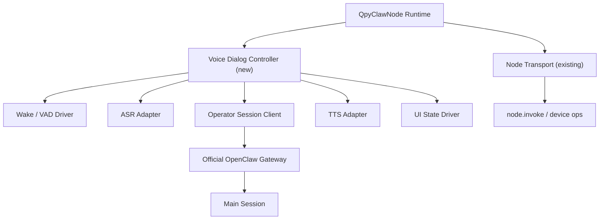
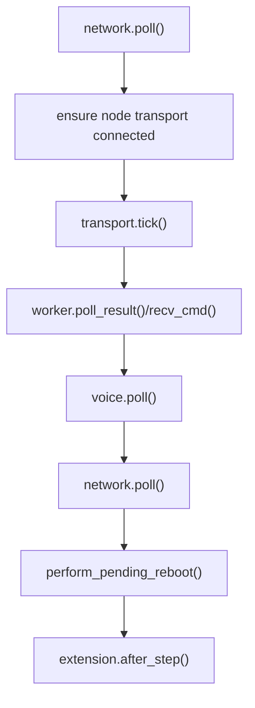
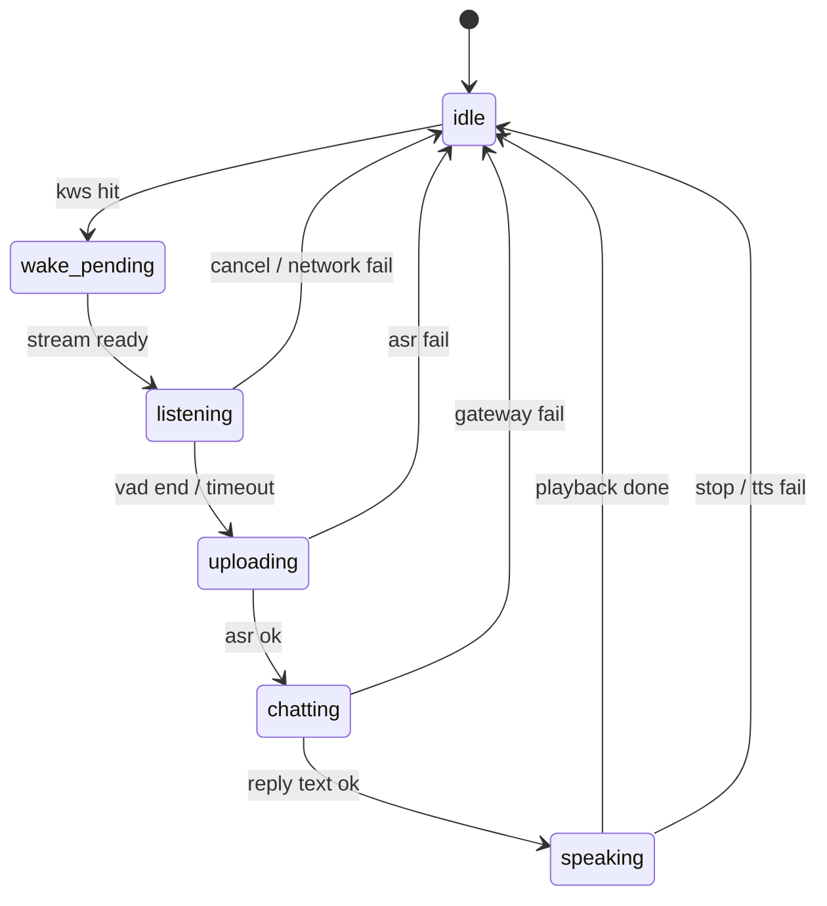
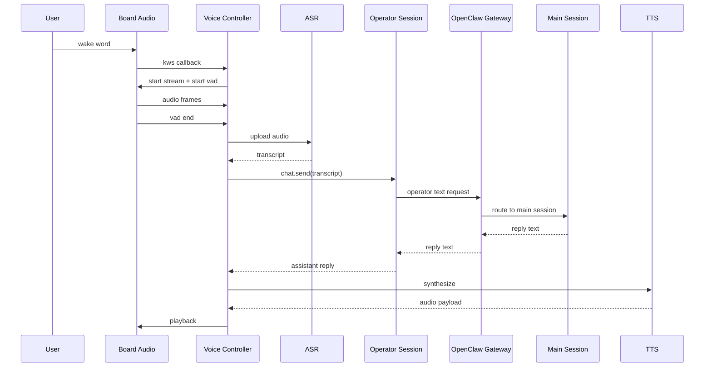

# qpyclaw-node Voice Dialog Implementation Plan

## 1. 文档目标

这份文档不是再判断“能不能做”，而是把 [08-qpyclaw-node-voice-dialog-v1.md](08-qpyclaw-node-voice-dialog-v1.md) 的路线结论，继续收敛成可执行的实现计划。

本文重点回答 4 个问题：

1. `qpyclaw-node` 语音对话 `V1` 到底落在哪些代码接入点
2. 在“尽量保持单文件 runtime”的前提下，运行时应该如何拆职责
3. `EC800MCNLE` 音频板怎样接入，而不把板级逻辑污染到通用 runtime
4. 首版实现应该按什么顺序推进，验收口径是什么

## 2. 截止基线

本文基于以下仓库状态编写：

1. 本地项目状态：`2026-03-31`
2. `qpyclaw-node` 通用 runtime：`embed/qpyclaw-node/runtime/usr_mirror/qpyclaw_node.py`
3. `EC800MCNLE` 板级扩展：`boards/ec800mcnle-audio-board/code/`
4. 语音路线判断稿：[08-qpyclaw-node-voice-dialog-v1.md](08-qpyclaw-node-voice-dialog-v1.md)

## 3. 目标与非目标

### 3.1 V1 目标

| 项目 | 目标 |
| --- | --- |
| 网络模型 | 保留现有 `role: node` 会话，并新增一条 `role: operator` 会话 |
| 对话模式 | 先做半双工：`Listening -> Thinking -> Speaking` |
| 音频处理 | 设备本地完成 `KWS / VAD / 采集 / 播放` |
| AI 接入 | 设备把 `transcript` 发到官方 `OpenClaw Gateway`，文本回复再本地 TTS |
| 板级体验 | `EC800MCNLE` 上提供屏幕状态反馈、音频播放反馈、联网状态反馈 |
| 工程约束 | 通用运行时尽量继续保持 `qpyclaw_node.py` 单文件收敛，配置继续优先放 `config_local.py` |

### 3.2 V1 非目标

| 项目 | 不做 |
| --- | --- |
| Gateway 协议 | 不在 `V1` 新增 `PCM / Opus` 媒体流协议 |
| OpenClaw Core | 不要求先改官方 `OpenClaw` core / gateway 核心实现 |
| 语音模式 | 不先做全双工、回声消除、打断恢复、服务端混音 |
| 通用板卡 | 不要求 `V1` 一次性覆盖所有 QuecPython 板卡 |
| runtime 文件结构 | 不为了语音功能把 runtime 再拆成一堆新的通用 `.py` 文件 |

## 4. 现有代码接入点

| 文件 | 当前作用 | 语音实现落点 |
| --- | --- | --- |
| [../../embed/qpyclaw-node/runtime/usr_mirror/qpyclaw_node.py](../../embed/qpyclaw-node/runtime/usr_mirror/qpyclaw_node.py) | 通用 node runtime、WebSocket、工具执行、网络重连 | 新增 operator 会话、语音状态机、ASR/TTS 适配器、语音配置 |
| [../../boards/ec800mcnle-audio-board/code/board_bootstrap.py](../../boards/ec800mcnle-audio-board/code/board_bootstrap.py) | 板级扩展注册、屏幕/音频/充电接入、runtime hook | 增加语音钩子暴露、UI 状态联动、板级最小封装 |
| [../../boards/ec800mcnle-audio-board/code/board_audio.py](../../boards/ec800mcnle-audio-board/code/board_audio.py) | 本地音频流、KWS、VAD、播放 | 继续作为板级音频底座，不把这里的实现抄回通用 runtime |
| [../../embed/qpyclaw-node/examples/ec800mcnle-audio-board/main.example.py](../../embed/qpyclaw-node/examples/ec800mcnle-audio-board/main.example.py) | 板级示例入口 | 切换为语音版启动样例 |

### 4.1 已验证可复用的关键事实

1. 当前通用 runtime 的传输层仍是 `WebSocket text frames + JSON`，而不是媒体流。
2. 当前主循环已具备稳定接入点：`QpyClawNode.step()` 可安全插入额外轮询逻辑。
3. 当前 extension 机制已经可用：
   - `on_runtime_created`
   - `on_online_changed`
   - `after_step`
4. 当前板级扩展已经能驱动：
   - 显示在线/离线/错误态
   - 本地音频流开关
   - 本地 `KWS / VAD`
   - 本地音频播放

这意味着 `V1` 不是从零开始，而是在现有 runtime 和板级扩展之间增加一层“语音对话控制面”。

## 5. 设计原则

### 5.1 通用 runtime 继续单文件收敛

基于 [../research/2026-03-29-quecpython-module-count-memory-study.md](../research/2026-03-29-quecpython-module-count-memory-study.md) 的结论，`V1` 继续遵守下面约束：

1. 通用逻辑优先继续收敛在 `qpyclaw_node.py`
2. 不为语音功能新增多份通用 runtime `.py` 文件
3. 若必须新增配置，优先沿用现有 `config_local.py`
4. 板级专有逻辑继续留在 `boards/ec800mcnle-audio-board/code/`

### 5.2 先保住 `node.invoke`，再加语音

语音对话不能破坏当前已经打通的：

1. `role: node`
2. `node.invoke`
3. 设备运维工具
4. 网络恢复与重连路径

所以 `V1` 不是把语音塞进现有工具调用链，而是新增一条并行的 `operator` 文本会话链。

### 5.3 优先半双工，而不是一开始追求“像电话”

对 `EC800M` 这类蜂窝设备，首版更合理的是：

1. 唤醒
2. 录音
3. 静音判停
4. 一次性 ASR
5. 文本发往 `OpenClaw`
6. 收回文本
7. TTS 播放
8. 回到待机

这比一开始就上全双工更容易稳定落地，也更适合 QuecPython 当前资源预算。

## 6. 推荐运行时拓扑

## 7. 单文件 runtime 内部职责拆分

下面的“模块”指的是 `qpyclaw_node.py` 内部新增类或新增逻辑块，不代表要拆成新的 `.py` 文件。

| 模块 | 建议位置 | 职责 | 是否通用 |
| --- | --- | --- | --- |
| `Node Transport` | 现有实现 | 继续负责 `role: node` 的连接、`node.invoke` 收发 | 是 |
| `Operator Session Client` | `qpyclaw_node.py` 新增 | 建立 `role: operator` 会话，负责 `main session` 文本聊天 | 是 |
| `Voice Dialog Controller` | `qpyclaw_node.py` 新增 | 管理整条语音生命周期与状态机 | 是 |
| `ASR Adapter` | `qpyclaw_node.py` 新增 | 屏蔽外部 ASR 提供方差异 | 是 |
| `TTS Adapter` | `qpyclaw_node.py` 新增 | 屏蔽外部 TTS 提供方差异 | 是 |
| `Voice Hook Bridge` | `qpyclaw_node.py` 新增 | 把通用 runtime 和板级 `audio/display` 钩子对接起来 | 是 |
| `EC800MCNLE Board Audio` | 板级目录保留 | 实现真实 `mic / speaker / kws / vad / display` | 否 |

## 8. 板级扩展最小契约

为避免 `qpyclaw_node.py` 直接依赖某块板子的类名，建议通过 extension 暴露最小语音契约。

### 8.1 推荐契约

| 接口 | 返回/参数 | 作用 |
| --- | --- | --- |
| `get_voice_hooks()` | `dict` | 返回语音相关回调和能力标记 |
| `voice_hooks["open_stream"]` | `callable()` | 打开音频流 |
| `voice_hooks["close_stream"]` | `callable()` | 关闭音频流 |
| `voice_hooks["read_frame"]` | `callable(frame_ms)` | 读取音频帧 |
| `voice_hooks["write_frame"]` | `callable(data)` | 播放音频帧 |
| `voice_hooks["start_kws"]` | `callable()` | 启动唤醒 |
| `voice_hooks["stop_kws"]` | `callable()` | 停止唤醒 |
| `voice_hooks["set_kws_callback"]` | `callable(callback)` | 注册唤醒回调 |
| `voice_hooks["start_vad"]` | `callable()` | 启动 VAD |
| `voice_hooks["stop_vad"]` | `callable()` | 停止 VAD |
| `voice_hooks["set_vad_callback"]` | `callable(callback)` | 注册 VAD 回调 |
| `voice_hooks["show_state"]` | `callable(state, meta)` | 切换板级 UI 状态 |

### 8.2 为什么要走这层契约

1. 通用 runtime 不需要 import 板级专有类
2. 未来更换 `EC600M`、`EC200U` 等板卡时，只改板级扩展即可
3. 能继续保持 `qpyclaw-node` 的“单文件通用 runtime + 板级 example”结构

## 9. 主循环接入方案

当前 `QpyClawNode.step()` 已经稳定承担：

1. 网络就绪检查
2. node transport 连接
3. `node.invoke` 命令处理
4. `after_step` 板级 tick

`V1` 推荐在不打乱现有语义的前提下，插入 `voice.poll()`。

### 9.1 推荐执行顺序

### 9.2 这样安排的原因

1. 先保证 `node.invoke` 路径优先级不下降
2. 语音逻辑即使短时失败，也不应拖垮设备运维链路
3. 板级 UI 刷新继续通过 `after_step()` 收敛

## 10. 语音状态机

### 10.1 各状态职责

| 状态 | 职责 | 退出条件 |
| --- | --- | --- |
| `idle` | 保持联网、等待唤醒、UI 显示待机 | `KWS` 命中 |
| `wake_pending` | 关闭重复唤醒、准备音频流和 VAD | 音频流就绪 |
| `listening` | 录音、累计帧、等待静音结束 | `VAD` 结束或超时 |
| `uploading` | 把音频送给 ASR，拿回 transcript | ASR 成功或失败 |
| `chatting` | transcript 发给 OpenClaw `main session`，等待回复 | 收到文本回复或超时 |
| `speaking` | TTS 转音频并播放 | 播放完成或失败 |

### 10.2 半双工策略

`V1` 明确采用半双工：

1. `listening` 时不播报
2. `speaking` 时不继续录音
3. 如果有新唤醒，默认只在下一轮会话开始时处理

这样可以把蜂窝抖动、板级音频竞争、内存峰值都控制在更小范围内。

## 11. 一次完整语音会话时序

## 12. 配置建议

`V1` 建议继续使用 `config_local.py` 承载增量配置，不再额外引入新的 runtime 配置模块。

| 配置项 | 建议值/示例 | 作用 |
| --- | --- | --- |
| `VOICE_ENABLED` | `True` | 总开关 |
| `VOICE_MODE` | `"half_duplex"` | 首版固定半双工 |
| `VOICE_OPERATOR_AUTH_TOKEN` | `""` | `role: operator` 会话 token |
| `VOICE_OPERATOR_SCOPES` | `["chat"]` | operator 权限范围 |
| `VOICE_MAIN_SESSION_KEY` | `"main"` | 目标对话 session |
| `VOICE_WAKEWORD` | `"_xiao_zhi_xiao_zhi"` | 唤醒词 |
| `VOICE_WAKE_THRESHOLD` | `0.7` | 唤醒阈值 |
| `VOICE_FRAME_MS` | `60` | 采集帧长 |
| `VOICE_MAX_RECORD_MS` | `12000` | 最长录音时长 |
| `VOICE_VAD_SILENCE_MS` | `800` | 静音结束判定 |
| `VOICE_ASR_PROVIDER` | `"http_json"` | ASR 适配器类型 |
| `VOICE_ASR_URL` | `""` | ASR 服务地址 |
| `VOICE_ASR_AUTH_TOKEN` | `""` | ASR 鉴权 |
| `VOICE_TTS_PROVIDER` | `"http_json"` | TTS 适配器类型 |
| `VOICE_TTS_URL` | `""` | TTS 服务地址 |
| `VOICE_TTS_AUTH_TOKEN` | `""` | TTS 鉴权 |
| `VOICE_UI_ENABLED` | `True` | 屏幕/表情/UI 状态反馈 |
| `VOICE_AUTO_RESUME_KWS` | `True` | 一轮对话结束后自动恢复待唤醒 |

### 12.1 Token 策略

`V1` 推荐：

1. `node` 会话继续用当前 node token
2. `operator` 会话使用独立 token
3. 若部署上允许同设备复用同一凭据，也应在配置层明确区分两个角色用途

## 13. 故障与重连策略

### 13.1 设计原则

语音失败不应拖垮 node 运维链路。

所以推荐分层处理：

| 故障类型 | 处理方式 |
| --- | --- |
| 蜂窝掉线 | 复用现有网络恢复逻辑，语音状态机回到 `idle` |
| `operator` 会话断开 | 只重连 operator，会话失败后恢复待机 |
| ASR 失败 | 丢弃本轮录音，提示失败，回到待机 |
| TTS 失败 | 允许只显示文本态，不阻塞主循环 |
| 板级音频失败 | 关闭本轮语音，保留 `node.invoke` |
| UI 刷新失败 | 吞掉板级异常，不能影响通用 runtime 主循环 |

### 13.2 恢复顺序

1. 先恢复网络
2. 再恢复 `node` transport
3. 再恢复 `operator` 会话
4. 最后恢复 `KWS / idle`

这样可以保证设备始终优先保持“可运维”。

## 14. 实施里程碑

### 14.1 P0: 文本链路打通

目标：先不纠结真实语音，把“设备侧 operator 对话链”打通。

| 项目 | 验收 |
| --- | --- |
| `operator` 会话 | 设备能独立建立第二条连接 |
| 文本对话 | 设备可把一段固定 transcript 发到 `main session` 并收回回复 |
| 故障恢复 | `operator` 断线不影响 `node.invoke` |
| 配置 | `config_local.py` 可控制开关与 token |

### 14.2 P1: EC800MCNLE 语音闭环

目标：把板级真实音频、显示和文本对话接起来。

| 项目 | 验收 |
| --- | --- |
| `KWS / VAD` | 唤醒后能录音并在静音时结束 |
| ASR | 录音可转 transcript |
| OpenClaw | transcript 可进入 `main session` |
| TTS | 回复文本可播放 |
| UI | 至少显示 `Listening / Thinking / Speaking` 三态 |

### 14.3 P2: 稳定性和开源收口

目标：把它从“演示能跑”推进到“开源可用”。

| 项目 | 验收 |
| --- | --- |
| 自动重连 | 蜂窝波动后能自动恢复到待机 |
| 失败隔离 | 语音异常不拖垮 node 主链路 |
| 文档 | Quickstart、配置样例、板级说明齐全 |
| 示例 | `main.example.py` 成为最短可跑入口 |

## 15. 推荐开发顺序

1. 先在 `qpyclaw_node.py` 内加 `Operator Session Client`
2. 再加 `Voice Dialog Controller`，先用假 transcript 跑通 `main session`
3. 然后把 `EC800MCNLE` 的 `KWS / VAD / 音频流` 接进来
4. 再接 ASR/TTS
5. 最后补 UI 状态联动、失败恢复和示例入口

这个顺序的好处是：每一步都能独立验收，不需要一次性把所有外设和云服务一起压上。

## 16. 当前结论

到这一层，`qpyclaw-node` 的语音方案已经不是概念讨论，而是可直接进入编码阶段的实现蓝图：

1. 架构上采用双连接：`node + operator`
2. 协议上继续复用官方 `OpenClaw Gateway` 文本对话能力
3. 设备上先做半双工语音终端
4. 工程上继续坚持“单文件通用 runtime + 板级目录承接专有能力”

下一份更细的文档，应该进入“事件格式 / operator API 映射 / config 字段最终命名 / 具体编码任务拆单”层面，而不是再讨论总方向。
