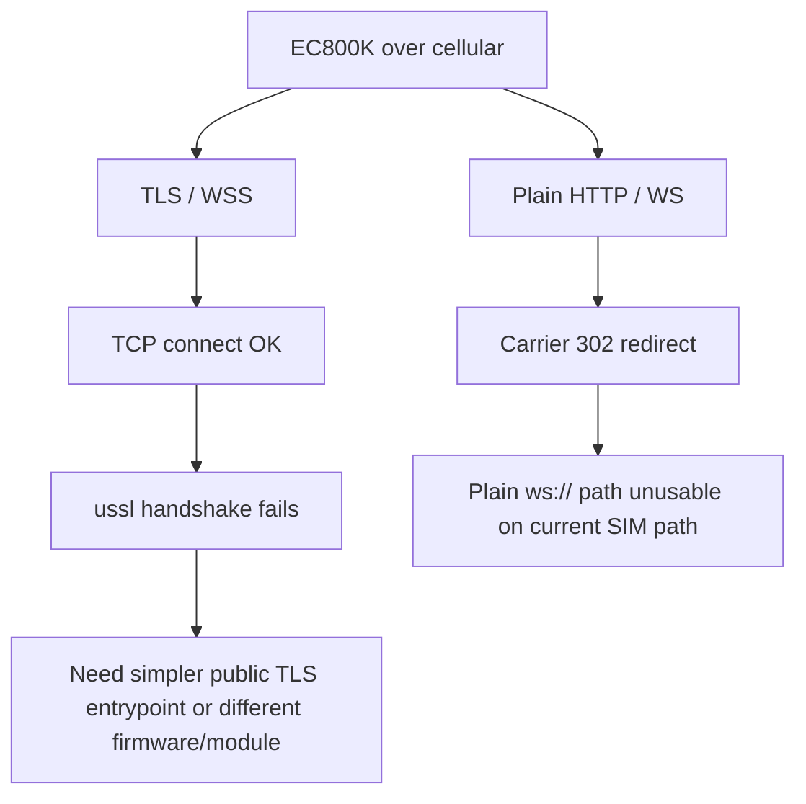

# Cloud OpenClaw Probe

## Purpose

Replace the local PeanutShell path with the public OpenClaw server on
`124.70.221.88`, then verify whether `EC800KCNLC` can reach it directly.

As of the latest pass, local PeanutShell mapping is no longer part of the
active bring-up path. Device configuration is now pinned to the cloud server
only.

## Server Reality

SSH verification succeeded on `2026-03-27`.

| Item | Result |
| --- | --- |
| Host | `124.70.221.88` |
| Hostname | `hcss-ecs-8836` |
| Gateway process | `openclaw-gateway` |
| Public listener | `0.0.0.0:18789` |
| Extra public probe port | `18790` |
| Extra local listeners | `127.0.0.1:18791`, `127.0.0.1:18792` |
| Auth mode | `token` |
| Bind mode | `lan` |

This means the cloud server already removes the local NAT problem. The
remaining problem is transport compatibility between the board and a public
OpenClaw entrypoint.

## Device Result Matrix

| Probe | Target | Result |
| --- | --- | --- |
| Plain HTTP baseline | `www.baidu.com:80` | `302` redirect to `service.sh.189.cn` |
| Plain HTTP / WS to cloud gateway | `124.70.221.88:18789` | same `302` telecom redirect |
| TLS baseline | `www.baidu.com:443` | raw TCP OK, `ussl.wrap_socket` fails with `ECONNRESET` |
| TLS to previous public host | `282r41l383.oicp.vip:443` | raw TCP OK, `ussl.wrap_socket` fails with `ECONNRESET` |
| TLS to simple public cloud probe | `124.70.221.88:18790` | raw TCP OK, `ussl.wrap_socket` still fails with `ECONNRESET` |
| High-level HTTPS API | `request.get("https://124.70.221.88:18790/")` | `HTTPS USSL '[Errno 104] ECONNRESET'` |
| Runtime pointed at cloud gateway | `ws://124.70.221.88:18789` | `CONNECT_FAILED: handshake failed: HTTP/1.1 302 Found` |

## Current Device State

After the board re-enumerated and runtime was verified, the following was
confirmed on `2026-03-27`:

| Item | Result |
| --- | --- |
| AT port | `COM13` |
| REPL port | `COM14` |
| Firmware | `EC800KCNLCR07A03M04_OCPU_QPY` |
| SIM | inserted / ready |
| Registration | OK |
| IPv4 | `10.85.154.6` |
| `/usr` runtime | intact |
| `/usr/app/config_local.py` | updated to `ws://124.70.221.88:18789` |
| Runtime auth token | present on device |

## Legacy Runtime A/B Check

To rule out a regression introduced by the new `qpyclaw` runtime itself, the
historical `lcc-claw-node-qpy` runtime was side-loaded onto the same board on
`2026-03-27`.

Test arrangement:

1. old runtime files were staged under `/usr/legacy_lcc/app`
2. a legacy-specific `config.py` was generated on device
3. the same cloud gateway URL and the same live token were reused
4. a distinct `device_id` was assigned to avoid node identity collision

Observed result:

| Runtime | Target | Result |
| --- | --- | --- |
| current `qpyclaw-node` | `ws://124.70.221.88:18789` | `handshake failed: HTTP/1.1 302 Found` |
| historical `lcc-claw-node-qpy` | `ws://124.70.221.88:18789` | `handshake failed: HTTP/1.1 302 Found` |

This matters because it removes one major source of ambiguity:

The current failure is not explained by a `qpyclaw`-specific regression alone.
The older runtime hits the same transport wall on the same cellular path.

## Interpreted Meaning



The cloud server itself is not the blocker.

The blockers are:

1. Current SIM/operator path rewrites plaintext HTTP traffic, so plain
   `ws://124.70.221.88:18789` is not reliable for `qpyclaw-node`.
2. Current `EC800K` firmware fails outbound TLS handshake before HTTP or
   WebSocket upgrade even on public HTTPS sites.
3. This is not only a low-level probe artifact. The official `request` module
   fails the same way against a deliberately simplified cloud TLS endpoint.

## TLS Clue From Host Side

The previous public HTTPS endpoint `282r41l383.oicp.vip:443` negotiates:

| Mode | Result |
| --- | --- |
| default | `TLSv1.3 / TLS_AES_128_GCM_SHA256` |
| forced TLS 1.2 | `TLSv1.2 / ECDHE-RSA-AES128-GCM-SHA256` |

So the endpoint is not ECDSA-only. It does support TLS 1.2, but with a modern
ECDHE + AES-GCM profile.

## Temporary Cloud TLS Probe

A temporary public TLS listener was started on `124.70.221.88:18790` with a
very broad compatibility profile:

```text
no TLS 1.3 + ALL:@SECLEVEL=0
```

Host-side external handshake succeeded with:

```text
TLSv1.2 / ECDHE-RSA-AES256-GCM-SHA384
```

But the EC800K board still failed both:

1. low-level `ussl.wrap_socket`
2. high-level `request.get("https://124.70.221.88:18790/")`

That narrows the problem further:

1. the public cloud path is reachable
2. the TLS server can negotiate with a normal desktop client
3. the failure is now strongly attributable to current `EC800K` TLS capability
   or current firmware behavior

The temporary listener was later stopped and verified closed from the host
side.

## Firmware Direction

Local firmware review cache already contains a newer EC800K CNLC stable line.

| Package | Date | Note |
| --- | --- | --- |
| `V0004` | `2025-05-25` | current recommended candidate |
| `V0003` | `2025-03-21` | previous stable |
| `V0002` | `2024-10-24` | notes mention `request` / `ussl` related fixes |

Current board firmware is:

```text
EC800KCNLCR07A03M04_OCPU_QPY
```

The package-version naming does not map 1:1 to the runtime ATI string. That
firmware path was already rechecked live against the official Quectel endpoint,
and `V0004` was reflashed during this bring-up cycle. The board still reports
`EC800KCNLCR07A03M04_OCPU_QPY`, and the TLS/plain-WS findings above did not
improve after that attempt.

## Decision

Switching to the cloud OpenClaw server is the right direction, but `EC800KCNLC`
still cannot act as a direct official OpenClaw Mode B node over the current
cellular path.

The evidence now shows both failure branches directly against the cloud path:

1. plain `ws://124.70.221.88:18789` is intercepted and becomes
   `HTTP/1.1 302 Found`
2. `wss://...` remains blocked earlier at `ussl.wrap_socket` with
   `ECONNRESET`

## Recommended Next Step

Do not spend more time trying to force direct official-cloud transport on the
current `EC800KCNLC` board.

Priority order:

1. Keep `EC800KCNLC` as the local `qpyclaw-node` capability-development target
   for filesystem, tool execution, SIM/network diagnostics, and board-side
   services.
2. For true official OpenClaw Mode B access, move transport ownership to a more
   capable endpoint:
   `EC600M`-class module, Linux companion, or a LAN/Wi-Fi coprocessor that can
   hold stable WSS to the official gateway.
3. If `EC800KCNLC` must remain in the design, treat it as the cellular/device
   control plane and let another processor own the official OpenClaw WSS
   session.
4. Resume pairing and node identity work only on the transport-capable target.

## Evidence

```text
docs/bringup/evidence/2026-03-27-cloud-openclaw-probe-summary.json
docs/bringup/evidence/2026-03-27-lcc-legacy-ab-verify.json
```
