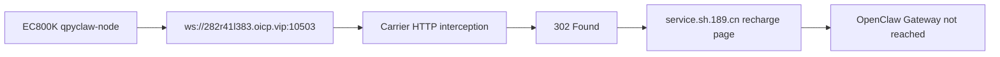

# EC800K Public Gateway Probe

## Summary

`qpyclaw-node` on the `EC800KCNLC` board now supports:

- device-local `config_local.py` overrides
- a higher websocket/connect timeout budget
- OpenClaw-oriented aliases such as `qpy.help`, `qpy.fs.ls`, `qpy.fs.tree`, `qpy.repl.run`, and `qpy.push`

The board-side runtime imported the local override successfully and used:

```text
ws://282r41l383.oicp.vip:10503
```

The websocket connect still failed, but the blocker is no longer inside the node runtime.
After PeanutShell was restarted, the same result persisted.

## Finding

The cellular network path returned:

```text
HTTP/1.1 302 Found
Location: http://service.sh.189.cn/service/jsp/recharge/greenRecharge/index.jsp
```

That means the module did not actually reach the mapped OpenClaw Gateway websocket endpoint. The request was intercepted earlier by the carrier-side HTTP path.

## Flow



## Interpretation

1. The `qpyclaw-node` runtime patch is valid.
2. The board can register to the cellular network and obtain IP connectivity.
3. The current carrier path is not suitable for plaintext `ws://` over a custom public port.
4. This is a network-access and exposure problem, not a `qpyclaw-node` protocol-implementation blocker.

## Recommended Path

1. Check whether the SIM is under a captive-portal, recharge, quota, or APN restriction state.
2. For production-style cellular access, prefer `wss://` on port `443`.
3. Put the local OpenClaw Gateway behind a websocket-capable reverse proxy such as Nginx or Caddy.
4. Keep PeanutShell or another tunnel only if it preserves raw websocket upgrade semantics end-to-end.
5. After the public entrypoint is corrected, rerun the one-shot connect probe before enabling `_main.py`.

## Evidence

Structured evidence is recorded in:

```text
docs/bringup/evidence/ec800kcnlc-public-gateway-probe-302.json
```
