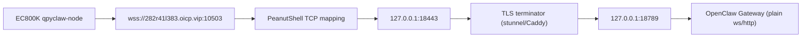

# WSS Over TCP Plan

## Short Answer

Yes, `wss://` still runs over TCP.

But it is not the same as plain `ws://`:

```text
ws   = TCP + HTTP Upgrade
wss  = TCP + TLS + HTTP Upgrade
```

That is why the current PeanutShell TCP mapping:

```text
282r41l383.oicp.vip:10503 -> 127.0.0.1:18789
```

works structurally for plain `ws://`, but does **not** automatically work for
`wss://` when `127.0.0.1:18789` is still a plain OpenClaw Gateway socket.

## Current Facts

1. `EC800KCNLC` device-side runtime supports `wss://`.
2. `ussl` imports successfully on the board.
3. Plain `ws://282r41l383.oicp.vip:10503` is intercepted by the carrier path and returns HTTP `302`.
4. Direct `wss://282r41l383.oicp.vip` currently resets and is not yet a usable path for the module.
5. Local OpenClaw Gateway is plain websocket/http on `127.0.0.1:18789`.

## Correct Topology



## Why This Path Fits The Current Problem

1. The outer traffic becomes TLS bytes, not plaintext HTTP.
2. Carrier-side HTTP redirection is much less likely to interfere with encrypted traffic on a custom TCP tunnel.
3. The local Gateway does not need to change protocol implementation.
4. `qpyclaw-node` can keep using a standard websocket client with `wss://`.

## Recommended Local Ports

| Layer | Suggested Address |
| --- | --- |
| OpenClaw Gateway | `127.0.0.1:18789` |
| Local TLS terminator | `127.0.0.1:18443` |
| PeanutShell public TCP | `282r41l383.oicp.vip:10503` |
| qpyclaw-node URL | `wss://282r41l383.oicp.vip:10503` |

## Minimal Execution Plan

1. Keep OpenClaw Gateway on `127.0.0.1:18789`.
2. Start `stunnel` or `Caddy` locally on `127.0.0.1:18443`.
3. Change PeanutShell TCP mapping target from `127.0.0.1:18789` to `127.0.0.1:18443`.
4. Update device local config to:

```python
OPENCLAW_WS_URL = "wss://282r41l383.oicp.vip:10503"
```

5. Rerun one-shot connect probe before enabling `_main.py`.

## Templates

See:

```text
desktop/reverse-proxy/stunnel/openclaw-wss-stunnel.conf.example
desktop/reverse-proxy/caddy/Caddyfile.example
desktop/reverse-proxy/node-tls-bridge/openclaw_tls_bridge.mjs
```
