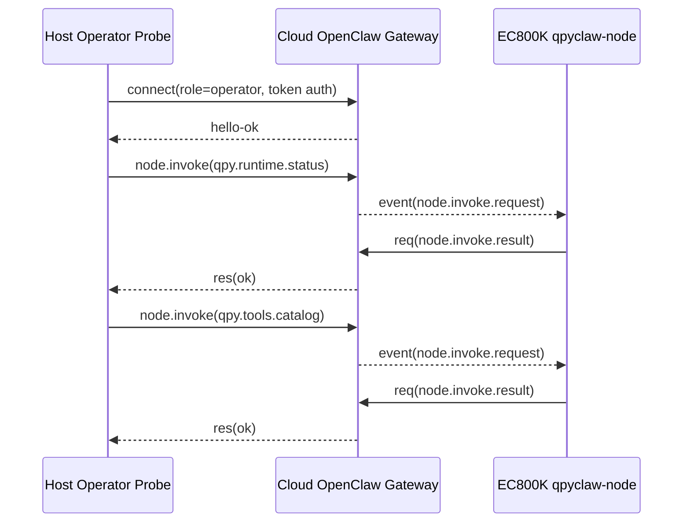

# EC800K Cloud Node Operator Invoke

## Date

`2026-03-28`

## Scope

Verify that the current `EC800KCNLC` board can not only stay online on the
cloud OpenClaw gateway, but also complete a real operator-side
`node.invoke -> node.invoke.request -> node.invoke.result` round trip.

## Current Device Identity

| Item | Value |
| --- | --- |
| Module | `EC800K` |
| Firmware | `EC800KCNLCR07A03M04_OCPU_QPY` |
| AT port | `COM9` |
| REPL port | `COM11` |
| Logical device id | `qpyclaw_ec800kcnlc_001` |
| Node id | `09c41c83ee53ba08930ac6ca8d4815640382a77a13e08edfcc17646e66b8fc54` |
| Gateway URL | `ws://124.70.221.88:18789` |
| Signer URL | `http://124.70.221.88:8787/sign` |

## Verification Chain

## Host-Side Result

Cloud gateway config was read directly from the server before probing. The
current `gateway.nodes.allowCommands` already includes:

1. `qpy.device.info`
2. `qpy.device.status`
3. `qpy.net.diag`
4. `qpy.sim.info`
5. `qpy.cell.info`
6. `qpy.runtime.status`
7. `qpy.tools.catalog`

Operator-side `node.invoke` then succeeded for both commands:

| Command | Result | Duration |
| --- | --- | --- |
| `qpy.runtime.status` | `succeeded / OK` | `2ms` |
| `qpy.tools.catalog` | `succeeded / OK` | `2ms` |

Important returned facts:

1. Selected node is `paired=true` and `connected=true`.
2. Gateway sees platform/family as `quectel / quecpython`.
3. Gateway sees declared command set containing:
   `qpy.cell.info` / `qpy.device.info` / `qpy.device.status` /
   `qpy.net.diag` / `qpy.runtime.status` / `qpy.sim.info` /
   `qpy.tools.catalog`.

## Device-Side Result

After the operator calls, `agent.debug_snapshot()` on the board showed:

1. `online = True`
2. `last_cmd_tool = qpy.tools.catalog`
3. `last_probe_tool = qpy.tools.catalog`
4. `last_exec_status = succeeded`
5. `last_exec_result_code = OK`
6. `result_cache_depth = 2`
7. `outbox_depth = 0`

This is the strongest device-local proof that the board really received and
executed the cloud-issued invoke commands.

## Evidence

| Evidence | File |
| --- | --- |
| Operator invoke raw result | `docs/bringup/evidence/2026-03-28-cloud-node-operator-invoke.json` |

## Conclusion

The current `EC800KCNLC + qpyclaw-node` path has crossed the most important
official cloud milestone:

1. official gateway connection works
2. pairing is completed
3. remote signer path works
4. operator-side `node.invoke` closed loop works

The remaining work is no longer "can it connect at all", but "how far do we
expand command set, peripherals, product behavior, and long-run reliability".
