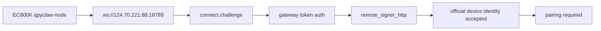
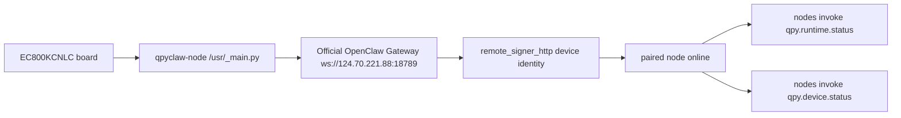

# EC800K Cloud Node Pairing Progress

## Date

`2026-03-28`

## Scope

Continue the `qpyclaw-node` bring-up on the current `EC800KCNLC` board against
the cloud OpenClaw gateway on `124.70.221.88`, then push the node path as far
as possible without modifying the official gateway code.

## Board State

| Item | Result |
| --- | --- |
| Module | `EC800K` |
| Firmware | `EC800KCNLCR07A03M04_OCPU_QPY` |
| AT port | `COM9` |
| REPL port | `COM11` |
| SIM | inserted / ready |
| Registration | `CEREG=1` |
| Current IPv4 during latest pass | `10.108.122.107` |

## What Changed In This Pass

1. Fixed the `qpyclaw-node` default `client.id` from `qpyclaw-node` to
   `node-host`.
2. Synced the board-local `OPENCLAW_AUTH_TOKEN` from the live cloud gateway
   config instead of the local desktop gateway config.
3. Confirmed the cloud-side `remote_signer_http` service is already running on
   `http://124.70.221.88:8787`.
4. Switched the board-local runtime to:
   `OPENCLAW_DEVICE_AUTH_MODE="remote_signer_http"`.

## Key Verification Chain

### 1. Direct node connect shape is now accepted

Initial failure after raw connect:

```text
INVALID_REQUEST: invalid connect params: /client/id must be equal to constant
```

After fixing `OPENCLAW_CLIENT_ID="node-host"`, this error disappeared.

### 2. Cloud token is now correct

After switching to the cloud gateway token, the previous:

```text
unauthorized: gateway token mismatch
```

was eliminated.

### 3. Device can reach the cloud signer over plain HTTP

Board-side REPL check:

```python
import request
resp = request.get("http://124.70.221.88:8787/health")
```

Observed result:

```text
status_code = 200
```

This matters because it proves the current `EC800K + SIM` path can use the
`remote_signer_http` strategy even though historical TLS/WSS findings remained
problematic on this module/firmware line.

### 4. Signer is actively used by the runtime

Latest runtime snapshot includes:

```text
last_signer.url = http://124.70.221.88:8787/sign
```

So the board is no longer failing before identity signing.

## Current Runtime Result

Latest `agent.debug_snapshot()` result reached:

```text
CONNECT_FAILED: NOT_PAIRED: pairing required
```

Interpretation:

1. Transport to the cloud gateway is working for this path.
2. Gateway token auth is working.
3. Remote signer-based device identity is working.
4. The remaining blocker is now only gateway-side pairing approval.

## Gateway Evidence

The cloud gateway pending device state already contains the new request:

| Field | Value |
| --- | --- |
| `requestId` | `1468c04f-6217-4df8-a706-cc4f654d567a` |
| `deviceId` | `09c41c83ee53ba08930ac6ca8d4815640382a77a13e08edfcc17646e66b8fc54` |
| `displayName` | `qpyclaw QuecPython Node` |
| `clientId` | `node-host` |
| `clientMode` | `node` |
| `role` | `node` |
| `platform` | `quectel` |
| `deviceFamily` | `quecpython` |

This is the strongest proof so far that the current `qpyclaw-node` path has
reached the official gateway pairing stage.

## Meaning

The older conclusion "`EC800K` can only fail before official cloud node entry"
is no longer universally true for the current board + SIM + runtime setup.

The node path has now advanced to:



## Next Action

Approve the pending node on the cloud gateway, then re-run the node:

1. approve request `1468c04f-6217-4df8-a706-cc4f654d567a`
2. or approve device
   `09c41c83ee53ba08930ac6ca8d4815640382a77a13e08edfcc17646e66b8fc54`
3. restart `agent.run()` on the board
4. verify transition from `pairing required` to `online=true`

## Conclusion

This pass moved `qpyclaw-node` from protocol mismatch and token mismatch to a
real official pairing state on the live cloud gateway. The remaining work is
gateway approval, not transport or runtime compatibility.

## Late Pass Update

Later on `2026-03-28`, the board-local `/usr/app/config_local.py` was found to
have regressed to a token-only shape:

```python
OPENCLAW_WS_URL = "ws://124.70.221.88:18789"
OPENCLAW_AUTH_TOKEN = "..."
```

That regression removed the previously validated signer path and caused the
official gateway to reject the node again with:

```text
NOT_PAIRED: device identity required
```

The practical recovery steps were:

1. restore `OPENCLAW_CLIENT_ID = "node-host"`
2. restore `OPENCLAW_DEVICE_AUTH_MODE = "remote_signer_http"`
3. restore `REMOTE_SIGNER_HTTP_URL = "http://124.70.221.88:8787/sign"`
4. restart the module runtime and re-launch `/usr/_main.py`

## Final Verification On `2026-03-28`

### 1. Signed device identity is again produced on-device

Board-side diagnostic result:

```text
MODE2 remote_signer_http
DEVICE2.id = 09c41c83ee53ba08930ac6ca8d4815640382a77a13e08edfcc17646e66b8fc54
RESPONSE2.ok = True
```

This proves the following chain is valid on the current `EC800KCNLC` board:

1. raw `ws://124.70.221.88:18789` websocket handshake
2. `connect.challenge`
3. gateway token auth
4. `remote_signer_http` identity signing
5. official gateway `connect` acceptance

### 2. Cloud gateway now reports the node online

Latest cloud `nodes status --json` result:

| Field | Value |
| --- | --- |
| `nodeId` | `09c41c83ee53ba08930ac6ca8d4815640382a77a13e08edfcc17646e66b8fc54` |
| `displayName` | `qpyclaw QuecPython Node` |
| `remoteIp` | `116.229.6.26` |
| `paired` | `true` |
| `connected` | `true` |
| `deviceFamily` | `quecpython` |
| `version` | `0.1.0` |

### 3. Cloud-to-device invoke is verified end-to-end

The official cloud gateway successfully invoked:

1. `qpy.runtime.status`
2. `qpy.device.status`

Observed evidence:

1. `qpy.runtime.status` returned `online = true`
2. `gateway.device_auth_mode = "remote_signer_http"`
3. `last_signer.url = "http://124.70.221.88:8787/sign"`
4. `connect_successes = 1`
5. `command_count = 37`
6. `qpy.device.status` returned modem / SIM / PDP / runtime data

### 4. Current outcome

The current `EC800KCNLC + qpyclaw-node + cloud OpenClaw` path is no longer only
at a pairing proof stage. It is now in a real working state:



## Operational Note

If the board falls back to:

```text
NOT_PAIRED: device identity required
```

the first thing to check is whether `/usr/app/config_local.py` has lost the
following fields:

1. `OPENCLAW_CLIENT_ID = "node-host"`
2. `OPENCLAW_DEVICE_AUTH_MODE = "remote_signer_http"`
3. `REMOTE_SIGNER_HTTP_URL = "http://124.70.221.88:8787/sign"`
