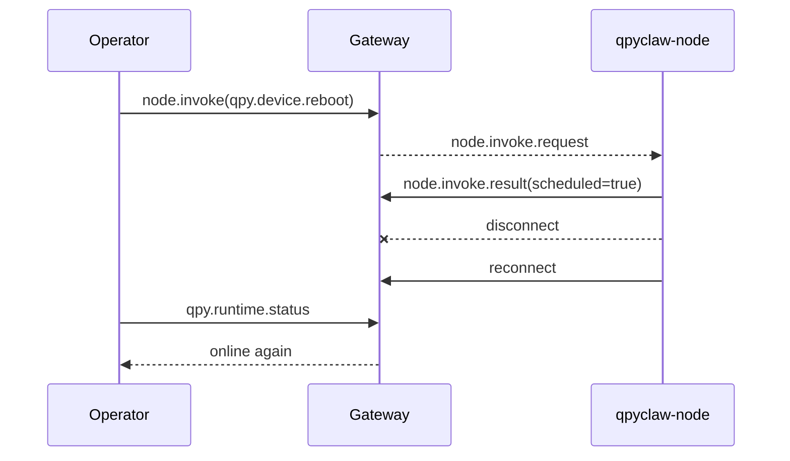
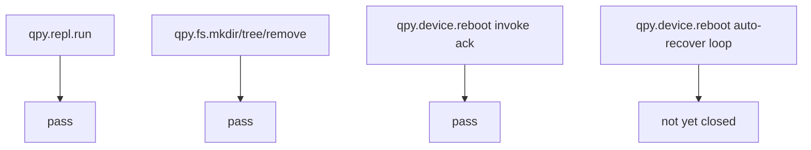

# EC800K Cloud Node Standard Regression

## Date

`2026-03-29`

## Scope

Run a standard cloud-side regression for the current `qpyclaw-node` command
surface, focusing on the three items that were still pending as explicit
operator-side proof:

1. `qpy.repl.run`
2. `qpy.fs.mkdir` + `qpy.fs.tree`
3. `qpy.device.reboot`

## Target

| Item | Value |
| --- | --- |
| Module | `EC800K` |
| Firmware | `EC800KCNLCR07A03M04_OCPU_QPY` |
| Logical device id | `qpyclaw_ec800kcnlc_001` |
| Node id | `09c41c83ee53ba08930ac6ca8d4815640382a77a13e08edfcc17646e66b8fc54` |
| Gateway URL | `ws://124.70.221.88:18789` |
| Signer URL | `http://124.70.221.88:8787/sign` |

## Result Summary

| Command | Result | Current Verdict |
| --- | --- | --- |
| `qpy.repl.run` | `succeeded / OK` | pass |
| `qpy.fs.mkdir` | `succeeded / OK` | pass |
| `qpy.fs.tree` | `succeeded / OK` | pass |
| `qpy.fs.remove` cleanup | `succeeded / OK` | pass |
| `qpy.device.reboot` | `scheduled = true` | partial |

## 1. `qpy.repl.run` Regression

### Operator-side command

The cloud operator invoked:

```text
qpy.repl.run
```

with device-side code equivalent to:

```python
result = {
  "device_auth_mode": getattr(cfg, "OPENCLAW_DEVICE_AUTH_MODE", None),
  "openclaw_count": len([name for name in dir(cfg) if name.startswith("OPENCLAW_")]),
}
```

### Observed result

Key returned facts:

1. `device_auth_mode = remote_signer_http`
2. `openclaw_count = 26`
3. `mode = exec`
4. `status = succeeded`
5. `result_code = OK`

### Meaning

This is a real cloud-side proof that:

1. `qpy.repl.run` is callable through Official OpenClaw Gateway
2. the current `exec` path works
3. the previously fixed builtins-related path is no longer blocked

## 2. `qpy.fs.mkdir` + `qpy.fs.tree` Regression

### Operator-side sequence

1. create `/usr/codex_regression_20260329/nested`
2. tree-read `/usr/codex_regression_20260329`
3. recursive cleanup remove `/usr/codex_regression_20260329`

### Observed result

Returned facts:

1. `qpy.fs.mkdir` returned `created = true`
2. `qpy.fs.tree` returned a directory node:
   `/usr/codex_regression_20260329`
3. the tree payload contained child directory:
   `nested`
4. cleanup `qpy.fs.remove` returned `removed = dir`

### Meaning

This is now a real cloud-side proof that the current node can:

1. create directories remotely
2. return recursive filesystem trees remotely
3. remove the test directory again

So the `filesystem write -> verify -> cleanup` loop is already available from
the official gateway path.

## 3. `qpy.device.reboot` Regression

### Operator-side command

The cloud operator invoked:

```text
qpy.device.reboot
```

with:

```json
{"mode":"soft","delay_ms":1500}
```

### Immediate result

The node returned:

1. `scheduled = true`
2. `mode = soft`
3. `delay_ms = 1500`
4. `status = succeeded`
5. `result_code = OK`

### What happened next

The expected cloud-side proof should have been:



But the actual evidence on this pass was:

1. the command ack succeeded
2. cloud polling did **not** observe a clear `connected=false -> connected=true`
3. a follow-up `qpy.runtime.status` timed out from cloud side
4. manual local relaunch of `/usr/_main.py` was required to restore a fresh
   healthy session
5. after manual relaunch, cloud-side `nodes status` showed a new
   `connectedAtMs`, and `qpy.runtime.status` succeeded again

### Current verdict

`qpy.device.reboot` is currently **partial**, not fully closed-loop verified.

More precisely:

1. cloud-side invoke path for reboot is working
2. scheduled reboot request can be sent to the device
3. but the current development bring-up path does not yet provide a fully
   cloud-verifiable reboot-and-auto-return loop

## 4. Most Likely Current Explanation

The strongest current explanation is:

1. this board is still being operated in a development launch mode
2. `qpyclaw-node` is currently brought up by manually running `/usr/_main.py`
3. therefore `device.reboot` is not yet equivalent to a production-grade
   "reboot and auto-start node runtime again" flow

This is consistent with the observed recovery action:

1. manual `/usr/_main.py` relaunch
2. fresh node reconnection
3. fresh `qpy.runtime.status` success

## 5. Evidence

| Evidence | File |
| --- | --- |
| Standard regression raw evidence | `docs/bringup/evidence/2026-03-29-cloud-node-standard-regression.json` |

## 6. Current Conclusion

As of `2026-03-29`, the operator-side standard regression status is:



This is enough to say:

1. the cloud-controlled debug and filesystem surface is now real
2. the remaining blocker is no longer "can reboot be requested"
3. the remaining blocker is "how to make reboot return to an online node
   automatically in the current board boot path"
