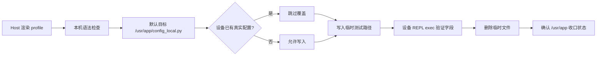

# qpyclaw-node config_local Bootstrap Phase 6

## 日期

`2026-03-29`

## 目标

Phase 5 已经把 `/usr` 运行时部署收口为 manifest 驱动，但
`/usr/app/config_local.py` 仍缺少统一、可重复、对设备安全的初始化入口。

Phase 6 的目标是把这件事标准化：

1. 用 board profile 渲染 `config_local.py`
2. 默认不覆盖设备上已有的真实配置
3. 允许把同一份配置推送到临时路径做验证
4. 把第一次刷机后的 bring-up 从“手工 copy 示例文件”升级为“脚本化初始化”

## 新增内容

### 核心文件

| 类型 | 文件 | 作用 |
| --- | --- | --- |
| profile registry | [config-local-profiles.json](C:\Users\kingd\Desktop\code\lcc-ai-team\embed\project\qpyclaw\embed\qpyclaw-node\deploy\config-local-profiles.json) | 统一维护板型默认值 |
| host bootstrap tool | [qpy_config_local_bootstrap.py](C:\Users\kingd\Desktop\code\lcc-ai-team\embed\project\qpyclaw\tools\host\qpy_config_local_bootstrap.py) | 渲染并可选推送设备侧 `config_local.py` |
| deploy doc | [deploy/README.md](C:\Users\kingd\Desktop\code\lcc-ai-team\embed\project\qpyclaw\embed\qpyclaw-node\deploy\README.md) | 说明 profile registry 与 bootstrap 用法 |
| host doc | [tools/host/README.md](C:\Users\kingd\Desktop\code\lcc-ai-team\embed\project\qpyclaw\tools\host\README.md) | 说明 host 侧命令入口 |
| runtime doc | [runtime/README.md](C:\Users\kingd\Desktop\code\lcc-ai-team\embed\project\qpyclaw\embed\qpyclaw-node\runtime\README.md) | 把 bootstrap 升级为推荐初始化流程 |

### 当前 profile

| profile key | 设备提示 | board profile | 面向场景 |
| --- | --- | --- | --- |
| `ec800kcnlc-dev-board` | `EC800KCNLC` | `ec800kcnlc-sim-only` | 无外设、SIM 优先、先把网络与运行时打通 |
| `ec800mcnle-audio-board` | `EC800MCNLE` | `ec800mcnle-audio-board` | 音频板 bring-up，后续可切入语音与外设能力 |

## 校验流程



## 实际验证

设备：`COM11`

### 1. Host 本机渲染与语法检查

执行：

```powershell
python -m py_compile C:\Users\kingd\Desktop\code\lcc-ai-team\embed\project\qpyclaw\tools\host\qpy_config_local_bootstrap.py
python C:\Users\kingd\Desktop\code\lcc-ai-team\embed\project\qpyclaw\tools\host\qpy_config_local_bootstrap.py --profile ec800kcnlc-dev-board --show-content --json
```

结果：

| 项目 | 结果 |
| --- | --- |
| host script 语法 | pass |
| profile 读取 | pass |
| 渲染输出 | pass |
| 默认 `BOARD_PROFILE` | `ec800kcnlc-sim-only` |
| 默认 `DEVICE_MODEL_HINT` | `EC800KCNLC` |

### 2. 默认路径保护现有配置

执行：

```powershell
python C:\Users\kingd\Desktop\code\lcc-ai-team\embed\project\qpyclaw\tools\host\qpy_config_local_bootstrap.py --profile ec800kcnlc-dev-board --port COM11 --push --json
```

结果摘要：

```json
{
  "push": {
    "requested": true,
    "remote_path": "/usr/app/config_local.py",
    "force": false,
    "attempted": false,
    "skipped_existing": true,
    "ok": true
  }
}
```

这说明默认行为正确：设备已有 `/usr/app/config_local.py` 时，脚本只做探测，不做覆盖。

### 3. 临时路径写入验证

执行：

```powershell
python C:\Users\kingd\Desktop\code\lcc-ai-team\embed\project\qpyclaw\tools\host\qpy_config_local_bootstrap.py --profile ec800kcnlc-dev-board --port COM11 --push --remote-path /usr/app/config_local.bootstrap.test.py --json
```

结果摘要：

| 项目 | 值 |
| --- | --- |
| 目标路径 | `/usr/app/config_local.bootstrap.test.py` |
| push attempted | `true` |
| push ok | `true` |
| local size | `992` |
| remote size | `992` |

### 4. 设备侧 REPL 执行验证

做法：

1. 在设备 REPL 中读取 `/usr/app/config_local.bootstrap.test.py`
2. `exec(...)` 到独立命名空间
3. 回读关键字段并转成 JSON

实际回读结果：

```json
{
  "OPENCLAW_WS_URL": "wss://your-public-openclaw-gateway.example.com:10503",
  "DEVICE_MODEL_HINT": "EC800KCNLC",
  "DEVICE_ID": "qpyclaw_ec800k_node_001",
  "BOARD_PROFILE": "ec800kcnlc-sim-only"
}
```

这一步同时证明：

1. 生成的 Python 文本能在 QuecPython 上成功执行
2. profile 默认值写入正确
3. host bootstrap 与 device runtime 对 `config_local.py` 的字段约定一致

### 5. 清理临时文件

执行：

```powershell
python C:\Users\kingd\.codex\skills\quecpython-dev\scripts\qpy_device_fs_cli.py --json --port COM11 rm --path /usr/app/config_local.bootstrap.test.py
python C:\Users\kingd\.codex\skills\quecpython-dev\scripts\qpy_device_fs_cli.py --json --port COM11 --ls-via repl ls --path /usr/app
```

清理后设备 `/usr/app` 为：

```text
__init__.py
agent.py
command_worker.py
config.py
config_local.py
device_auth.py
runtime_state.py
tool_runner.py
tools/
transport_ws_openclaw.py
ws_client.py
```

没有残留 `config_local.bootstrap.test.py`。

## 价值

| 维度 | Phase 5 之前 | Phase 6 之后 |
| --- | --- | --- |
| 首次 bring-up | 手工改示例文件 | profile 驱动脚本化 |
| 真实 token 保护 | 容易误覆盖 | 默认保护现有配置 |
| 板型差异管理 | 靠人工记忆 | registry 明确收口 |
| 验证方式 | 人工推断 | 可做临时路径回读验证 |
| 文档一致性 | 示例文件与真实部署分离不清 | bootstrap 成为 canonical flow |

## 结论

截至 `2026-03-29`，Phase 6 已完成并验证通过：

1. `config_local.py` 已有标准化 profile registry
2. host bootstrap 工具可稳定渲染并推送配置
3. 默认行为已确认不会覆盖设备现有真实配置
4. 临时路径验证已确认 QuecPython 端可执行且字段正确
5. `config_local` 的第一次初始化流程已经从“手工 copy”升级为“可重复、可审计、可保护现网配置”的脚本化入口

下一步就可以把 `config_local bootstrap` 与 `runtime manifest sync` 组合起来，作为新的标准刷机后恢复流程。

## 证据

结构化证据见：

[2026-03-29-config-local-bootstrap-phase6.json](C:\Users\kingd\Desktop\code\lcc-ai-team\embed\project\qpyclaw\docs\bringup\evidence\2026-03-29-config-local-bootstrap-phase6.json)
