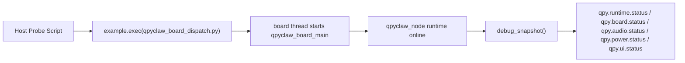
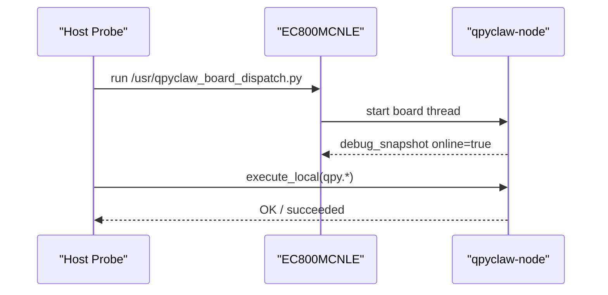

# EC800MCNLE Audio Board Runtime Probe

## 日期

`2026-03-29`

## 目的

把开发期已经验证可行的这条链路，固化成一个稳定的 host 侧探针：



这份探针的意义，不是替代 `qpy_runtime_smoke.py`，而是补上一个更贴近开发现场的板级联调入口。

## 为什么推荐 `dispatch`，而不是直接跑 `board_main`

当前 `EC800MCNLE` 音频板在开发期联调时，推荐入口是：

```text
/usr/qpyclaw_board_dispatch.py
```

而不是：

```text
/usr/qpyclaw_board_main.py
```

原因很直接：

1. `qpyclaw_board_main.py` 直接占用主解释器，后续 REPL 重连容易打断当前 bring-up。
2. `qpyclaw_board_dispatch.py` 会把 `board_main` 放到新线程里跑，REPL 仍可继续做状态探测和本地命令验证。
3. 这更符合当前开发阶段的诉求：先快速验证“在线 + 板级扩展 + 本地命令面”是否打通。

## 新增 host 工具

文件：

[`qpy_board_runtime_probe.py`](/C:/Users/kingd/Desktop/code/lcc-ai-team/embed/project/qpyclaw/tools/host/qpy_board_runtime_probe.py)

默认流程：

1. 运行 `/usr/qpyclaw_board_dispatch.py`
2. 等待数秒让 runtime 完成联网和扩展加载
3. 读取 `qpyclaw_node.debug_snapshot()`
4. 顺序执行默认本地命令：
   `qpy.runtime.status`
   `qpy.board.status`
   `qpy.audio.status`
   `qpy.power.status`
   `qpy.ui.status`

## 推荐命令

标准 JSON 探测：

```powershell
python C:\Users\kingd\Desktop\code\lcc-ai-team\embed\project\qpyclaw\tools\host\qpy_board_runtime_probe.py --port COM19 --json
```

保留原始串口回显：

```powershell
python C:\Users\kingd\Desktop\code\lcc-ai-team\embed\project\qpyclaw\tools\host\qpy_board_runtime_probe.py --port COM19 --include-raw --json
```

只读当前运行态，不重复拉起 dispatch：

```powershell
python C:\Users\kingd\Desktop\code\lcc-ai-team\embed\project\qpyclaw\tools\host\qpy_board_runtime_probe.py --port COM19 --skip-dispatch --json
```

追加额外本地命令：

```powershell
python C:\Users\kingd\Desktop\code\lcc-ai-team\embed\project\qpyclaw\tools\host\qpy_board_runtime_probe.py --port COM19 --command qpy.audio.volume.get --command qpy.display.status --json
```

## 推荐判定口径

探针 `ok=true` 的最小条件：

1. `debug_snapshot().has_runtime = true`
2. `debug_snapshot().online = true`
3. `debug_snapshot().has_extension = true`
4. `debug_snapshot().extension_name` 非空
5. 所有被探测的本地命令都返回：
   `status = succeeded`
   `result_code = OK`

## 本轮实测结果

本轮对 `COM19` 的真实探测已经通过，关键事实如下：

| 项目 | 结果 |
| --- | --- |
| `ok` | `true` |
| `probe_attempts_used` | `2` |
| `snapshot.online` | `true` |
| `snapshot.extension_name` | `EC800MCNLEBoardExtension` |
| `state.node_id` | `d88d71750471be40bc686de26ba3b4f77f3eb35f902c5e881ec009103b9916db` |
| `state.logical_device_id` | `qpyclaw_ec800m_audio_001` |
| `state.last_signer.url` | `http://124.70.221.88:8787/sign` |
| `qpy.runtime.status` | `OK` |
| `qpy.board.status` | `OK` |
| `qpy.audio.status` | `OK` |
| `qpy.power.status` | `OK` |
| `qpy.ui.status` | `OK` |

说明：

这轮联调后半段为了追查 `qpyclaw_node` 模块缓存污染问题，对同一块板子做了多次
REPL 打断和重复 `dispatch`。因此当前 evidence 目录里的同名 JSON 可能已经被后续
失败样本覆盖，不再适合作为“最终稳定结论”。

更准确的做法是：

1. 让板子做一次干净冷重启
2. 再重新执行 `qpy_board_runtime_probe.py`
3. 用新的成功 JSON 覆盖同名 evidence 文件

## 关于 `dispatch` 回显抖动

这块板子在开发期通过串口发 `example.exec(...)` 时，偶发会出现这样一种情况：

1. `dispatch` 的成功令牌没有稳定回显
2. 但几秒后 `debug_snapshot()` 和本地命令面已经完全正常

因此当前探针脚本采取的是更务实的口径：

1. `dispatch` 回显作为参考，不作为最终成败唯一依据
2. 真正的最终判定，以 `debug_snapshot + local commands` 为准
3. 探针自动重试，并取最后一份有效 JSON，而不是取第一份串口回包

## 设备清理补充

本轮还顺手确认并清理了设备侧遗留文件：

```text
/usr/qpyclaw_node.py.tmp
```

当前手工核对 `/usr` 结果已经只剩：

```text
board
qpyclaw_board_main.py
system_config.json
qpyclaw_board_dispatch.py
config_local.py
_main.py
qpyclaw_node.py
```

## 与已有工具的关系

| 工具 | 角色 | 更适合做什么 |
| --- | --- | --- |
| `qpy_runtime_smoke.py` | 运行时烟测 | 验证 `/usr` runtime 和工具目录最小可用性 |
| `qpy_post_flash_recover.py --smoke` | 恢复包装器 | 刷机或 `/usr` 重置后的标准恢复 |
| `qpy_board_runtime_probe.py` | 板级在线探针 | 开发期反复验证 `dispatch -> online -> local tools` |

## 当前结论

`EC800MCNLE` 这条板级 bring-up 路径已经不再需要靠人工一条条敲 REPL：



这意味着后续继续做音频链路、KWS/VAD、显示 UI、远程运维命令时，已经有一条固定、可复用、可脚本化的板级探测入口。
