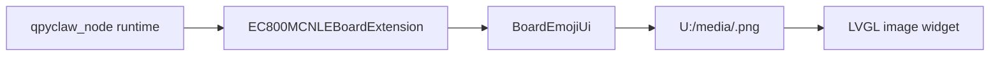

# EC800MCNLE Audio Board UI Assets

## Date

`2026-03-29`

## Current State

The `EC800MCNLE` board UI path is already wired in code:



Current facts:

1. `board_ui.py` defaults `media_prefix` to `U:/media`.
2. `board_bootstrap.py` exposes `qpy.ui.status` and `qpy.ui.emotion.show`.
3. Runtime probe evidence already shows:
   - display ready
   - UI ready
   - current emoji `neutral`
   - media prefix `U:/media`

## Asset Source Of Truth

Project-local asset root:

`C:\Users\kingd\Desktop\code\lcc-ai-team\embed\project\qpyclaw\boards\ec800mcnle-audio-board\resource\ui\emoji`

Reference upstream asset source:

`C:\Users\kingd\Desktop\code\lcc-ai-team\embed\opensource\AIChatbot-Xiaozhi-Mqtt\src(UI)\media`

The project-local asset set currently contains `20` PNG files:

1. `angry.png`
2. `confident.png`
3. `confused.png`
4. `cool.png`
5. `crying.png`
6. `delicious.png`
7. `embarrassed.png`
8. `funny.png`
9. `happy.png`
10. `kissy.png`
11. `laughing.png`
12. `loving.png`
13. `neutral.png`
14. `relaxed.png`
15. `sad.png`
16. `shocked.png`
17. `sleepy.png`
18. `surprised.png`
19. `thinking.png`
20. `winking.png`

This matches the `supported_emojis` list in board UI code.

## Deployment Path

Board media deploy manifest:

`C:\Users\kingd\Desktop\code\lcc-ai-team\embed\project\qpyclaw\embed\qpyclaw-node\deploy\board-manifests\ec800mcnle-audio-board-media.json`

Host sync tool:

`C:\Users\kingd\Desktop\code\lcc-ai-team\embed\project\qpyclaw\tools\host\qpy_board_media_sync.py`

Standard sync command:

```powershell
python C:\Users\kingd\Desktop\code\lcc-ai-team\embed\project\qpyclaw\tools\host\qpy_board_media_sync.py --profile ec800mcnle-audio-board --port COM19 --json
```

Dry run:

```powershell
python C:\Users\kingd\Desktop\code\lcc-ai-team\embed\project\qpyclaw\tools\host\qpy_board_media_sync.py --profile ec800mcnle-audio-board --port COM19 --dry-run --json
```

Integrated recovery flow:

```powershell
python C:\Users\kingd\Desktop\code\lcc-ai-team\embed\project\qpyclaw\tools\host\qpy_post_flash_recover.py --profile ec800mcnle-audio-board --port COM19 --json
```

## Why A Separate Media Sync Exists

`/usr` runtime code and `U:/media` assets should not be mixed into the same deployment root.

Reasons:

1. Runtime files belong to the generic `qpyclaw-node` layer.
2. Emoji PNGs are board-specific UI resources.
3. `U:/media` is a different device-side storage path from `/usr`.
4. Keeping a separate manifest makes it obvious which board resources are part of the shipped UI experience.

## Immediate Validation Loop

Recommended practical loop for screen work:

1. Sync board code to `/usr/board`.
2. Sync emoji assets to `U:/media`.
3. Start board runtime.
4. Invoke `qpy.ui.emotion.show` with a few emotions.
5. Confirm the screen changes on hardware.

Suggested commands:

```powershell
python C:\Users\kingd\Desktop\code\lcc-ai-team\embed\project\qpyclaw\tools\host\qpy_board_code_sync.py --profile ec800mcnle-audio-board --port COM19 --json
python C:\Users\kingd\Desktop\code\lcc-ai-team\embed\project\qpyclaw\tools\host\qpy_board_media_sync.py --profile ec800mcnle-audio-board --port COM19 --json
python C:\Users\kingd\Desktop\code\lcc-ai-team\embed\project\qpyclaw\tools\host\qpy_board_runtime_probe.py --port COM19 --skip-dispatch --command qpy.ui.status --json
```

## Conclusion

For the screen path, the missing piece was not the assets themselves. The missing piece was a standard, project-owned deployment path from local board resources to device `U:/media`.
