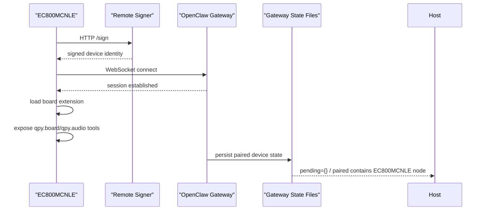

# EC800MCNLE Audio Node Cloud Online Bring-up

## 日期

`2026-03-29`

## 目标

在 `EC800MCNLE` 音频开发板上，以板级扩展方式启动 `qpyclaw-node`，并确认下面四件事已经同时成立：

1. 板子已插卡且 `SIM ready`
2. 板级代码已成功挂入单文件 `qpyclaw_node.py` runtime
3. 设备通过 `remote_signer_http` 完成官方 OpenClaw 身份链路
4. 板级工具已经进入节点命令面，后续可以被网关侧调用

## 当前板卡与云端标识

| 项目 | 值 |
| --- | --- |
| 模组/板型 | `EC800MCNLE` 音频开发板 |
| REPL 端口 | `COM19` |
| 逻辑设备 ID | `qpyclaw_ec800m_audio_001` |
| 节点 ID | `d88d71750471be40bc686de26ba3b4f77f3eb35f902c5e881ec009103b9916db` |
| 设备显示名 | `qpyclaw EC800M Audio Node` |
| Gateway URL | `ws://124.70.221.88:18789` |
| Remote Signer URL | `http://124.70.221.88:8787/sign` |
| 板级 profile | `ec800mcnle-audio-board` |

## 本轮动作

1. 确认设备 `/usr` 侧基础运行布局已经齐备：
   `app/`、`qpyclaw_node.py`、`board/`
2. 将
   `embed/qpyclaw-node/examples/ec800mcnle-audio-board/main.example.py`
   下发为设备入口：
   `/usr/qpyclaw_board_main.py`
3. 通过 `example.exec('usr/qpyclaw_board_main.py')` 拉起全新运行进程，避免旧 REPL 模块缓存继续干扰判断
4. 在设备侧重新读取 `qpyclaw_node.debug_snapshot()`，直接确认新进程当前状态
5. 在设备侧执行本地命令面验证，确认板级工具已经能被 runtime 正常执行
6. 在云服务器读取 `pending.json` / `paired.json`，确认这块音频板对应的新身份已经不在待批准队列中

## 验证链



## 设备侧实时快照

重新拉起板级入口后，设备侧 `qpyclaw_node.debug_snapshot()` 的关键结果如下：

| 字段 | 结果 |
| --- | --- |
| `has_runtime` | `true` |
| `online` | `true` |
| `has_extension` | `true` |
| `extension_name` | `EC800MCNLEBoardExtension` |
| `state.node_id` | `d88d71750471be40bc686de26ba3b4f77f3eb35f902c5e881ec009103b9916db` |
| `state.logical_device_id` | `qpyclaw_ec800m_audio_001` |
| `state.connect_successes` | `2` |
| `state.reconnect_count` | `1` |
| `state.last_signer.url` | `http://124.70.221.88:8787/sign` |
| `state.last_signer.logical_device_id` | `qpyclaw_ec800m_audio_001` |
| `board.display.ready` | `true` |
| `board.audio.supported` | `true` |
| `board.power.supported` | `true` |
| `board.ui.ready` | `true` |

需要注意两点：

1. 快照里仍保留了历史错误字段，如 `last_exception = "server closed websocket"` 与 `last_error = "[Errno 104] ECONNRESET"`。
2. 这些字段说明本轮运行过程中发生过重连，但当前结论应以 `online = true`、`connect_successes = 2` 为准。

## 本地命令面验证

设备侧直接执行 `qpyclaw_node.execute_local(...)` 后，当前命令面验证结果如下：

| 命令 | 结果 | 说明 |
| --- | --- | --- |
| `qpy.tools.catalog` | `OK` | 返回 `tool_count = 20` |
| `qpy.board.status` | `OK` | 返回 UI / 显示 / 音频 / 供电快照 |
| `qpy.audio.status` | `OK` | 返回当前音频能力和音量 |
| `qpy.audio.volume.get` | `OK` | 当前音量为 `5` |
| `qpy.audio.volume.set` | `OK` | 使用参数 `{"volume": 6}` 可成功设置 |
| `qpy.audio.volume.get` | `OK` | 设置后读回 `6` |
| `qpy.audio.volume.set` | `OK` | 使用参数 `{"volume": 5}` 成功恢复 |

当前可见的板级相关命令包括：

1. `qpy.board.status`
2. `qpy.audio.status`
3. `qpy.audio.volume.get`
4. `qpy.audio.volume.set`
5. `qpy.device.reboot`

其中：

1. `qpy.device.reboot` 已进入目录面，但本轮没有实际执行，避免打断当前 bring-up
2. `qpy.audio.volume.set` 的参数名是 `volume`，不是 `value`

## 云端状态文件验证

通过云服务器直接读取：

1. `/home/openclaw/.openclaw/devices/pending.json`
2. `/home/openclaw/.openclaw/devices/paired.json`

得到的当前结论是：

1. `pending.json` 当前为 `{}`，说明这块音频板的新身份已经不在待批准队列中
2. `paired.json` 已包含节点
   `d88d71750471be40bc686de26ba3b4f77f3eb35f902c5e881ec009103b9916db`
3. 该节点显示名为 `qpyclaw EC800M Audio Node`
4. 该节点 `clientId = node-host`
5. 该节点 `clientMode = node`
6. 该节点 `platform = quectel`
7. 该节点 `deviceFamily = quecpython`
8. 该节点在服务器状态文件里记录了 `remoteIp = 61.171.210.155`

这说明当前阻塞点已经不是“等待批准”。

## 当前结论

截至 `2026-03-29`，`EC800MCNLE` 音频板上的 `qpyclaw-node` 已经完成下面这条链路：


可以明确下结论：

1. 这块板子已经不是“只有板级代码，没进云端”的状态
2. 它已经不是“卡在 `NOT_PAIRED`”的状态
3. 它已经是“云端身份已配对，设备 runtime 在线，板级工具已挂入”的状态

## 官方网关远程调用补充验证

在本轮后续排查中，又额外确认了一条更强的事实：

1. 从云服务器本机对 `ws://127.0.0.1:18789` 做原始 WebSocket 探测时，
   `connect.challenge` 可以稳定收到
2. 服务器本机最小化 operator RPC
   `connect -> node.list -> node.invoke`
   也可以稳定成功
3. 当前 `node.invoke` 参数必须包含 `idempotencyKey`
4. 带上 `idempotencyKey` 后，已经真实远程调用成功：
   `qpy.runtime.status`
   `qpy.board.status`
   `qpy.audio.status`
   `qpy.audio.volume.get`

这意味着当前事实应当更新为：

1. `EC800MCNLE` 音频板已经被官方网关真实远程调用成功
2. 板级工具不只是“本地 execute_local 可用”
3. 它们已经通过官方网关的 operator 路径返回了真实数据

其中，`qpy.runtime.status` 返回的关键信息包括：

1. `online = true`
2. `gateway.device_auth_mode = remote_signer_http`
3. `gateway.url = ws://124.70.221.88:18789`
4. `board_profile = ec800mcnle-audio-board`
5. `command_count = 45`

而 `qpy.board.status` 已经返回完整板级快照：

1. `display.ready = true`
2. `audio.supported = true`
3. `power.charge_enabled = true`
4. `ui.current_emoji = neutral`

## 仍未打穿的点

当前还没有完全打穿的，已经不再是“网关能不能调用这块板子”，而是：

1. 官方 `openclaw.mjs nodes status`
2. 官方 `openclaw.mjs nodes invoke`
3. 桌面主机直连公网网关的 raw RPC 路径

当前观察到的现象是：

```text
gateway closed (1006 abnormal closure (no close frame))
```

以及桌面主机直接对公网 `ws://124.70.221.88:18789` 做 raw RPC 时，会在等待后续帧时超时。

所以更准确的判断应当是：

1. 网关和节点本身没有问题
2. 服务器本机 raw operator RPC 已经闭环
3. 当前回归点在“官方 CLI 包装层”和“这台桌面主机到公网网关的 operator 路径”

## 当前可用运维入口

为了绕过当前两层不稳定因素，已经新增一个可落地的 host 工具：

`tools/host/qpy_openclaw_server_ops.py`

它的工作方式是：

1. 本机 SSH 到云服务器
2. 在云服务器本机对 `ws://127.0.0.1:18789` 发起 raw RPC
3. 执行 `node.list` 或 `node.invoke`

这条路径已经实际验证通过：

1. `node-list --connected-only`
2. `node-invoke --command qpy.board.status`

因此当前 `qpyclaw` 项目的实际运维入口已经具备。

## 建议的下一步

1. 继续补 `qpy_openclaw_server_ops.py` 的调用面，至少加入常用 `qpy.runtime.status` / `qpy.device.status` / `qpy.audio.volume.set`
2. 单独排查官方 `openclaw.mjs nodes ...` 回归，而不是再怀疑设备侧
3. 在 `examples/ec800mcnle-audio-board/` 继续补充板级示例，包括显示/UI/音频输入输出
4. 等开发阶段稳定后，再决定是否把当前板级入口切换成 `main.py` 自启动
