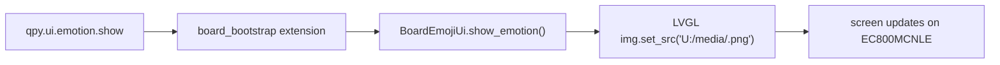

# EC800MCNLE Audio Board Screen Emoji Bring-up

## Date

`2026-03-29`

## Goal

Turn the EC800MCNLE screen path from "code exists" into an actual project
asset and deployment flow:

1. keep emoji PNG assets inside `qpyclaw`
2. provide a host-side sync entrypoint to `U:/media`
3. keep board UI lookup aligned with `board_ui.py`
4. use existing board write smoke as the first functional trigger path

## Current Fact Pattern

The board-side UI code is already live:

- UI implementation:
  [board_ui.py](/C:/Users/kingd/Desktop/code/lcc-ai-team/embed/project/qpyclaw/boards/ec800mcnle-audio-board/code/board_ui.py)
- Board extension command:
  `qpy.ui.emotion.show`
- Runtime validation path:
  [qpy_runtime_smoke.py](/C:/Users/kingd/Desktop/code/lcc-ai-team/embed/project/qpyclaw/tools/host/qpy_runtime_smoke.py)

`board_ui.py` looks for files under:

```text
U:/media/<emotion>.png
```

## Imported Asset Set

Source assets were copied from:

- [src(UI)/media](/C:/Users/kingd/Desktop/code/lcc-ai-team/embed/opensource/AIChatbot-Xiaozhi-Mqtt/src(UI)/media)

Project-local destination:

- [emoji](/C:/Users/kingd/Desktop/code/lcc-ai-team/embed/project/qpyclaw/boards/ec800mcnle-audio-board/resource/ui/emoji)

Imported count: `20`

## New Deploy Entry

Host helper:

- [qpy_board_media_sync.py](/C:/Users/kingd/Desktop/code/lcc-ai-team/embed/project/qpyclaw/tools/host/qpy_board_media_sync.py)

Manifest:

- [ec800mcnle-audio-board-media.json](/C:/Users/kingd/Desktop/code/lcc-ai-team/embed/project/qpyclaw/embed/qpyclaw-node/deploy/board-manifests/ec800mcnle-audio-board-media.json)

The generic sync engine was updated to accept QuecPython drive-style remote
roots such as `U:/media`, not only `/usr`.

## Practical Commands

Dry run:

```powershell
python C:\Users\kingd\Desktop\code\lcc-ai-team\embed\project\qpyclaw\tools\host\qpy_board_media_sync.py --profile ec800mcnle-audio-board --port COM19 --dry-run --json
```

Real sync:

```powershell
python C:\Users\kingd\Desktop\code\lcc-ai-team\embed\project\qpyclaw\tools\host\qpy_board_media_sync.py --profile ec800mcnle-audio-board --port COM19 --json
```

Optional listing check:

```powershell
python C:\Users\kingd\.codex\skills\quecpython-dev\scripts\qpy_device_fs_cli.py --json --port COM19 --allow-any-path ls --path U:/media --ls-via repl
```

Board write smoke trigger:

```powershell
python C:\Users\kingd\Desktop\code\lcc-ai-team\embed\project\qpyclaw\tools\host\qpy_runtime_smoke.py --port COM19 --board-write-smoke --json
```

## Expected Visual Result

When `qpy.ui.emotion.show` succeeds:



During `--board-write-smoke`, the current implementation should:

1. switch the screen to `thinking`
2. restore the previous expression, typically `neutral`

## Boundary

This bring-up means the screen/emoji path can now be developed as a real
feature. It does not yet prove:

1. every PNG renders correctly on the physical panel
2. animated expressions exist
3. screen state is already bound to OpenClaw conversation semantics

The next useful validation is a real on-device sync to `U:/media`, followed
by `qpy.ui.emotion.show` observation on the physical board.
