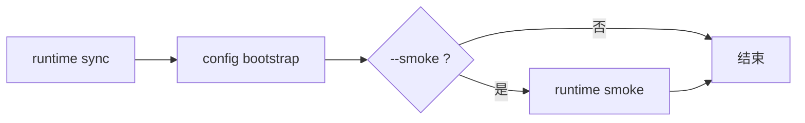

# qpyclaw-node Post-Flash Recovery With Smoke Phase 9

## 日期

`2026-03-29`

## 目标

Phase 7 已经有标准恢复入口：

[qpy_post_flash_recover.py](C:\Users\kingd\Desktop\code\lcc-ai-team\embed\project\qpyclaw\tools\host\qpy_post_flash_recover.py)

Phase 8 已经有标准 runtime 自检入口：

[qpy_runtime_smoke.py](C:\Users\kingd\Desktop\code\lcc-ai-team\embed\project\qpyclaw\tools\host\qpy_runtime_smoke.py)

Phase 9 的目标是把这两者真正接成一条命令：

`recover --smoke`

这样“恢复完成”和“恢复后 runtime 基础可用”就不再是两件分开的事。

## 代码变化

`[qpy_post_flash_recover.py](C:\Users\kingd\Desktop\code\lcc-ai-team\embed\project\qpyclaw\tools\host\qpy_post_flash_recover.py)` 新增：

1. `--smoke`
2. `--smoke-script`
3. `--smoke-fs-read-path`
4. `--smoke-fs-read-max-bytes`
5. `--smoke-include-raw`

执行顺序现在变成：



约束保持不变：

1. `config_local.py` 默认仍受保护
2. `--dry-run` 下不会执行 smoke
3. 前序步骤失败时 smoke 自动跳过

## 实际验证

设备：`COM11`

Profile：`ec800kcnlc-dev-board`

执行：

```powershell
python C:\Users\kingd\Desktop\code\lcc-ai-team\embed\project\qpyclaw\tools\host\qpy_post_flash_recover.py --profile ec800kcnlc-dev-board --port COM11 --smoke --json
```

结果摘要：

| 项目 | 结果 |
| --- | --- |
| runtime sync | pass |
| config bootstrap | pass |
| runtime smoke | pass |
| overall | pass |

### 1. runtime sync

| 指标 | 值 |
| --- | --- |
| `mkdir_count` | `3` |
| `push_count` | `16` |
| `remove_count` | `17` |

### 2. config bootstrap

| 指标 | 值 |
| --- | --- |
| `remote_path` | `/usr/app/config_local.py` |
| `force` | `false` |
| `attempted` | `false` |
| `skipped_existing` | `true` |

这说明接入 smoke 以后，也没有破坏 Phase 6 的核心约束：

真实 `config_local.py` 仍然不会被默认覆盖。

### 3. runtime smoke

| 指标 | 值 |
| --- | --- |
| `catalog_status` | `succeeded` |
| `catalog_tool_count` | `16` |
| `fs_read_status` | `succeeded` |
| `fs_read_bytes` | `128` |
| `loaded_domains_after_catalog` | `["runtime"]` |
| `loaded_domains_after_fs_read` | `["filesystem", "runtime"]` |

这说明恢复脚本尾部直接调用 smoke 后，设备已经处于可工作的 runtime 状态。

## 结论

截至 `2026-03-29`，`recover --smoke` 已完成并在 `COM11` 实机验证通过：

1. 标准恢复入口已支持一条命令完成“恢复 + 自检”
2. `config_local.py` 的保护逻辑没有被破坏
3. 恢复完成后立即自检通过
4. 现在 host 侧已经有一个真正闭环的恢复动作，而不是“恢复完再靠人工验证”

## 证据

[2026-03-29-post-flash-recovery-smoke-phase9.json](C:\Users\kingd\Desktop\code\lcc-ai-team\embed\project\qpyclaw\docs\bringup\evidence\2026-03-29-post-flash-recovery-smoke-phase9.json)
