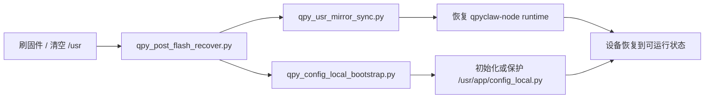

# qpyclaw-node Post-Flash Recovery Wrapper Phase 7

## 日期

`2026-03-29`

## 目标

Phase 5 已经解决了 runtime 文件如何安全同步到设备 `/usr`，Phase 6
已经解决了 `config_local.py` 如何标准化初始化。

Phase 7 的目标不是再造新能力，而是把这两段已经验证过的流程收口成一个
真正可执行的标准恢复入口：

1. 先恢复 runtime
2. 再恢复或初始化 `config_local.py`
3. 默认继续保护设备上已有的真实配置
4. 让“刷固件后如何恢复 qpyclaw-node”从两条命令变成一条命令

## 新增内容

### 新脚本

[qpy_post_flash_recover.py](C:\Users\kingd\Desktop\code\lcc-ai-team\embed\project\qpyclaw\tools\host\qpy_post_flash_recover.py)

它是 host 侧编排层，不直接替代底层工具，而是顺序调用：

1. [qpy_usr_mirror_sync.py](C:\Users\kingd\Desktop\code\lcc-ai-team\embed\project\qpyclaw\tools\host\qpy_usr_mirror_sync.py)
2. [qpy_config_local_bootstrap.py](C:\Users\kingd\Desktop\code\lcc-ai-team\embed\project\qpyclaw\tools\host\qpy_config_local_bootstrap.py)

### 默认行为

| 步骤 | 默认行为 |
| --- | --- |
| runtime sync | 按 manifest 恢复 `/usr` |
| config bootstrap | 按 board profile 生成 `config_local.py` |
| 现有真实配置 | 默认不覆盖 |
| dry-run | 只预览，不改设备 |
| test mode | 可用 `--skip-sync` 和临时 `--config-remote-path` 做非破坏性验证 |

## 结构变化



## 推荐命令

标准恢复：

```powershell
python C:\Users\kingd\Desktop\code\lcc-ai-team\embed\project\qpyclaw\tools\host\qpy_post_flash_recover.py --profile ec800kcnlc-dev-board --port COM11 --json
```

只预览：

```powershell
python C:\Users\kingd\Desktop\code\lcc-ai-team\embed\project\qpyclaw\tools\host\qpy_post_flash_recover.py --profile ec800kcnlc-dev-board --port COM11 --dry-run --json
```

非破坏性测试模式：

```powershell
python C:\Users\kingd\Desktop\code\lcc-ai-team\embed\project\qpyclaw\tools\host\qpy_post_flash_recover.py --profile ec800kcnlc-dev-board --port COM11 --skip-sync --config-remote-path /usr/app/config_local.recovery.test.py --json
```

## 实际验证

设备：`COM11`

Profile：`ec800kcnlc-dev-board`

### 1. Dry-run

执行：

```powershell
python C:\Users\kingd\Desktop\code\lcc-ai-team\embed\project\qpyclaw\tools\host\qpy_post_flash_recover.py --profile ec800kcnlc-dev-board --dry-run --json
```

结果摘要：

| 项目 | 值 |
| --- | --- |
| runtime mode | `manifest` |
| planned directories | `3` |
| planned files | `16` |
| planned remove | `17` |
| config push requested | `false` |
| overall | pass |

这说明 wrapper 的 dry-run 语义正确：

1. runtime 会走 manifest 预览
2. config 只渲染，不落盘到设备

### 2. 标准恢复模式

执行：

```powershell
python C:\Users\kingd\Desktop\code\lcc-ai-team\embed\project\qpyclaw\tools\host\qpy_post_flash_recover.py --profile ec800kcnlc-dev-board --port COM11 --json
```

结果摘要：

| 项目 | 值 |
| --- | --- |
| runtime sync | pass |
| mkdir count | `3` |
| push count | `16` |
| remove count | `17` |
| config remote path | `/usr/app/config_local.py` |
| config skipped existing | `true` |
| overall | pass |

这里最关键的是第二步：

`config_local.py` 的默认目标路径仍然被保护，wrapper 没有因为做了编排层就破坏
Phase 6 的“不覆盖现有真实配置”约束。

### 3. 测试模式覆盖“新文件写入”分支

执行：

```powershell
python C:\Users\kingd\Desktop\code\lcc-ai-team\embed\project\qpyclaw\tools\host\qpy_post_flash_recover.py --profile ec800kcnlc-dev-board --port COM11 --skip-sync --config-remote-path /usr/app/config_local.recovery.test.py --json
```

结果摘要：

| 项目 | 值 |
| --- | --- |
| runtime sync | skipped |
| config remote path | `/usr/app/config_local.recovery.test.py` |
| push attempted | `true` |
| push ok | `true` |
| local size | `992` |
| remote size | `992` |

这一步说明 wrapper 本身不只是会“跳过已有配置”，也能正确透传到 bootstrap
工具，把 profile 渲染结果写入一个新的目标路径。

### 4. 设备侧 REPL 验证

在板子上读取并 `exec`：

`/usr/app/config_local.recovery.test.py`

回读关键字段为：

```json
{
  "OPENCLAW_WS_URL": "wss://your-public-openclaw-gateway.example.com:10503",
  "DEVICE_MODEL_HINT": "EC800KCNLC",
  "DEVICE_ID": "qpyclaw_ec800k_node_001",
  "BOARD_PROFILE": "ec800kcnlc-sim-only"
}
```

这说明 wrapper 透传下去的配置内容与 Phase 6 的单脚本行为一致，没有发生字段漂移。

### 5. 清理测试文件

执行：

```powershell
python C:\Users\kingd\.codex\skills\quecpython-dev\scripts\qpy_device_fs_cli.py --json --port COM11 rm --path /usr/app/config_local.recovery.test.py
python C:\Users\kingd\.codex\skills\quecpython-dev\scripts\qpy_device_fs_cli.py --json --port COM11 --ls-via repl ls --path /usr/app
```

清理后 `/usr/app` 为：

```text
__init__.py
agent.py
command_worker.py
config.py
config_local.py
device_auth.py
runtime_state.py
tool_runner.py
tools/
transport_ws_openclaw.py
ws_client.py
```

没有残留测试文件。

## 价值

| 维度 | Phase 6 之前 | Phase 7 之后 |
| --- | --- | --- |
| 恢复入口 | 两个脚本分开调用 | 一个标准恢复入口 |
| 刷机后操作复杂度 | 人工编排顺序 | 固定顺序脚本化 |
| 真实配置保护 | 已支持，但靠调用者记住顺序 | 编排层默认继承保护逻辑 |
| 非破坏性测试 | 需要自己拼命令 | wrapper 内建测试模式 |
| 运维可复制性 | 中等 | 高 |

## 结论

截至 `2026-03-29`，Phase 7 已完成并验证通过：

1. `qpy_post_flash_recover.py` 已成为新的标准恢复入口
2. 它已成功串起 runtime manifest sync 与 config bootstrap
3. 在 `COM11` 上，标准模式已确认不会覆盖现有真实 `config_local.py`
4. 测试模式已确认 wrapper 也能正确执行“新配置文件写入”分支
5. `qpyclaw-node` 的刷机后恢复流程已经从“多个低层工具组合”升级为“单入口、可重复、可审计”的运维动作

下一步如果继续推进，就不该再停留在“恢复流程”层面，而应该进入：

1. 标准自检脚本
2. 上电自启动切换策略
3. 外设板能力分层 bring-up

## 证据

[2026-03-29-post-flash-recovery-wrapper-phase7.json](C:\Users\kingd\Desktop\code\lcc-ai-team\embed\project\qpyclaw\docs\bringup\evidence\2026-03-29-post-flash-recovery-wrapper-phase7.json)
