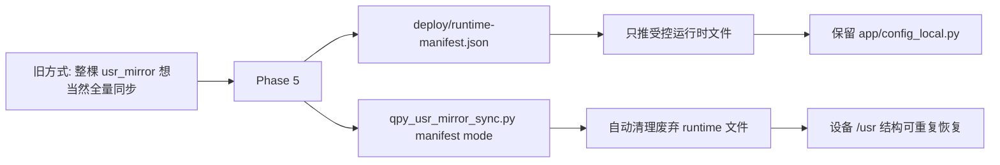

# qpyclaw-node Runtime Deploy Manifest Phase 5 Sync

## 日期

`2026-03-29`

## 范围

本轮不是继续压运行时模块，而是把设备部署入口正式收口为：

1. 显式部署清单
2. 受控同步脚本
3. 已废弃运行时文件自动清理

也就是说，从这一轮开始，`qpyclaw-node` 的推荐部署方式不再是“把整棵 `usr_mirror` 想当然全量推上去”，而是“按 manifest 明确允许哪些文件进入 `/usr`”。

## 新增内容

### 1. 显式部署清单

新增：

`[runtime-manifest.json](C:\Users\kingd\Desktop\code\lcc-ai-team\embed\project\qpyclaw\embed\qpyclaw-node\deploy\runtime-manifest.json)`

它定义了：

1. `local_root_rel`
2. `remote_root`
3. `files`
4. `preserve_remote_files`
5. `remove_remote_files`

当前 manifest 语义是：

1. 只允许 `16` 个受控运行时文件进入设备 `/usr`
2. 保留设备本地的 `app/config_local.py`
3. 主动清理 `config_local.example.py`、`system_control.py`、`json_codec.py` 和旧版 `tool_*.py` 薄包装文件

### 2. 受控同步脚本

更新：

`[qpy_usr_mirror_sync.py](C:\Users\kingd\Desktop\code\lcc-ai-team\embed\project\qpyclaw\tools\host\qpy_usr_mirror_sync.py)`

新增能力：

1. 默认读取 `embed/qpyclaw-node/deploy/runtime-manifest.json`
2. `--dry-run`
3. `--ignore-manifest`
4. `--skip-remove`
5. manifest 模式下只推 allowlist 文件
6. manifest 模式下按显式清单清理废弃文件

### 3. 部署说明

新增：

`[deploy/README.md](C:\Users\kingd\Desktop\code\lcc-ai-team\embed\project\qpyclaw\embed\qpyclaw-node\deploy\README.md)`

并更新：

`[runtime/README.md](C:\Users\kingd\Desktop\code\lcc-ai-team\embed\project\qpyclaw\embed\qpyclaw-node\runtime\README.md)`

`[tools/host/README.md](C:\Users\kingd\Desktop\code\lcc-ai-team\embed\project\qpyclaw\tools\host\README.md)`

## Dry Run 验证

执行：

```powershell
python C:\Users\kingd\Desktop\code\lcc-ai-team\embed\project\qpyclaw\tools\host\qpy_usr_mirror_sync.py --port COM11 --dry-run --json
```

结果摘要：

```json
{
  "mode": "manifest",
  "planned_directories": 3,
  "planned_files": 16,
  "planned_remove": 17,
  "preserve_remote_files": [
    "app/config_local.py"
  ],
  "ok": true
}
```

这说明 manifest 计划正确收敛到了：

1. `/usr`
2. `/usr/app`
3. `/usr/app/tools`

以及明确的文件 allowlist 和 stale-file cleanup 列表。

## 真实设备同步

设备：`COM11`

执行：

```powershell
python C:\Users\kingd\Desktop\code\lcc-ai-team\embed\project\qpyclaw\tools\host\qpy_usr_mirror_sync.py --port COM11 --json
```

结果摘要：

| 项目 | 数量 |
| --- | ---: |
| `mkdir` | 3 |
| `push` | 16 |
| `remove` | 17 |
| 总结果 | pass |

本次同步已自动清理：

1. `app/config_local.example.py`
2. `app/json_codec.py`
3. `app/system_control.py`
4. 旧版 `app/tools/tool_*.py` 薄包装文件

同时明确保留：

1. `app/config_local.py`

## 同步后设备目录

设备 `/usr/app` 当前为：

```text
__init__.py
agent.py
command_worker.py
config.py
config_local.py
device_auth.py
runtime_state.py
tool_runner.py
tools/
transport_ws_openclaw.py
ws_client.py
```

设备 `/usr/app/tools` 当前为：

```text
__init__.py
tool_probe.py
tools_device.py
tools_fs.py
tools_net.py
tools_runtime.py
```

这说明 Phase 2/3/4 的收敛结果，现在已经被 manifest 化、脚本化，而不再依赖人工记忆。

## 同步后运行时冒烟

设备 REPL 上执行：

1. `from app import config`
2. `RuntimeState(config)`
3. `ToolRunner(config, state)`
4. `runner.execute(qpy.tools.catalog)`

结果：

```json
{
  "config_local_loaded": true,
  "config_local_error": "",
  "catalog_status": "succeeded",
  "catalog_tool_count": 16
}
```

这说明：

1. manifest 同步不会覆盖或破坏设备本地 `config_local.py`
2. 同步后的 runtime 仍可正常初始化
3. `qpy.tools.catalog` 仍然正常

## 结构变化



## 结论

截至 `2026-03-29`，Phase 5 已完成并验证通过：

1. `qpyclaw-node` 已有正式的 runtime deployment manifest
2. Host 同步脚本已默认接入 manifest
3. `COM11` 已完成一次真实 manifest 同步
4. 设备本地 `config_local.py` 已确认被保留
5. 同步后运行时冒烟通过

这意味着后续即使重新刷机、清空 `/usr`、或者继续裁剪运行时结构，也已经有了一个明确、可重复、可审计的部署入口。

## 证据

结构化证据见：

`[2026-03-29-runtime-deploy-manifest-phase5-sync.json](C:\Users\kingd\Desktop\code\lcc-ai-team\embed\project\qpyclaw\docs\bringup\evidence\2026-03-29-runtime-deploy-manifest-phase5-sync.json)`
