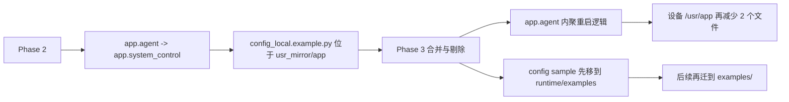

# qpyclaw-node Runtime File Count Phase 3 Merge And Prune

## 日期

`2026-03-29`

## 范围

本轮只做两件事：

1. 把不应部署到设备的 `config_local.example.py` 移出 `usr_mirror/app`
2. 把 `system_control.py` 合并进 `agent.py`

本轮目标不是继续改传输、鉴权或工具协议，只是继续减少设备侧运行时文件数量，并保持行为不变。

## 代码变更

### 1. 示例配置文件移出设备镜像

示例文件从：

`runtime/usr_mirror/app/config_local.example.py`

移动到：

`[runtime/examples/config_local.example.py](C:\Users\kingd\Desktop\code\lcc-ai-team\embed\project\qpyclaw\embed\qpyclaw-node\runtime\examples\config_local.example.py)`

> 后续说明：同日稍后的目录分层调整中，示例又进一步从 `runtime/examples/`
> 迁到 `embed/qpyclaw-node/examples/<board>/`，以避免 runtime 目录继续承载板型示例。

这意味着：

1. 仓库仍保留示例配置
2. 设备部署镜像不再携带这个示例文件
3. `[runtime/README.md](C:\Users\kingd\Desktop\code\lcc-ai-team\embed\project\qpyclaw\embed\qpyclaw-node\runtime\README.md)` 已更新到新路径

### 2. `system_control.py` 并入 `agent.py`

以下函数已并入：

1. `_safe_import`
2. `_safe_call`
3. `_call_power_restart`
4. `_call_machine_reset`
5. `_call_pm_reboot`
6. `execute_reboot`
7. `perform_pending_reboot`

合并后：

1. `[agent.py](C:\Users\kingd\Desktop\code\lcc-ai-team\embed\project\qpyclaw\embed\qpyclaw-node\runtime\usr_mirror\app\agent.py)` 直接承载重启控制逻辑
2. `runtime/usr_mirror/app/system_control.py` 已删除

## 本地结果

执行兼容性检查：

```bash
python C:\Users\kingd\.codex\skills\quecpython-dev\scripts\check_quecpython_compat.py C:\Users\kingd\Desktop\code\lcc-ai-team\embed\project\qpyclaw\embed\qpyclaw-node\runtime\usr_mirror\app
```

结果：

```text
Scanned files: 16
Issues found: 0
```

当前 `runtime/usr_mirror/app` 下 Python 文件总数已经降到 `16`。

## 设备变更

设备：`COM11`

### 变更前 `/usr/app`

```text
__init__.py
agent.py
command_worker.py
config.py
config_local.example.py
config_local.py
device_auth.py
json_codec.py
runtime_state.py
system_control.py
tool_runner.py
tools/
transport_ws_openclaw.py
ws_client.py
```

### 下发与清理动作

1. 推送新的 `[agent.py](C:\Users\kingd\Desktop\code\lcc-ai-team\embed\project\qpyclaw\embed\qpyclaw-node\runtime\usr_mirror\app\agent.py)` 到 `/usr/app/agent.py`
2. 删除 `/usr/app/system_control.py`
3. 删除 `/usr/app/config_local.example.py`

执行结果：

| 动作 | 结果 |
| --- | --- |
| push `/usr/app/agent.py` | pass |
| rm `/usr/app/system_control.py` | pass |
| rm `/usr/app/config_local.example.py` | pass |

### 变更后 `/usr/app`

```text
__init__.py
agent.py
command_worker.py
config.py
config_local.py
device_auth.py
json_codec.py
runtime_state.py
tool_runner.py
tools/
transport_ws_openclaw.py
ws_client.py
```

设备根目录文件数相对本轮开始时减少了 `2` 个。

## 设备冒烟

设备 REPL 上直接做了 `app.agent` 导入验证，结果如下：

```json
{
  "agent_imported": true,
  "system_control_loaded": false,
  "has_execute_reboot": true,
  "has_perform_pending_reboot": true,
  "perform_pending_reboot_without_pending": false,
  "debug_snapshot_has_state": false
}
```

这说明：

1. `app.agent` 可以独立导入成功
2. 导入 `app.agent` 时不会再尝试加载 `app.system_control`
3. 合并后的重启辅助函数仍然存在
4. 在无待执行重启任务时，`perform_pending_reboot` 行为正常

## 结构对比



## 结论

截至 `2026-03-29`，Phase 3 已完成并验证通过：

1. 设备镜像不再包含 `config_local.example.py`
2. `system_control.py` 已成功并入 `agent.py`
3. 本地兼容性检查通过
4. 真实设备 `COM11` 已同步并完成导入冒烟

这意味着下一轮如果继续压文件数量，最自然的候选就只剩：

1. `json_codec.py`
2. 更细化的部署清单控制

## 证据

结构化证据见：

`[2026-03-29-runtime-file-count-phase3-merge-and-prune.json](C:\Users\kingd\Desktop\code\lcc-ai-team\embed\project\qpyclaw\docs\bringup\evidence\2026-03-29-runtime-file-count-phase3-merge-and-prune.json)`
