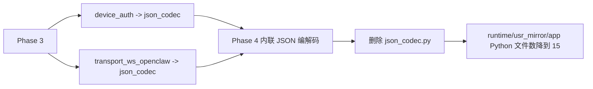

# qpyclaw-node Runtime File Count Phase 4 json_codec Removal

## 日期

`2026-03-29`

## 范围

本轮只做一件事：

把 `json_codec.py` 这个薄包装模块彻底移除，并把它的 `dumps/loads` 能力直接并入真实消费者。

本轮不改：

1. WebSocket 协议行为
2. 设备鉴权协议行为
3. 命令执行链路
4. 工具注册和懒加载逻辑

## 代码变更

### 1. `device_auth.py` 内联 JSON 编解码

`[device_auth.py](C:\Users\kingd\Desktop\code\lcc-ai-team\embed\project\qpyclaw\embed\qpyclaw-node\runtime\usr_mirror\app\device_auth.py)` 不再依赖 `app.json_codec`，改为本地直接：

1. `import ujson as _json`
2. `dumps(value)`
3. `loads(value)`

### 2. `transport_ws_openclaw.py` 内联 JSON 编解码

`[transport_ws_openclaw.py](C:\Users\kingd\Desktop\code\lcc-ai-team\embed\project\qpyclaw\embed\qpyclaw-node\runtime\usr_mirror\app\transport_ws_openclaw.py)` 同样不再依赖 `app.json_codec`，改为本地直接：

1. `import ujson as _json`
2. `dumps(value)`
3. `loads(value)`

### 3. 删除 `json_codec.py`

`runtime/usr_mirror/app/json_codec.py` 已删除。

## 本地结果

执行兼容性检查：

```bash
python C:\Users\kingd\.codex\skills\quecpython-dev\scripts\check_quecpython_compat.py C:\Users\kingd\Desktop\code\lcc-ai-team\embed\project\qpyclaw\embed\qpyclaw-node\runtime\usr_mirror\app
```

结果：

```text
Scanned files: 15
Issues found: 0
```

当前 `runtime/usr_mirror/app` 下 Python 文件总数已经降到 `15`。

## 设备同步

设备：`COM11`

### 下发动作

1. 推送新的 `[device_auth.py](C:\Users\kingd\Desktop\code\lcc-ai-team\embed\project\qpyclaw\embed\qpyclaw-node\runtime\usr_mirror\app\device_auth.py)` 到 `/usr/app/device_auth.py`
2. 推送新的 `[transport_ws_openclaw.py](C:\Users\kingd\Desktop\code\lcc-ai-team\embed\project\qpyclaw\embed\qpyclaw-node\runtime\usr_mirror\app\transport_ws_openclaw.py)` 到 `/usr/app/transport_ws_openclaw.py`
3. 删除 `/usr/app/json_codec.py`

执行结果：

| 动作 | 结果 |
| --- | --- |
| push `/usr/app/device_auth.py` | pass |
| push `/usr/app/transport_ws_openclaw.py` | pass |
| rm `/usr/app/json_codec.py` | pass |

## 设备冒烟

设备 REPL 上直接导入：

1. `app.device_auth`
2. `app.transport_ws_openclaw`

并验证：

1. `app.json_codec` 不再被加载
2. 两侧本地 `dumps/loads` 可正常 round-trip
3. `WsNativeTransport` 仍然存在

结果如下：

```json
{
  "device_auth_imported": true,
  "transport_imported": true,
  "json_codec_loaded": false,
  "device_auth_roundtrip": 1,
  "transport_roundtrip": 2,
  "has_transport_class": true
}
```

## 设备最终 `/usr/app`

```text
__init__.py
agent.py
command_worker.py
config.py
config_local.py
device_auth.py
runtime_state.py
tool_runner.py
tools/
transport_ws_openclaw.py
ws_client.py
```

相对 Phase 3，再减少 `1` 个文件。

## 结构变化



## 结论

截至 `2026-03-29`，Phase 4 已完成并验证通过：

1. `json_codec.py` 已从本地运行时镜像删除
2. 设备上的 `/usr/app/json_codec.py` 已删除
3. `device_auth.py` 和 `transport_ws_openclaw.py` 已完成内联替代
4. 本地兼容性检查通过
5. 真实设备 `COM11` 导入冒烟通过

这意味着当前运行时目录里，明显的“超薄包装模块”已经基本清理干净。

## 下一步候选

接下来如果继续做 Phase 5，方向就不再是“删一个薄模块”，而是：

1. 做显式部署清单，避免将来误把非运行时文件再次带进 `/usr`
2. 评估 `config_local.py` 的设备侧存在方式是否需要进一步标准化

## 证据

结构化证据见：

`[2026-03-29-runtime-file-count-phase4-json-codec-removal.json](C:\Users\kingd\Desktop\code\lcc-ai-team\embed\project\qpyclaw\docs\bringup\evidence\2026-03-29-runtime-file-count-phase4-json-codec-removal.json)`
