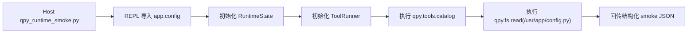

# qpyclaw-node Runtime Smoke Phase 8

## 日期

`2026-03-29`

## 目标

Phase 7 已经把刷机后恢复流程收口成了
[qpy_post_flash_recover.py](C:\Users\kingd\Desktop\code\lcc-ai-team\embed\project\qpyclaw\tools\host\qpy_post_flash_recover.py)，
但“恢复完成”不等于“runtime 真能起”。

Phase 8 的目标是新增一个保守、稳定、可重复的 host 自检脚本，专门验证：

1. `app.config` 能导入
2. `CONFIG_LOCAL_LOADED` 状态正确
3. `RuntimeState(config)` 能初始化
4. `ToolRunner(config, state)` 能初始化
5. `qpy.tools.catalog` 能执行
6. `qpy.fs.read` 能执行

## 新增内容

### 新脚本

[qpy_runtime_smoke.py](C:\Users\kingd\Desktop\code\lcc-ai-team\embed\project\qpyclaw\tools\host\qpy_runtime_smoke.py)

这个脚本的特点是：

1. 不修改设备 runtime 代码
2. 只复用现有 REPL 通道
3. 直接在板子上完成 `import -> init -> execute`
4. 返回结构化 JSON，适合后续纳入运维流水线

### 验证链路



## 推荐命令

```powershell
python C:\Users\kingd\Desktop\code\lcc-ai-team\embed\project\qpyclaw\tools\host\qpy_runtime_smoke.py --port COM11 --json
```

## 实际验证

设备：`COM11`

执行：

```powershell
python C:\Users\kingd\Desktop\code\lcc-ai-team\embed\project\qpyclaw\tools\host\qpy_runtime_smoke.py --port COM11 --json
```

结果：

```json
{
  "ok": true,
  "payload": {
    "config_local_loaded": true,
    "config_local_error": "",
    "device_model_hint": "EC800KCNLC",
    "board_profile": "ec800kcnlc-sim-only",
    "catalog_status": "succeeded",
    "catalog_result_code": "OK",
    "catalog_tool_count": 16,
    "fs_read_status": "succeeded",
    "fs_read_result_code": "OK",
    "fs_read_path": "/usr/app/config.py",
    "fs_read_bytes": 128,
    "loaded_domains_after_catalog": [
      "runtime"
    ],
    "loaded_domains_after_fs_read": [
      "filesystem",
      "runtime"
    ]
  }
}
```

## 结果解读

### 1. `config_local.py` 生效

| 项目 | 结果 |
| --- | --- |
| `config_local_loaded` | `true` |
| `config_local_error` | `""` |

这说明恢复流程后，设备侧仍能正确加载本地配置覆盖。

### 2. runtime 基础初始化正常

`RuntimeState` 与 `ToolRunner` 都已经成功初始化，否则后续两个工具都不会返回
`succeeded / OK`。

### 3. lazy-import 行为仍成立

| 检查点 | 已加载域 |
| --- | --- |
| 执行 `qpy.tools.catalog` 后 | `["runtime"]` |
| 再执行 `qpy.fs.read` 后 | `["filesystem", "runtime"]` |

这说明：

1. `qpy.tools.catalog` 只拉起 `runtime` 域
2. `qpy.fs.read` 再拉起 `filesystem` 域
3. `device` 和 `network` 域没有被这个自检误加载

### 4. 文件系统工具可用

`qpy.fs.read` 已成功读取：

`/usr/app/config.py`

读取字节数：

`128`

这说明恢复后的 `/usr` 结构可访问，filesystem 工具链正常。

## 价值

| 维度 | Phase 7 之前 | Phase 8 之后 |
| --- | --- | --- |
| 恢复后验证 | 靠人工 REPL 临时敲命令 | 固定脚本化自检 |
| 输出形式 | 零散人工观察 | 结构化 JSON |
| 对 lazy-import 的保护 | 只能靠记忆 | 自检结果直接可见 |
| 运维复制性 | 中等 | 高 |

## 结论

截至 `2026-03-29`，Phase 8 已完成并验证通过：

1. `qpy_runtime_smoke.py` 已成为新的标准 runtime 自检入口
2. 它在 `COM11` 上已确认 `config -> RuntimeState -> ToolRunner -> qpy.tools.catalog -> qpy.fs.read` 链路完整可用
3. 当前 lazy-import 优化没有在恢复流程后被破坏
4. `qpyclaw-node` 现在已经具备两条标准 host 运维动作：
   1. 恢复：`qpy_post_flash_recover.py`
   2. 自检：`qpy_runtime_smoke.py`

下一步如果继续推进，最自然的方向就不是恢复和自检，而是：

1. `_main.py -> main.py` 的上电自启动切换策略
2. EC800M 音频板的分层 bring-up
3. 把 runtime smoke 纳入 recovery 脚本的可选 `--smoke` 步骤

## 证据

[2026-03-29-runtime-smoke-phase8.json](C:\Users\kingd\Desktop\code\lcc-ai-team\embed\project\qpyclaw\docs\bringup\evidence\2026-03-29-runtime-smoke-phase8.json)
