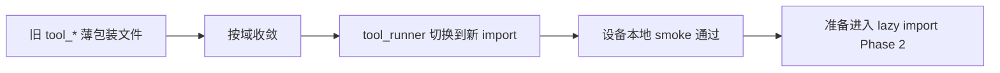

# qpyclaw-node Tools Consolidation Phase 1 Smoke

## Date

`2026-03-29`

## Scope

验证 `qpyclaw-node` Phase 1 工具模块收敛是否真正落地:

1. `tool_runner.py` 已切到按域导入
2. 新的 `tools_device.py`
3. 新的 `tools_fs.py`
4. 新的 `tools_net.py`
5. 新的 `tools_runtime.py`
6. 旧的薄包装 `tool_*` 文件已从设备和本地 runtime 镜像删除

## Result Summary

| 项目 | 结果 |
| --- | --- |
| QuecPython 兼容检查 | pass |
| 新模块下发到 `COM11` | pass |
| `ToolRunner` 重新导入并实例化 | pass |
| `qpy.tools.catalog` 本地执行 | pass |
| `qpy.fs.read` 本地执行 | pass |
| 设备 `/usr/app/tools` 目录收敛 | pass |

## Device Evidence

设备 `COM11` 上最终 `/usr/app/tools` 文件列表为:

```text
__init__.py
tool_probe.py
tools_device.py
tools_fs.py
tools_net.py
tools_runtime.py
```

这说明:

1. 旧的薄包装 `tool_*` 文件已经删除
2. `tool_probe.py` 仍保留为共享底座
3. 域级工具文件已经替代原先分散结构

## Runtime Smoke

设备本地 REPL 直接执行:

1. `RuntimeState(cfg)`
2. `ToolRunner(cfg, state)`
3. `runner.execute(qpy.tools.catalog)`
4. `runner.execute(qpy.fs.read)`

观测结果:

```json
{
  "catalog_status": "succeeded",
  "catalog_tool_count": 16,
  "fs_read_status": "succeeded",
  "fs_read_bytes": 128
}
```

说明:

1. 新 `ToolRunner` 能正常加载域模块
2. `qpy.tools.catalog` 没被破坏
3. `qpy.fs.read` 没被破坏
4. Phase 1 并未改变现有命令行为

## Current Conclusion

截至 `2026-03-29`, `qpyclaw-node` 的工具模块收敛 Phase 1 已完成:



当前可以确认:

1. 文件结构收敛已真实落地
2. 设备上真实 smoke 已通过
3. 下一阶段可以进入 `ToolRunner` lazy import
