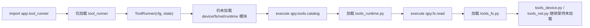

# qpyclaw-node Tools Consolidation Phase 2 Lazy Import Smoke

## 日期

`2026-03-29`

## 范围

本次只验证一件事：

在不改变 `qpyclaw-node` 对外工具名、别名、返回结构和权限判断的前提下，`[tool_runner.py](C:\Users\kingd\Desktop\code\lcc-ai-team\embed\project\qpyclaw\embed\qpyclaw-node\runtime\usr_mirror\app\tool_runner.py)` 是否已经从“启动时全量导入工具模块”切换为“按领域懒加载”。

本轮明确不触碰：

1. `transport_ws_openclaw.py`
2. `ws_client.py`
3. `runtime_state.py`
4. `command_worker.py`
5. `device_auth.py`
6. `config.py`
7. `config_local.*`

## 变更摘要

`tool_runner.py` 已从“注册时直接实例化工具类”改为“注册静态元数据，首次命中领域工具时再导入并实例化”。

当前懒加载领域划分如下：

| 领域 | 模块 |
| --- | --- |
| `device` | `app.tools.tools_device` |
| `filesystem` | `app.tools.tools_fs` |
| `network` | `app.tools.tools_net` |
| `runtime` | `app.tools.tools_runtime` |

同时保留以下行为不变：

1. 所有工具名与别名不变
2. `_allowed()` 权限判断不变
3. `_normalize_args()` 行为不变
4. 错误包结构不变
5. `qpy.help` 与 `qpy.tools.catalog` 仍共享同一个 `ToolToolsCatalog` 实例

## 结果总览

| 检查项 | 结果 |
| --- | --- |
| QuecPython 兼容检查 | pass |
| 新版 `tool_runner.py` 下发到 `COM11` | pass |
| 导入 `app.tool_runner` 时未提前加载领域模块 | pass |
| 实例化 `ToolRunner` 时未提前加载领域模块 | pass |
| 执行 `qpy.tools.catalog` 后仅加载 `runtime` 域 | pass |
| 执行 `qpy.fs.read` 后新增加载 `filesystem` 域 | pass |
| `qpy.help` / `qpy.tools.catalog` 共享实例 | pass |

## 验证步骤

### 1. 本地兼容性检查

执行：

```bash
python C:\Users\kingd\.codex\skills\quecpython-dev\scripts\check_quecpython_compat.py C:\Users\kingd\Desktop\code\lcc-ai-team\embed\project\qpyclaw\embed\qpyclaw-node\runtime\usr_mirror\app
```

结果：

```text
Scanned files: 18
Issues found: 0
```

### 2. 下发设备

执行：

```bash
python C:\Users\kingd\.codex\skills\quecpython-dev\scripts\qpy_device_fs_cli.py --json --port COM11 --push-via repl push --local C:\Users\kingd\Desktop\code\lcc-ai-team\embed\project\qpyclaw\embed\qpyclaw-node\runtime\usr_mirror\app\tool_runner.py --remote-dir /usr/app
```

结果摘要：

| 字段 | 值 |
| --- | --- |
| `backend` | `repl` |
| `bytes_written` | `9758` |
| `remote_path` | `/usr/app/tool_runner.py` |
| `ok` | `true` |

### 3. 设备侧懒加载探针

设备 REPL 上执行的核心动作：

1. 清理 `sys.modules` 中与本次验证相关的模块
2. 导入 `app.tool_runner`
3. 实例化 `ToolRunner(cfg, state)`
4. 执行 `qpy.tools.catalog`
5. 执行 `qpy.fs.read`
6. 观测四个领域模块是否被加载

观测结果如下：

| 阶段 | `app.tool_runner` | `tools_runtime` | `tools_fs` | `tools_net` | `tools_device` |
| --- | --- | --- | --- | --- | --- |
| `after_import` | true | false | false | false | false |
| `after_init` | true | false | false | false | false |
| `after_runtime_tool` | true | true | false | false | false |
| `after_fs_tool` | true | true | true | false | false |

这说明：

1. 导入和实例化阶段已经不再全量加载工具域模块
2. `qpy.tools.catalog` 首次命中时才拉起 `tools_runtime.py`
3. `qpy.fs.read` 首次命中时才拉起 `tools_fs.py`
4. `device` / `network` 域在本轮验证结束后仍未被加载

### 4. 命令冒烟结果

```json
{
  "catalog_status": "succeeded",
  "catalog_tool_count": 16,
  "shared_catalog_impl": true,
  "fs_read_status": "succeeded",
  "fs_read_bytes": 128
}
```

补充说明：

`qpy.fs.read` 的返回结构未变化，本次针对 `/usr/app/tool_runner.py` 的补充探针结果为：

```json
{
  "path": "/usr/app/tool_runner.py",
  "size": 9758,
  "bytes_read": 128,
  "truncated": true
}
```

## 观测图



## 结论

截至 `2026-03-29`，`qpyclaw-node` 工具收敛 Phase 2 已落地完成：

1. `tool_runner.py` 已切换到按领域懒加载
2. Phase 1 的工具域合并结果未被破坏
3. `runtime` 与 `filesystem` 域已在真实设备 `COM11` 上验证加载时机正确
4. 当前可以进入下一轮“继续压缩文件数量 / 合并低收益小模块”的优化评估

## 证据

结构化证据见：

`[2026-03-29-tools-consolidation-phase2-lazy-import-smoke.json](C:\Users\kingd\Desktop\code\lcc-ai-team\embed\project\qpyclaw\docs\bringup\evidence\2026-03-29-tools-consolidation-phase2-lazy-import-smoke.json)`
