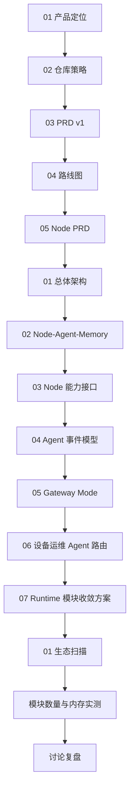

# qpyclaw Product Docs Index

## 文档清单

| 文档 | 目的 | 读者 |
| --- | --- | --- |
| [01-product-positioning.md](01-product-positioning.md) | 明确产品定位、价值主张、生态吸引力与商业化方向 | 产品、研发、合作方 |
| [02-repo-strategy.md](02-repo-strategy.md) | 明确仓库边界、目录组织与 `fleet` 拆分原则 | 架构、研发 |
| [03-prd-v1.md](03-prd-v1.md) | 明确首版产品需求、优先级、验收口径 | 产品、研发、测试 |
| [04-roadmap.md](04-roadmap.md) | 明确阶段里程碑与演进顺序 | 产品、研发、商务 |
| [05-qpyclaw-node-prd.md](05-qpyclaw-node-prd.md) | 单独定义 `qpyclaw-node` 的用户、场景、能力边界、网络模型和验收标准 | 产品、研发、测试、商务 |
| [../architecture/01-system-architecture.md](../architecture/01-system-architecture.md) | 明确 node、agent、gateway、fleet 之间的系统关系 | 架构、研发 |
| [../architecture/02-node-agent-memory.md](../architecture/02-node-agent-memory.md) | 明确 node-agent 关系、记忆存储与设备侧数据模型 | 架构、研发 |
| [../architecture/03-node-capabilities-and-edge-connectivity.md](../architecture/03-node-capabilities-and-edge-connectivity.md) | 明确 node 的能力面、语音终端路径与 edge 连接方式 | 架构、研发 |
| [../architecture/04-agent-event-model-and-minimal-tools.md](../architecture/04-agent-event-model-and-minimal-tools.md) | 明确 `qpyclaw-agent` 作为 Gateway Core 的事件、工具与编排模型 | 架构、研发 |
| [../architecture/05-qpyclaw-agent-gateway-mode.md](../architecture/05-qpyclaw-agent-gateway-mode.md) | 明确为什么 `qpyclaw-agent` 可以定义为 QuecPython OpenClaw Gateway，以及 v1 只承诺哪些核心骨架 | 架构、产品 |
| [../architecture/06-qpy-device-ops-agent-and-routing.md](../architecture/06-qpy-device-ops-agent-and-routing.md) | 明确云端 `qpy设备运维` agent 的职责、路由入口和对话方式 | 架构、研发、运维 |
| [../architecture/07-qpyclaw-node-tools-consolidation-plan.md](../architecture/07-qpyclaw-node-tools-consolidation-plan.md) | 明确 `qpyclaw-node` 运行时工具模块收敛、按域合并和 lazy import 的迁移方案 | 架构、研发 |
| [../research/01-ecosystem-scan.md](../research/01-ecosystem-scan.md) | 记录 OpenClaw 生态现状和可对标项目 | 产品、商务 |
| [../research/2026-03-29-quecpython-module-count-memory-study.md](../research/2026-03-29-quecpython-module-count-memory-study.md) | 记录 QuecPython 模块数量、导入开销和当前 `qpyclaw-node` 文件结构的设备实测结论 | 架构、研发 |
| [../../discussion/2026-03-26-project-conversation-log.md](../../discussion/2026-03-26-project-conversation-log.md) | 记录本轮讨论和决策轨迹，供复盘 | 所有人 |

## 推荐阅读顺序

## 当前文档阶段

1. 当前阶段是 `项目定义 + runtime 结构优化设计阶段`。
2. 当前目标是把仓库、产品线、协议边界、首批能力和内存友好型 runtime 结构定义清楚。
3. 当前先完成结构方案、迁移口径和回归方法, 再进入运行时代码改造。
