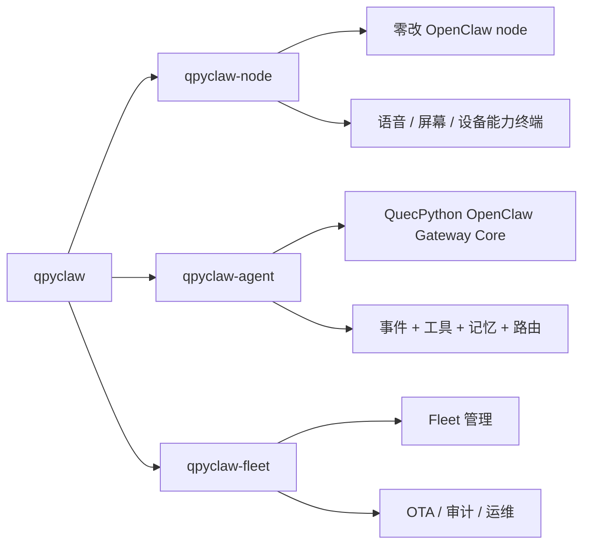

# qpyclaw Product Positioning

## 1. 一句话定位

`qpyclaw` 是面向 QuecPython 设备的 OpenClaw node 运行时与 Gateway Core 项目。

它不是“桌面版 OpenClaw 的缩水移植”，而是“把 OpenClaw 的 node 能力与 gateway core 下沉到真实设备世界”。

## 2. 为什么这个项目成立

### 2.1 技术成立

OpenClaw 已经明确存在 `Gateway + node` 架构。`qpyclaw` 要做的不是复制桌面形态，而是把其中最关键的两层抽出来：设备 node 与最小 gateway core。QuecPython 设备天然适合成为：

1. 低成本蜂窝 node
2. 语音交互 node
3. 屏幕状态终端 node
4. 传感器 / 电机 / 摄像头 / I/O 外设 node
5. `gateway-lite / gateway core`

### 2.2 产品成立

OpenClaw 当前强在：

1. 个人 agent
2. 聊天渠道
3. 桌面工具
4. 插件与 skills 生态

`qpyclaw` 要补的是：

1. 真实硬件接入
2. 低成本常在线设备
3. 蜂窝设备运行时
4. 语音、屏幕、传感器、外设能力
5. 私有 edge gateway / gateway-lite

## 3. 产品矩阵

| 产品线 | 核心问题 | 用户看到的价值 |
| --- | --- | --- |
| `qpyclaw-node` | 如何让 OpenClaw 零改接入 QuecPython 设备 | 现有 OpenClaw 用户可以直接接设备 |
| `qpyclaw-agent` | 如何在 QuecPython 上做 OpenClaw Gateway 核心骨架 | 设备不只是被控节点，还能成为私有 edge gateway |
| `qpyclaw-fleet` | 如何把设备变成可运维、可量产、可商业交付的系统 | 客户能部署、管理、审计、升级大量节点 |

## 4. 目标用户

### 4.1 OpenClaw 生态用户

1. 已经在用 OpenClaw，但想把能力延伸到真实硬件
2. 想要语音终端、状态终端、现场节点
3. 既希望零改接官方 Gateway，也愿意尝试 `qpyclaw-agent gateway-lite`

### 4.2 Maker / 硬件开发者

1. 想把 OpenClaw 接到传感器、继电器、电机、摄像头
2. 想用 QuecPython 做边缘智能节点
3. 想要一套能复用的设备 + Gateway Core 运行时

### 4.3 商业客户 / 集成商

1. 想要可量产、可部署、可运维的设备 agent 节点
2. 想要语音面板、运维终端、告警节点
3. 想把 OpenClaw 生态能力接入业务现场

## 5. 价值结构

### 5.1 技术价值

1. 补齐 OpenClaw 在嵌入式设备上的 node 与 gateway core 空白
2. 建立 OpenClaw-compatible QuecPython 协议、设备能力与工具面
3. 把音频、屏幕、I/O、传感器等能力纳入 OpenClaw 可调用体系

### 5.2 生态价值

1. 给 OpenClaw 生态提供第一类真正面向设备世界的 node / gateway core
2. 用 skill、board package、device profile 吸引部分生态用户试用
3. 把“agent 会聊天”升级成“agent 有身体、有现场入口”

### 5.3 生产价值

1. 可做现场运维终端
2. 可做语音控制面板
3. 可做远程诊断节点
4. 可做传感器 / 告警 / 执行器节点

### 5.4 商业价值

1. 可卖板级适配与项目交付
2. 可卖 Gateway Core 私有化方案
3. 可卖 fleet 管理、OTA、日志、审计与运维能力
4. 可卖行业解决方案包

## 6. 为什么不能只做极客项目

如果只做“EC800 上跑一个 demo”，它会停在极客项目。

如果做到下面 4 点，它就会进入生态和商业轨道：

1. 零改官方 Gateway 接入，或用 `qpyclaw-agent` 直接承接 node
2. 有立刻可见的设备超能力
3. 有稳定、可复现、可部署的板级方案
4. 有清晰的 Gateway Core 边界和 fleet 演进路线

## 7. 当前首板的战略意义

`EC800MCNLE` 不是最终上限，它是最合理的第一块板。

原因：

1. 有蜂窝网络
2. 有音频能力
3. 有 LCD 能力
4. 有 QuecPython 运行时
5. 非常适合做“OpenClaw 语音 / 状态终端”
6. 足以验证 `Gateway Core` 骨架是否成立

这块板的成功意义不在于“证明能跑”，而在于：

1. 证明 OpenClaw 真的能下沉到设备
2. 证明 QuecPython 设备能成为 OpenClaw 原生 node
3. 证明 QuecPython 设备也能承接最小 gateway core
4. 为更高资源模组和更多外设扩展打样

## 8. 对外传播建议

### 不要这样说

1. “把 OpenClaw 搬到 EC800 上”
2. “复制一个轻量版 OpenClaw”
3. “一个有趣的硬件极客项目”

### 要这样讲

1. “OpenClaw 的 QuecPython 设备运行时”
2. “零改 OpenClaw node 标准”
3. “QuecPython OpenClaw Gateway Core / Gateway-Lite”
4. “从 OpenClaw 到真实设备世界的桥梁”
