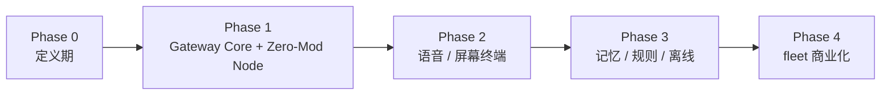

# qpyclaw Roadmap

## 1. 路线图原则

1. 先定义 Gateway Core 与 node 的边界，再进入实现
2. 先打穿 `qpyclaw-node <-> qpyclaw-agent` 主链路，再扩展外设与体验
3. 先做设备能力与 gateway core，再做 fleet
4. 先打穿首板，再扩展模组家族

## 2. 路线图

## 3. 各阶段目标

### Phase 0：定义期

1. 明确仓库结构
2. 明确产品定位
3. 明确 node / agent / fleet 边界
4. 明确首板资源抽象

### Phase 1：Gateway Core + Zero-Mod Node

1. 明确 `qpyclaw-agent` 的 Gateway Core / Gateway-Lite 边界
2. 打通 `qpyclaw-node -> qpyclaw-agent`
3. 保留 `qpyclaw-node -> Official OpenClaw Gateway` 兼容路径
4. 提供首批只读工具并发布最小演示

### Phase 2：语音 / 屏幕终端

1. 打通语音输入上行
2. 打通语音播报输出
3. 打通状态卡片与屏幕展示
4. 形成“可展示”的生态亮点

### Phase 3：记忆 / 规则 / 离线

1. 形成 `qpyclaw-agent` 的完整最小闭环
2. 加入本地事件、规则、轻量记忆
3. 加入离线 fallback
4. 在更高资源模组上验证多节点与更复杂编排

### Phase 4：fleet 商业化

1. 设备注册
2. 配置中心
3. OTA
4. 日志与诊断
5. 安全审计
6. 行业交付

## 4. 里程碑判断标准

| 阶段 | 判断标准 |
| --- | --- |
| Phase 1 完成 | `qpyclaw-node` 能稳定作为 OpenClaw node，且 `qpyclaw-agent` 能承接最小 gateway 会话 |
| Phase 2 完成 | 用户可把设备作为语音 / 屏幕终端使用 |
| Phase 3 完成 | `qpyclaw-agent` 具备 Gateway Core 的事件、记忆、规则与离线形态 |
| Phase 4 完成 | 项目具备稳定商业交付能力 |
