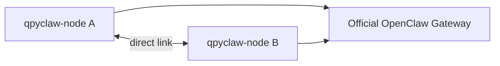
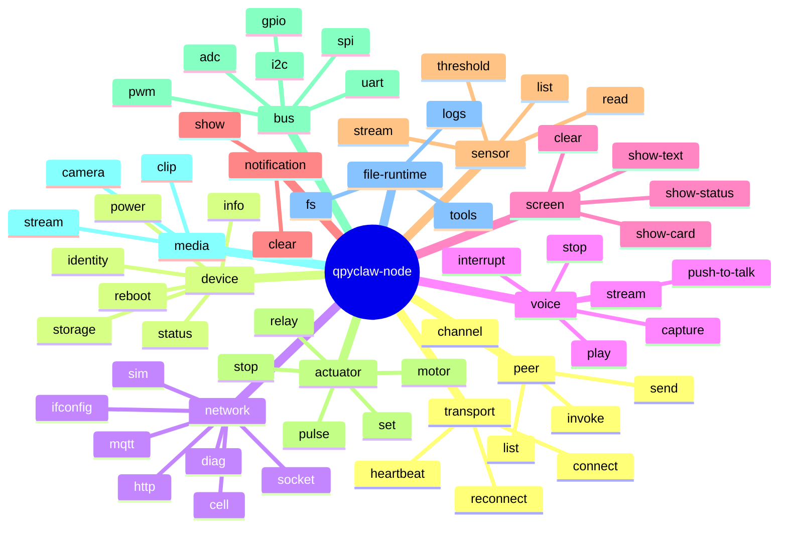

# qpyclaw-node PRD

## 1. 文档目标

单独定义 `qpyclaw-node` 的产品需求。

这份文档只回答一件事：

`qpyclaw-node` 到底是什么，要服务谁，第一版必须做成什么样，为什么它值得做。

## 2. 产品定义

### 2.1 一句话定义

`qpyclaw-node` 是运行在 QuecPython 设备上的 OpenClaw 兼容节点运行时。

它的核心职责不是“在设备上跑一个完整 AI agent”，而是：

1. 让设备稳定接入官方 OpenClaw Gateway
2. 让设备能力被标准化暴露、调用与回执
3. 让设备成为语音、屏幕、传感器、执行器、多媒体与总线外设的真实入口

### 2.2 当前主线范围

当前阶段只考虑一条主线：

```text
qpyclaw-node -> Official OpenClaw Gateway
```

说明：

1. 当前 `qpyclaw-node` PRD 不再把其他上游模式作为主线
2. 当前重点是先把 node 做深、做全、做透
3. 其他上游或桥接模式后续再单独讨论

### 2.3 角色边界


`qpyclaw-node` 负责：

1. 连接
2. 宣告能力
3. 执行命令
4. 返回结果
5. 上报事件
6. 暴露全量设备能力目录

`qpyclaw-node` 当前不负责：

1. 替代官方 OpenClaw Gateway
2. 多租户或后台管理
3. 复杂平台侧管理面

## 3. 目标用户

| 用户 | 当前痛点 | 为什么会用 `qpyclaw-node` |
| --- | --- | --- |
| OpenClaw 现有用户 | 只有桌面和聊天入口，缺真实设备触点 | 能零改接入设备能力 |
| Maker / 硬件开发者 | 设备接入协议、能力抽象、调用接口要自己重做 | 能直接复用 OpenClaw 生态 |
| 集成商 / 方案商 | 现场设备、语音终端、状态面板不好快速交付 | 有标准 runtime，可更快做项目交付 |
| 企业 PoC 团队 | 想快速验证“AI + 设备”是否有业务价值 | 上手成本低，演示效果强 |

## 4. 核心价值主张

### 4.1 对 OpenClaw 生态的价值

1. 让 OpenClaw 从“桌面入口”延展到“设备入口”
2. 让现有用户不用改大量上游逻辑就能接入设备
3. 让 node 不再只是抽象概念，而是实际可买、可装、可部署的设备
4. 让多 node 设备网络成为 OpenClaw 生态可见的一部分

### 4.2 对设备开发者的价值

1. 把设备连接、能力暴露、命令处理标准化
2. 避免每个项目都重复造一套协议和运行时
3. 让语音、屏幕、外设、蜂窝网络能力进入统一调用面
4. 先完整盘点和实现能力，再在后续加入约束、安全和策略

### 4.3 对商业落地的价值

1. 可做“AI 语音面板”
2. 可做“AI 运维终端”
3. 可做“AI 远程诊断节点”
4. 可做“AI 传感器 / 告警 / 控制节点”
5. 可做“多节点协同设备网络”

## 5. 设计原则

1. 先稳定连接，再谈复杂体验
2. 先暴露全量能力目录，再谈权限和安全约束
3. 先把能力做出来，再做启用策略和风险分级
4. 先聚焦官方 OpenClaw Gateway 主线，再讨论其他模式
5. 网络设计必须默认适配蜂窝设备与 CGNAT 环境
6. 多 node 协同必须从一开始进入产品边界，而不是后补

## 6. 产品目标

## 6.1 一级目标

1. `qpyclaw-node` 可稳定接入官方 OpenClaw Gateway
2. 设备在官方 Gateway 上被识别为在线 node
3. Gateway 可调用首批 `qpy.*` 工具并收到稳定回执
4. 设备可作为语音终端和屏幕终端展示
5. 设备状态、网络状态、SIM 状态可被远程读取
6. 设备的全量能力目录可被发现和索引

## 6.2 二级目标

1. 形成统一的设备能力命名空间
2. 形成首板 `EC800MCNLE` 的标准 profile
3. 形成多 node 间接通信与直接通信的抽象
4. 形成后续外设扩展与行业定制的接口基础

## 7. 非目标

1. 不替代官方 OpenClaw Gateway
2. 不做多租户控制台
3. 不把 v1 缩成“只读状态查询 node”
4. 不把安全策略放到能力建模之前
5. 不在当前阶段把其他上游模式拉成主线

## 8. 典型使用场景

## 8.1 场景 A：零改接入设备

用户已经在使用 OpenClaw，希望接入一块真实设备，并通过官方 Gateway 查看设备状态、调用设备命令。

成功结果：

1. 设备上线
2. Gateway 看到 node
3. 调用 `qpy.device.status`
4. 收到结构化结果

## 8.2 场景 B：语音对话终端

用户把 `EC800MCNLE` 设备当作语音终端使用。

成功结果：

1. 用户说话
2. 设备采集语音或转写文本
3. 官方 Gateway 处理
4. 设备播报结果并更新屏幕

## 8.3 场景 C：现场状态终端

用户把设备装在柜体、工位或值班点，用来展示在线状态、网络状态、告警与简单交互。

成功结果：

1. 可远程看状态
2. 可现场看屏幕
3. 网络异常和 SIM 异常可快速定位

## 8.4 场景 D：全能力外设节点

用户给设备外挂传感器、电机、继电器、摄像头或总线设备。

成功结果：

1. Gateway 能发现能力
2. Gateway 能调用工具
3. 设备能回报采样值或执行结果

## 8.5 场景 E：多 Node 协同

用户部署多个 `qpyclaw-node`，希望它们之间交换状态、转发指令或协同动作。

成功结果：

1. 多个 node 能被官方 Gateway 统一发现
2. node A 能经 Gateway 间接调用 node B 的能力
3. 在需要时，node 与 node 之间也可建立直接通信链路

## 9. 网络与连接模型

## 9.1 关键原则

`qpyclaw-node` 必须按“出站长连接优先”设计，而不是按“等待被入站访问”设计。

原因：

1. 蜂窝设备常见运营商内网 IP 或 CGNAT
2. 不同运营商之间通常不能假设直接按 IP 双向可达
3. 即便拿到公网地址，也不能假设稳定、固定、长期开放入站端口

## 9.2 当前唯一主线


说明：

1. 由 `qpyclaw-node` 主动发起连接
2. 官方 Gateway 不依赖直接访问 node IP
3. 所有控制、调用、事件都复用已有长连接

## 9.3 多 Node 通信模型

### 模型 A：经 Official OpenClaw Gateway 间接通信


特点：

1. 最通用
2. 最适合当前主线
3. 不依赖 node 之间直接可达
4. 最适合蜂窝网络现实

### 模型 B：多个 Node 直接通信



特点：

1. 适合低时延或本地协同场景
2. 适合局域网、专网、专用 APN、VPN、协处理器桥接场景
3. 不应作为当前主线前提

### 当前结论

1. 当前主线优先“经 Gateway 间接通信”
2. “Node 直接通信”明确保留在产品边界里
3. 直接通信是增强能力，不是当前首板成败前提

## 10. 功能范围

## 10.1 产品能力策略

当前不是“先裁剪能力”，而是：

1. 先定义全量能力目录
2. 先把全量能力纳入产品边界
3. 先推动实现能力面
4. 约束、安全、权限、策略放到下一层

也就是说：

`v1 的产品方向是 full capability inventory first`

## 10.2 全能力目录

### A. Device

1. `device.info`
2. `device.status`
3. `device.identity`
4. `device.power`
5. `device.storage`
6. `device.reboot`

### B. Network

1. `net.diag`
2. `net.ifconfig`
3. `sim.info`
4. `cell.info`
5. `mqtt.*`
6. `http.*`
7. `socket.*`

### C. Voice

1. `voice.push_to_talk`
2. `voice.capture`
3. `voice.play`
4. `voice.stop`
5. `voice.interrupt`
6. `voice.stream`

### D. Screen / UX

1. `screen.show_text`
2. `screen.show_status`
3. `screen.show_card`
4. `screen.clear`
5. `notification.show`
6. `notification.clear`

### E. Sensor

1. `sensor.list`
2. `sensor.read`
3. `sensor.stream`
4. `sensor.threshold`

### F. Actuator

1. `actuator.set`
2. `actuator.pulse`
3. `actuator.stop`
4. `motor.*`
5. `relay.*`

### G. Bus / Peripheral

1. `uart.*`
2. `i2c.*`
3. `spi.*`
4. `gpio.*`
5. `pwm.*`
6. `adc.*`

### H. Media

1. `camera.snap`
2. `camera.stream`
3. `media.record_clip`
4. `media.play_clip`

### I. File / Runtime

1. `runtime.status`
2. `runtime.logs`
3. `tools.catalog`
4. `fs.list`
5. `fs.read`
6. `fs.write`

### J. Node-to-Node

1. `node.peer.list`
2. `node.peer.invoke`
3. `node.peer.send`
4. `node.peer.channel.open`

## 10.3 当前交付优先级

虽然能力目录按全量定义，但当前交付优先级仍分层：

### P0

1. 连接与会话
2. `device.*`
3. `net.*`
4. `runtime.*`
5. `voice.play`
6. `screen.show_text`

### P1

1. `voice.capture`
2. `screen.show_status`
3. `sensor.*`
4. `bus.*`
5. `node.peer.*` 间接通信

### P2

1. `actuator.*`
2. `media.*`
3. `fs.write`
4. `node.peer.*` 直接通信

## 11. 能力模型



## 12. 安全与权限边界

当前策略调整为：

1. 本文档先以“能力定义与实现”为主
2. 安全、权限、风险分级后续单独出文档
3. 但高风险能力必须在实现时保留清晰边界和开关位

换句话说：

1. 现在不先砍能力
2. 现在先把能力边界和实现空间拉满
3. 下一轮再做安全与默认开放策略

## 13. 首板定义

## 13.1 首板选择

`EC800MCNLE` 作为 `qpyclaw-node` 第一块验证板。

## 13.2 选择理由

1. 有蜂窝网络
2. 有音频能力
3. 有 LCD 能力
4. 有 QuecPython 运行时
5. 有 UART / I2C 等外设扩展基础

## 13.3 v1 首板目标

1. 稳定联网
2. 稳定上线
3. 稳定返回核心能力调用
4. 跑通语音输入输出演示
5. 跑通屏幕状态展示演示
6. 打通至少一条多 node 间接通信演示链路

## 14. 用户体验要求

1. 首次上电后能完成连接准备
2. 网络中断后自动重连
3. 调用失败时给出结构化错误
4. 设备侧日志能定位连接、调用、音频、屏幕和外设问题
5. 首板演示必须让非研发用户也能一眼看懂

## 15. 成功指标

## 15.1 产品指标

1. 用户能在官方 Gateway 看到在线 node
2. 核心工具可稳定调用
3. 语音 / 屏幕演示链路可复现
4. 多 node 间接通信链路可复现
5. 文档足够支撑二次适配

## 15.2 工程指标

1. 连续运行期间连接稳定
2. 断线可恢复
3. 工具调用超时与错误可观测
4. 设备 profile 可复用
5. 能力目录可扩展

## 16. 验收标准


验收通过至少满足：

1. `qpyclaw-node` 可稳定连接官方 OpenClaw Gateway
2. 可处理断线重连
3. 核心能力调用可用
4. 语音和屏幕链路至少各完成一条演示
5. 多 node 经 Gateway 间接通信完成一条演示
6. 有清晰日志与复现文档

## 17. 商业化抓手

### 17.1 可直接打包的交付物

1. 预配置开发板
2. 现场语音终端
3. 远程运维终端
4. 状态展示面板
5. 多节点现场协同套件

### 17.2 可持续扩展的服务

1. 板级适配服务
2. 行业外设适配服务
3. 多 node 现场协同方案
4. 后续与 `qpyclaw-fleet` 对接的运维服务

## 18. 当前最大风险

1. 上游协议细节若变化，需要及时同步兼容
2. 蜂窝网络环境不稳定时，必须把重连和超时机制做好
3. 全能力策略会显著扩大实现范围
4. 多 node 直接通信在蜂窝环境下不应被过早当作默认前提

## 19. 当前建议

1. 把 `qpyclaw-node` 首先定义为“官方 Gateway 直连的全能力设备 node”
2. 把语音和屏幕作为首批亮点能力
3. 把网络模型固定为“出站长连接到 Official OpenClaw Gateway”
4. 把“全能力目录”与“默认安全策略”拆成两层文档处理
5. 把“多 node 间接通信”纳入当前主线，把“多 node 直接通信”纳入明确扩展位
