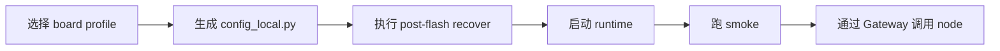

# qpyclaw Quickstart

本文档用于第一次把 `qpyclaw-node` 跑起来。

当前 Quickstart 只覆盖：

1. `Mode B: qpyclaw-node -> Official OpenClaw Gateway`
2. Windows 宿主机工作流
3. QuecPython 设备侧 `/usr` 部署

## 1. 你需要准备什么

| 类别 | 要求 |
| --- | --- |
| 宿主机 | Windows + Python 3 |
| 设备 | QuecPython 模组或开发板 |
| 网络 | 设备侧已插卡，具备蜂窝数据能力 |
| 串口 | 可访问设备 REPL 端口 |
| 仓库 | 已拿到本仓库完整目录 |

当前推荐先从以下两块板子开始：

| Profile | 设备 | 场景 | 当前建议 |
| --- | --- | --- | --- |
| `ec800kcnlc-dev-board` | `EC800KCNLC` 开发板 | 无外设、先打通联网与运行时 | 首推 |
| `ec800mcnle-audio-board` | `EC800MCNLE` 音频板 | 屏幕、音频、表情资源与板级扩展 | 适合板级联调 |

## 2. 推荐上手路径



## 3. 第一步：准备配置

推荐优先使用 host bootstrap 工具生成设备本地 `config_local.py`，而不是直接手写。

先预览配置内容：

```powershell
python tools/host/qpy_config_local_bootstrap.py `
  --profile ec800kcnlc-dev-board `
  --show-content `
  --json
```

如果你已经有真实网关地址和 token，可直接推到设备：

```powershell
python tools/host/qpy_config_local_bootstrap.py `
  --profile ec800kcnlc-dev-board `
  --port COM14 `
  --push `
  --ws-url ws://your-openclaw-gateway.example.com:18789 `
  --auth-token replace_with_real_gateway_token `
  --json
```

如果网关要求设备身份签名，则改用：

```powershell
python tools/host/qpy_config_local_bootstrap.py `
  --profile ec800kcnlc-dev-board `
  --port COM14 `
  --push `
  --ws-url ws://your-openclaw-gateway.example.com:18789 `
  --auth-token replace_with_real_gateway_token `
  --device-auth-mode remote_signer_http `
  --remote-signer-url http://your-signer.example.com:8787/sign `
  --remote-signer-auth-token replace_with_real_signer_token `
  --json
```

手写配置时，优先参考：

1. `embed/qpyclaw-node/code/config_local.example.py`
2. `embed/qpyclaw-node/examples/ec800kcnlc-dev-board/config_local.example.py`
3. `embed/qpyclaw-node/examples/ec800mcnle-audio-board/config_local.example.py`

## 4. 第二步：恢复设备侧运行时

标准入口是 `qpy_post_flash_recover.py`。

`EC800KCNLC`：

```powershell
python tools/host/qpy_post_flash_recover.py `
  --profile ec800kcnlc-dev-board `
  --port COM14 `
  --ws-url ws://your-openclaw-gateway.example.com:18789 `
  --auth-token replace_with_real_gateway_token `
  --json
```

`EC800MCNLE` 音频板：

```powershell
python tools/host/qpy_post_flash_recover.py `
  --profile ec800mcnle-audio-board `
  --port COM19 `
  --ws-url ws://your-openclaw-gateway.example.com:18789 `
  --auth-token replace_with_real_gateway_token `
  --json
```

这个 wrapper 会串起来：

1. `/usr` 运行时同步
2. 板级代码同步
3. 板级媒体同步
4. `config_local.py` bootstrap

## 5. 第三步：启动运行时

当前仓库仍保留开发态调试方式，默认不把 `_main.py` 改成正式 `main.py`。

### 通用运行时

在设备 REPL 中执行：

```python
import qpyclaw_node
qpyclaw_node.run()
```

### EC800MCNLE 音频板

在设备 REPL 中执行：

```python
import dispatch
dispatch.main()
```

或者直接使用板级循环入口：

```python
import node_main
node_main.main(open_audio=True)
```

`dispatch.py` 会加载 `board_bootstrap` 并将 `board_ui`/`BoardVoiceSessionController` 注入到通用 runtime，`node_main.py` 提供手动运行 board 循环，便于调试音频与 UI。

## 6. 第四步：执行 smoke

通用 smoke：

```powershell
python tools/host/qpy_runtime_smoke.py `
  --port COM14 `
  --json
```

板级 smoke：

```powershell
python tools/host/qpy_runtime_smoke.py `
  --port COM19 `
  --board-smoke `
  --json
```

带板级写入验证：

```powershell
python tools/host/qpy_runtime_smoke.py `
  --port COM19 `
  --board-write-smoke `
  --json
```

## 7. 第五步：从 Gateway 侧验证节点

如果你已有可用的 Official OpenClaw Gateway，可用 operator 工具确认节点上线。

列出在线节点：

```powershell
python tools/host/qpy_openclaw_server_ops.py `
  --transport direct `
  --ssh-host your-openclaw-gateway.example.com `
  --gateway-token replace_with_real_gateway_token `
  node-list `
  --connected-only `
  --json
```

调用一个节点命令：

```powershell
python tools/host/qpy_openclaw_server_ops.py `
  --transport direct `
  --ssh-host your-openclaw-gateway.example.com `
  --gateway-token replace_with_real_gateway_token `
  node-invoke `
  --node your-node-id `
  --command qpy.runtime.status `
  --json
```

## 8. 可选：验证文本语音链路

当前已经实机验证的最小闭环是：

1. `EC800MCNLE` 板级代码已部署
2. `OPENCLAW_DEVICE_AUTH_MODE = "remote_signer_http"`
3. `VOICE_ENABLED = True`
4. `VOICE_OPERATOR_CLIENT_ID = "cli"`
5. `VOICE_OPERATOR_CLIENT_MODE = "cli"`
6. `VOICE_OPERATOR_REUSE_NODE_TOKEN = True`

推荐先用英文短句做 smoke，这样串口日志里最容易直接看清返回值。

在设备 REPL 中执行：

```python
import usys
usys.path.append("/usr")
import qpyclaw_node as n
print(n.voice_chat("Please reply in one short English sentence: who are you?"))
```

如果你想从主机侧直接跑音频板文本语音 smoke，用当前的 host 工具即可：

```powershell
python tools/host/qpy_board_voice_smoke.py --port COM19 --mode text --json
```

如果第一次返回：

```text
NOT_PAIRED: pairing required
```

这通常不是设备异常，而是官方网关对 `operator(cli)` 的一次 repair pairing 门禁。

在网关主机上批准一次最新 pending request，然后重试：

```bash
openclaw devices approve --latest
```

如果你的网关源码仓是直接在主机上运行，也可以用：

```bash
node openclaw.mjs devices approve --latest
```

批准一次后，同一设备会同时具备 `node + operator` 角色，后续文本语音 smoke 可以直接重试。

## 9. 常见问题

| 现象 | 优先排查 |
| --- | --- |
| 节点一直不上线 | 先检查 SIM、PDP、`OPENCLAW_WS_URL` 和 token |
| token 路径可连但官方网关拒绝 | 改用 `remote_signer_http` 设备身份模式 |
| `voice_chat()` 首次返回 `NOT_PAIRED` | 先去网关侧批准最新 pending repair pairing |
| `EC800MCNLE` 板子没有表情 | 先跑 board media sync，确认 `U:/media/*.png` 已同步 |
| 设备断网后不恢复 | 检查 `NETWORK_AUTO_RECOVER` 是否被本地覆盖关闭 |
| 冷启动不自动运行 | 当前是开发态设计，不是默认正式启动态 |

## 10. 最小成功标准

只要满足以下 4 条，就算 Quickstart 成功：

1. 设备可导入 `qpyclaw_node`
2. `qpy_runtime_smoke.py` 通过
3. 节点在 Gateway 侧可见
4. `qpy.runtime.status` 或 `qpy.device.info` 可从 Gateway 成功调用
