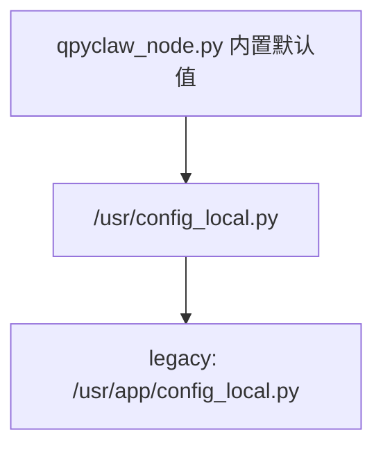

# qpyclaw 配置样例

`qpyclaw-node` 的仓库默认配置必须保持安全占位状态。

真实网关地址、token、签名器地址，应只出现在设备本地 `config_local.py` 或未纳入版本控制的本地工作副本中。

## 1. 加载顺序

当前运行时的配置覆盖顺序如下：



说明：

1. canonical 路径是 `/usr/config_local.py`
2. 兼容迁移期时，仍接受旧路径 `/usr/app/config_local.py`
3. `config_local.py` 中的公开字段会覆盖运行时默认值

## 2. 推荐样例文件

推荐优先看以下样例：

| 文件 | 用途 |
| --- | --- |
| `embed/qpyclaw-node/runtime/usr_mirror/config_local.example.py` | 通用最小样例 |
| `embed/qpyclaw-node/examples/ec800kcnlc-dev-board/config_local.example.py` | `EC800KCNLC` 板级样例 |
| `embed/qpyclaw-node/examples/ec800mcnle-audio-board/config_local.example.py` | `EC800MCNLE` 板级样例 |

## 3. 最小可运行配置

如果你的网关允许 token 直接接入，最小配置通常如下：

```python
DEVICE_ID = "qpyclaw_demo_node_001"
DEVICE_NAME = "qpyclaw Demo Node"
DEVICE_MODEL_HINT = "EC800KCNLC"
BOARD_PROFILE = "ec800kcnlc-sim-only"

OPENCLAW_WS_URL = "ws://your-openclaw-gateway.example.com:18789"
OPENCLAW_AUTH_TOKEN = "replace_with_real_gateway_token"
OPENCLAW_CLIENT_DISPLAY_NAME = "qpyclaw Demo Node"
TENANT_ID = "tenant_demo"

OPENCLAW_DEVICE_AUTH_MODE = "none"
```

## 4. 官方网关签名模式

如果网关返回设备身份相关错误，应切换到签名模式：

```python
DEVICE_ID = "qpyclaw_demo_node_001"
DEVICE_NAME = "qpyclaw Demo Node"
BOARD_PROFILE = "ec800kcnlc-sim-only"

OPENCLAW_WS_URL = "ws://your-openclaw-gateway.example.com:18789"
OPENCLAW_AUTH_TOKEN = "replace_with_real_gateway_token"
OPENCLAW_CLIENT_ID = "node-host"
OPENCLAW_CLIENT_DISPLAY_NAME = "qpyclaw Demo Node"
TENANT_ID = "tenant_demo"

OPENCLAW_DEVICE_AUTH_MODE = "remote_signer_http"
REMOTE_SIGNER_HTTP_URL = "http://your-signer.example.com:8787/sign"
REMOTE_SIGNER_HTTP_AUTH_TOKEN = "replace_with_real_signer_token"
```

## 5. 官方网关文本语音模式

当前已经验证通过的最小配置思路是：

1. `node` 连接继续走 `remote_signer_http`
2. `voice operator` 复用同一网关地址
3. `voice operator` 先复用 node token
4. `voice operator` 客户端形态对齐官方 `cli`

推荐附加字段如下：

```python
VOICE_ENABLED = True
VOICE_MAIN_SESSION_KEY = "main"
VOICE_OPERATOR_WS_URL = OPENCLAW_WS_URL
VOICE_OPERATOR_REUSE_NODE_TOKEN = True
VOICE_OPERATOR_CLIENT_ID = "cli"
VOICE_OPERATOR_CLIENT_MODE = "cli"
VOICE_OPERATOR_CLIENT_DISPLAY_NAME = "qpyclaw voice cli"
VOICE_CHAT_SUBSCRIBE = False
```

重要说明：

1. 第一次建立 `operator(cli)` 会话时，官方网关可能返回 `NOT_PAIRED: pairing required`
2. 这通常是一次 `repair pairing` 门禁，不是设备侧代码异常
3. 在网关主机批准一次最新 pending request 后，再重试即可
4. 当前已验证 `chat.send + chat.history` 可以跑通文本语音 smoke

## 6. 关键字段说明

| 字段 | 必需 | 说明 | 推荐 |
| --- | --- | --- | --- |
| `DEVICE_ID` | 是 | 设备逻辑 ID | 保持稳定，不要频繁变更 |
| `DEVICE_NAME` | 是 | 设备显示名 | 面向人阅读 |
| `DEVICE_MODEL_HINT` | 否 | 模组提示 | 与实际板卡一致 |
| `BOARD_PROFILE` | 是 | 板级 profile | 与 deploy profile 对齐 |
| `OPENCLAW_WS_URL` | 是 | 网关 websocket 地址 | 使用你真实网关地址 |
| `OPENCLAW_AUTH_TOKEN` | 是 | Gateway token | 不要提交到仓库 |
| `OPENCLAW_CLIENT_ID` | 否 | 客户端 ID | 设备签名模式下建议显式设置 |
| `OPENCLAW_CLIENT_DISPLAY_NAME` | 否 | OpenClaw 侧显示名 | 建议与 `DEVICE_NAME` 保持一致 |
| `TENANT_ID` | 否 | 租户 ID | 默认可先用 demo |
| `OPENCLAW_DEVICE_AUTH_MODE` | 是 | 设备鉴权模式 | 先试 `none`，失败再切签名模式 |
| `REMOTE_SIGNER_HTTP_URL` | 条件必需 | 远程签名服务地址 | 仅签名模式需要 |
| `REMOTE_SIGNER_HTTP_AUTH_TOKEN` | 条件必需 | 签名服务 token | 仅签名模式需要 |

## 7. 网络恢复相关配置

`qpyclaw-node` 当前内置了蜂窝网络自恢复机制，以下字段通常值得保留默认值：

| 字段 | 默认意图 |
| --- | --- |
| `NETWORK_AUTO_RECOVER` | 允许自动恢复 PDP 与重连 |
| `RECONNECT_BACKOFF_SEC` | 连接失败后的基础退避 |
| `NETWORK_READY_TIMEOUT_SEC` | 等待网络 ready 的最大时长 |
| `NETWORK_FORCE_RECOVER_AFTER_CONNECT_FAILURES` | 连续失败后提升为强恢复 |
| `NETWORK_ENFORCE_AUTO_ACTIVATE` | PDP 未激活时主动激活 |
| `NETWORK_CLOSE_TRANSPORT_ON_PDP_DOWN` | PDP 掉线时主动关闭 transport，避免假在线 |

除非你在做非常明确的运营商适配，否则不要先改这些恢复项。

## 8. 推荐实践

1. 仓库内只提交 `config_local.example.py`，不要提交真实 `config_local.py`
2. 首次上板优先用 `qpy_config_local_bootstrap.py` 生成配置
3. 板级 profile、设备名字、显示名字要保持一致，不要一板多名
4. 先跑 token-only，若被官方网关拒绝，再切 `remote_signer_http`
5. 生产环境建议把 token 和 signer token 都放在设备本地，不走仓库文件
6. 如果你要启用文本语音模式，优先保持 `VOICE_OPERATOR_CLIENT_ID="cli"` 和 `VOICE_OPERATOR_CLIENT_MODE="cli"`
7. 首次遇到 `NOT_PAIRED: pairing required`，先在网关侧批准 pending device，不要先怀疑串口或蜂窝链路

## 9. 反模式

以下做法不推荐：

1. 把真实网关 token 写进 `qpyclaw_node.py`
2. 直接修改仓库默认值替代 `config_local.py`
3. 多块板子共用一个 `DEVICE_ID`
4. 在公开示例中写死你的公网 IP、签名器地址、真实设备 ID
