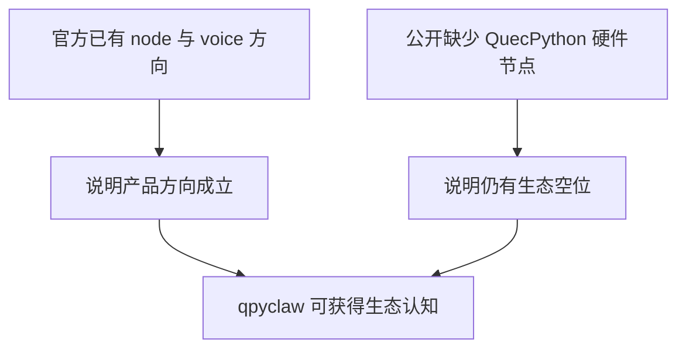

# OpenClaw Ecosystem Scan

更新日期：`2026-03-26`

## 1. 调研问题

需要回答两个问题：

1. OpenClaw 生态里是否已经有“语音终端 / 声音交互 / node voice”这类项目
2. 是否已经有公开的 QuecPython 硬件 node / Agent Runtime 项目

## 2. 结论

### 2.1 有语音相关项目，而且语音已经是 OpenClaw 生态的明确方向

我查到的公开资料表明：

1. OpenClaw 官方文档已经明确存在 `Nodes` 概念，并强调 node 是接入 Gateway 的 companion device  
   参考：[Nodes](https://docs.openclaw.ai/nodes)
2. 官方文档已经明确存在 `Talk Mode`  
   参考：[Talk Mode](https://docs.openclaw.ai/nodes/talk)
3. 官方文档已经明确存在 `Voice Wake`，并且节点会接收 `voicewake.changed` 等事件  
   参考：[Voice Wake](https://docs.openclaw.ai/nodes/voicewake)

### 2.2 公开生态里存在若干语音相关项目，但我没有找到主流公开的 QuecPython 硬件 node

当前能看到的公开方向包括：

1. [OpenClaw Voice](https://openclawvoice.com/)  
   浏览器语音对话入口，强调本地 STT、TTS 和 Gateway 集成。
2. [VoxClaw](https://malpern.github.io/VoxClaw/)  
   给 OpenClaw 增加“会说话”的声音输出体验。
3. [DeepClaw](https://deepgram.com/learn/voice-is-now-a-first-class-citizen-in-openclaw)  
   把 OpenClaw 接到电话/语音入口。
4. [CrabCallr](https://crabcallr.com/)  
   面向浏览器/电话的语音界面。

但是，截至本次调研：

1. 没有找到公开主流的 `QuecPython + OpenClaw` node 项目
2. 没有找到公开主流的 `EC800/EC600` 语音终端型 OpenClaw node
3. 没有找到成熟公开的 “OpenClaw-compatible embedded agent runtime for QuecPython”

这反而说明 `qpyclaw` 的差异化空间是真实存在的。

## 3. 为什么这对 `qpyclaw` 是好消息

含义：

1. 你不是在定义一个没人认的方向
2. 你是在填一个已经被生态证明有价值，但还没人把设备侧做好到位的空位

## 4. 对 `qpyclaw-node` 的启发

既然官方生态里已经存在：

1. voice wake
2. talk mode
3. node invoke
4. device 命令面

那么 `qpyclaw-node` 非常适合被定义成：

1. 语音终端 node
2. 屏幕状态 node
3. 设备诊断 node
4. 传感器与执行器 node

## 5. 对 `qpyclaw-agent` 的启发

公开生态侧更多还是：

1. 语音入口
2. 声音输出
3. 浏览器语音
4. 电话语音

而缺少：

1. 设备侧轻量 Agent Runtime
2. 设备侧记忆与事件模型
3. 面向外设世界的 Agent 抽象

这正是 `qpyclaw-agent` 的机会。

## 6. 当前判断

1. `qpyclaw-node` 作为人与 OpenClaw 对话的语音终端，方向完全成立
2. 生态里已经有“语音”认知基础，但还没有你这个方向的 QuecPython 硬件实现
3. `qpyclaw-agent` 也成立，但更像第二阶段发力点
