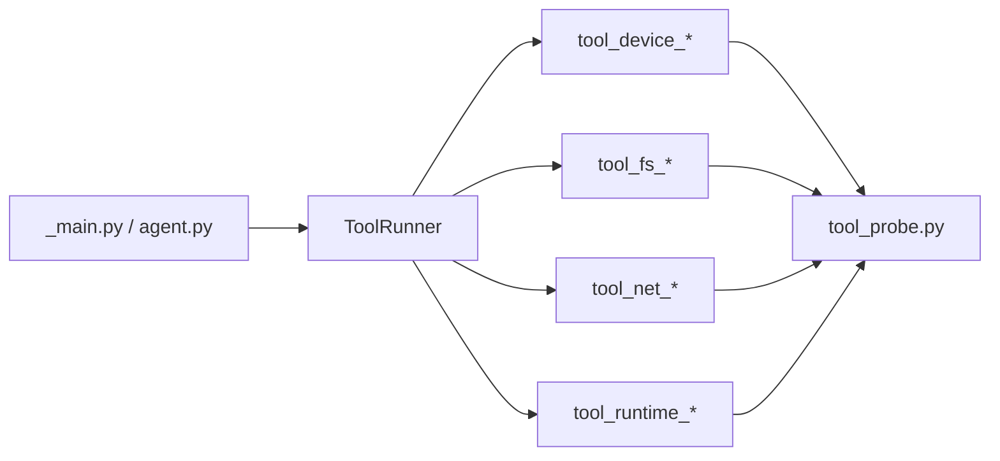
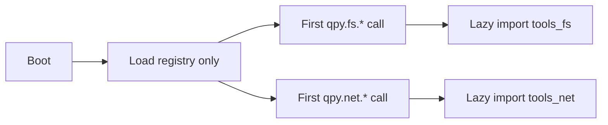

# QuecPython 模块文件数量与导入内存开销调研

## 1. 结论先行

这次调研的核心结论有 4 条：

1. 用户的直觉是对的: 在 QuecPython 上, 即使是一个只有 `1` 字节内容的空模块, `import` 之后也会产生非零内存开销。
2. 但这个开销不是“单文件一定特别夸张”, 而是“单文件不大, 累积起来明显, 再叠加碎片化会更难受”。
3. 对当前 `qpyclaw-node` 来说, 真正值得优化的不是“所有文件都乱合并”, 而是“把启动时必定全部导入的超小工具包装文件按域合并”。
4. 比单纯减少文件数更重要的优化点是: 当前 `ToolRunner` 是启动即全量导入工具模块, 所以现在付出的不是“按需成本”, 而是“开机全付成本”。

## 2. 调研目标

这份调研只回答一个问题:

`qpyclaw-node` 当前的代码文件数量结构, 是否值得为了 QuecPython 内存而做一次“减少模块数”的重构。

## 3. 调研方法

本次使用了 `quecpython-dev` skill 的设备工作流与脚本思路, 但实际内存测量采用了更稳定的直接 REPL 方式。

### 3.1 使用方式

1. 使用 `quecpython-dev` skill 确认设备运维流程与 REPL/`/usr` 操作路径。
2. 通过 skill 自带脚本确认当前可用 REPL 口, 最终锁定 `COM11`。
3. 在设备上使用 `gc.collect()` 和 `gc.mem_free()` 做导入前后测量。
4. 创建临时模块文件, 导入, 删除 `sys.modules` 中的对象, 再次测量。
5. 对“同样内容拆成多个文件”和“合成一个 bundle 文件”做对比实验。

### 3.2 官方资料口径

本次测量方法与 QuecPython 官方文档口径一致:

1. 官方 `gc` 文档说明 `gc.collect()` 用于主动回收内存碎片。
2. 官方 `gc` 文档说明 `gc.mem_free()` 用于查询剩余可用内存大小, 单位为字节。
3. 官方内存管理文档说明 QuecPython 运行时内存本身就偏紧张, 动态内存管理是嵌入式系统重点。

参考:

1. [QuecPython gc 文档](https://developer.quectel.com/doc/quecpython/API_reference/zh/stdlib/gc.html)
2. [QuecPython 内存管理文档](https://developer.quectel.com/doc/quecpython/Application_guide/zh/system/memory-management.html)

## 4. 当前代码结构观察

### 4.1 `app/` 目录规模

当前 `qpyclaw-node` 运行时目录:

```text
project/qpyclaw/embed/qpyclaw-node/runtime/usr_mirror/app
```

统计结果:

| 项目 | 数值 |
| --- | --- |
| `app/` 全部文件数 | `29` |
| `app/` 根目录文件数 | `12` |
| `app/tools/` 文件数 | `17` |
| `app/tools/` 中 `< 1KB` 文件数 | `14` |
| `app/tools/` 总体积 | `33899` bytes |

### 4.2 当前最关键的结构事实

`ToolRunner` 在启动时直接导入全部工具模块:



也就是说:

1. 当前不是按需导入工具。
2. 当前是启动时一次性把这些工具模块都拉进来。
3. 因此, 这些小文件的模块开销是会在启动路径上累计支付的。

对应代码见:

1. [tool_runner.py](C:/Users/kingd/Desktop/code/lcc-ai-team/embed/project/qpyclaw/embed/qpyclaw-node/runtime/usr_mirror/app/tool_runner.py)
2. [tool_probe.py](C:/Users/kingd/Desktop/code/lcc-ai-team/embed/project/qpyclaw/embed/qpyclaw-node/runtime/usr_mirror/app/tools/tool_probe.py)

## 5. 设备实测结果

原始证据见:

[2026-03-29-quecpython-module-count-memory-study.json](C:/Users/kingd/Desktop/code/lcc-ai-team/embed/project/qpyclaw/docs/research/evidence/2026-03-29-quecpython-module-count-memory-study.json)

### 5.1 单个空模块导入

最小实验:

1. 在 `/usr` 下创建一个 `1` 字节的空模块。
2. 测量导入前空闲内存。
3. `import` 该模块。
4. 从 `sys.modules` 删除模块对象并再次回收。

结果:

| 指标 | 数值 |
| --- | --- |
| 文件大小 | `1` byte |
| 导入前 `mem_free` | `429104` |
| 导入后 `mem_free` | `429024` |
| 删除模块后 `mem_free` | `429088` |
| 导入瞬时开销 | `80` bytes |
| 卸载后残留 | `16` bytes |

### 5.2 多个空模块单独导入

对 6 个 `1` 字节空模块分别做单独导入循环, 结果如下:

| 模块 | 导入开销 | 卸载后残留 |
| --- | --- | --- |
| `codex_empty_1` | `64` | `32` |
| `codex_empty_2` | `352` | `352` |
| `codex_empty_3` | `16` | `16` |
| `codex_empty_4` | `208` | `208` |
| `codex_empty_5` | `16` | `16` |
| `codex_empty_6` | `16` | `16` |

观察:

1. 单个空模块开销明显不是 `0`。
2. 数值存在波动, 说明设备上有 GC 碎片化和分配粒度影响。
3. 所以这类实验更适合看“趋势”, 不适合把每个字节当绝对真理。

### 5.3 公平对比: 相同内容拆 6 个模块 vs 合 1 个 bundle

这是本次最关键的一组数据。

实验设计:

1. Case A: 6 个模块, 每个模块只有 1 个空类。
2. Case B: 1 个 bundle 模块, 内含 6 个空类。
3. 两边承载的业务内容等价, 唯一主要差别就是模块数量。

结果:

| Case | 导入开销 |
| --- | --- |
| `6` 个单类模块 | `976` bytes |
| `1` 个六类 bundle 模块 | `608` bytes |
| bundle 节省 | `368` bytes |

这说明:

1. 对“同样内容”, 模块数减少确实能省内存。
2. 在这次设备实测里, bundle 相比拆分模块少了大约 `37.7%` 的导入开销。

### 5.4 反例: 6 个空模块 vs 1 个六类 bundle

还有一组容易误读但很重要的数据:

| Case | 导入开销 |
| --- | --- |
| `6` 个空模块同时常驻 | `288` bytes |
| `1` 个六类 bundle 常驻 | `656` bytes |

这组数据说明:

1. 不是“文件越少一定越省”。
2. 如果 bundle 里承载的真实代码内容更重, 它当然可能比多个空壳文件更贵。
3. 所以真正有效的比较方法, 必须是“同样内容的拆分方式对比”。

## 6. 对当前 `qpyclaw-node` 的直接判断

## 6.1 该不该优化文件数量

该优化, 但要有边界。

原因:

1. 当前 `ToolRunner` 启动时会把工具模块全量导入。
2. `tools/` 下有大量超小包装文件。
3. 这些小文件大部分只是把请求转发给 `tool_probe.py` 里的真实逻辑。
4. 这正好符合“同样内容拆太散, 模块开销白白增加”的场景。

### 6.2 当前最值得动的不是哪一层

最值得动的是 `app/tools/` 的超小包装层。

不建议一上来就动:

1. `transport_ws_openclaw.py`
2. `ws_client.py`
3. `runtime_state.py`
4. `command_worker.py`

因为这些文件虽然也能合并, 但它们承担的是不同的运行时边界:

1. 传输协议
2. WebSocket 细节
3. 状态机
4. 线程执行

这些边界一旦硬合并, 后续调试成本会明显上升。

## 7. 最推荐的重构方案

## 7.1 P1: 先合并工具包装文件

建议把当前 `tool_*` 小文件按能力域合成 4 个文件:

| 新文件 | 建议收纳内容 |
| --- | --- |
| `tools_device.py` | `device.info` `device.status` `device.reboot` |
| `tools_fs.py` | `fs.list` `fs.read` `fs.write` `fs.mkdir` `fs.remove` |
| `tools_net.py` | `net.diag` `net.ifconfig` `sim.info` `cell.info` |
| `tools_runtime.py` | `runtime.status` `tools.catalog` `repl.run` |

保留:

1. `tool_probe.py`
2. `tool_runner.py`
3. `tools/__init__.py`

这样做的价值:

1. 减少模块数量。
2. 不破坏 `ToolRunner -> execute()` 的总接口。
3. 保留按领域阅读和调试的结构。

## 7.2 P2: 再改成懒加载

如果你要的不只是“少几个文件”, 而是真想让设备把内存挤出来, 下一步应该做:



也就是:

1. 启动时只加载注册表和名字映射。
2. 第一次调用某个能力域时再导入对应模块。
3. 这样省下来的将不只是“模块固定开销”, 还有“启动即导入全部功能”的总代价。

对于当前架构, 这比单纯“把 17 个文件合成 10 个文件”更有实际价值。

## 7.3 P3: 小文件低收益合并

以下文件可以视情况顺手处理, 但收益不会很大:

1. [json_codec.py](C:/Users/kingd/Desktop/code/lcc-ai-team/embed/project/qpyclaw/embed/qpyclaw-node/runtime/usr_mirror/app/json_codec.py)
2. [system_control.py](C:/Users/kingd/Desktop/code/lcc-ai-team/embed/project/qpyclaw/embed/qpyclaw-node/runtime/usr_mirror/app/system_control.py)

例如:

1. `json_codec.py` 只有一层 `ujson` 包装, 完全可以并入调用最密集的上层文件。
2. `system_control.py` 可以考虑并入 `agent.py` 或设备控制域文件。

但这类优化属于“零头优化”, 不是主战场。

## 8. 不建议合并的边界

以下边界建议保留:

| 边界 | 原因 |
| --- | --- |
| `config.py` 与 `config_local.*` | 本地覆写与发布默认值必须分离 |
| `transport_ws_openclaw.py` 与 `ws_client.py` | 协议层与 socket/websocket 细节层分离, 便于排障 |
| `runtime_state.py` | 运行态快照与状态统计应独立 |
| `command_worker.py` | 多线程与执行队列边界清晰 |
| `device_auth.py` | 远程签名与认证链路单独隔离更安全 |

## 9. 最终判断

可以明确下结论:

1. `QuecPython` 上“空 `.py` 文件导入也会占内存”这件事, 已被当前设备实测证实。
2. 但单个空文件的代价并没有大到值得为它牺牲所有代码结构。
3. 对 `qpyclaw-node` 当前架构来说, 真正值得做的是:

   1. 合并 `tools/` 里的超小包装模块
   2. 进一步把工具导入改成 lazy import

4. 如果只做“把所有文件都糊成一个大文件”, 技术上能减模块数, 但会损失调试边界, 并不划算。

## 10. 建议执行顺序

1. 第一轮: 合并 `app/tools/` 的超小包装文件, 不改协议层。
2. 第二轮: 把 `ToolRunner` 改成按域懒加载。
3. 第三轮: 再决定是否处理 `json_codec.py` 这类低收益小文件。

如果你认可, 下一步我就不直接改逻辑, 而是先给你出一版“合并后的目标目录结构与迁移方案”。
