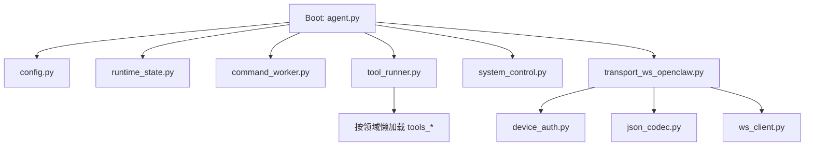
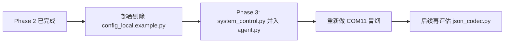

# qpyclaw-node Runtime File Count Post-Phase2 Assessment

## 日期

`2026-03-29`

## 目标

在 `app/tools` 已完成“按领域合并 + ToolRunner 懒加载”之后，继续评估：

1. 现在还能从哪里继续减少设备侧 `.py` 文件数量
2. 哪些点是低风险高收益
3. 哪些点暂时不该碰

本评估建立在前置研究之上：

- `[2026-03-29-quecpython-module-count-memory-study.md](C:\Users\kingd\Desktop\code\lcc-ai-team\embed\project\qpyclaw\docs\research\2026-03-29-quecpython-module-count-memory-study.md)`
- `[2026-03-29-tools-consolidation-phase2-lazy-import-smoke.md](C:\Users\kingd\Desktop\code\lcc-ai-team\embed\project\qpyclaw\docs\bringup\2026-03-29-tools-consolidation-phase2-lazy-import-smoke.md)`

## 当前盘点

当前 `runtime/usr_mirror/app` 下共有 `18` 个 Python 文件。

按体积从小到大看，最值得关注的不是“大文件本身”，而是“是否仍然存在低价值独立模块”。

| 文件 | 大小（bytes） | 当前判断 |
| --- | ---: | --- |
| `app/__init__.py` | 31 | 包边界，保留 |
| `app/tools/__init__.py` | 36 | 包边界，保留 |
| `app/json_codec.py` | 122 | 小模块，后续候选 |
| `app/config_local.example.py` | 847 | 明显是部署剔除候选 |
| `app/system_control.py` | 1743 | 只被 `agent.py` 使用，低风险合并候选 |
| `app/tools/tools_device.py` | 1695 | 已收敛完成，暂不再拆/并 |
| `app/tools/tools_net.py` | 2740 | 已收敛完成，暂不再拆/并 |
| `app/tools/tools_runtime.py` | 2809 | 已收敛完成，暂不再拆/并 |
| `app/tools/tools_fs.py` | 2957 | 已收敛完成，暂不再拆/并 |
| `app/config.py` | 3236 | 配置边界，暂不建议动 |
| `app/agent.py` | 3357 | 启动主循环，边界清晰 |
| `app/command_worker.py` | 3886 | 并发边界，暂不建议动 |
| `app/device_auth.py` | 4880 | 鉴权边界，暂不建议动 |
| `app/runtime_state.py` | 8919 | 状态边界，暂不建议动 |
| `app/tool_runner.py` | 9758 | 刚完成懒加载改造 |
| `app/ws_client.py` | 10558 | 传输边界，暂不建议动 |
| `app/transport_ws_openclaw.py` | 20421 | 传输主边界，暂不建议动 |
| `app/tools/tool_probe.py` | 23044 | 共享探针与 FS 工具底座，暂不建议动 |

## 结论先行

Phase 2 之后，最粗糙、最不合理的“薄包装文件”已经基本清掉了。

下一轮如果还要继续压文件数量，优先级应当是：

1. 先优化“部署到设备的文件集合”
2. 再优化“只被单一入口引用的小独立模块”
3. 最后才考虑动 `transport / auth / config / worker / state` 这些真实架构边界

## 当前结构判断

这张图说明两件事：

1. `tools_*` 这条线已经做到了“只在命中时加载”
2. 现在真正还在启动链路上的小模块，主要集中在 `system_control.py` 和 `json_codec.py`

## 候选项分级

### A. 现在就值得做

| 候选项 | 收益 | 风险 | 建议 |
| --- | --- | --- | --- |
| 部署时不下发 `config_local.example.py` | 少 1 个设备文件，零运行时影响 | 极低 | 应优先执行 |
| 合并 `system_control.py` 到 `agent.py` | 少 1 个启动模块，少 1 次 import | 低 | 可作为 Phase 3 首选代码改造 |

说明：

1. `config_local.example.py` 是示例文件，不参与运行
2. 它更适合留在仓库里给开发者参考，而不是进入设备 `/usr/app`
3. `system_control.py` 目前只被 `agent.py` 使用，单向依赖清晰，合并后回归面相对小

### B. 可以做，但应等边界解冻

| 候选项 | 收益 | 风险 | 建议 |
| --- | --- | --- | --- |
| 删除 `json_codec.py`，把 `dumps/loads` 内联进消费者 | 少 1 个启动模块 | 中 | 等允许触碰 `device_auth.py` / `transport_ws_openclaw.py` 后再做 |

原因：

1. `json_codec.py` 本身极小，合并收益主要来自“减少模块数”
2. 但它的两个消费者都在当前冻结边界里
3. 现在为了省 `1` 个文件去改传输和鉴权边界，不划算

### C. 当前不建议做

| 候选项 | 原因 |
| --- | --- |
| 合并 `command_worker.py` 到 `agent.py` | 会削弱并发边界，排障和回归代价上升 |
| 合并 `runtime_state.py` | 状态面太大，不是“薄模块” |
| 合并 `ws_client.py` / `transport_ws_openclaw.py` | 传输复杂度高，风险显著大于收益 |
| 合并 `config.py` | 配置边界应保持单独稳定 |
| 再次改造 `tools_*` | 当前已是 4 个领域文件 + 1 个共享底座，继续压缩收益很低 |

## 推荐执行顺序

## 建议路线

### 路线 1：最稳

1. 先不改更多运行时代码
2. 先把设备部署清单收紧，排除 `config_local.example.py`
3. 再观察设备端文件数、空间占用和启动稳定性

适合目标：

尽快把“无运行时价值的文件”从设备上拿掉。

### 路线 2：继续推进但保持低风险

1. 在路线 1 基础上
2. 追加把 `system_control.py` 合并到 `agent.py`
3. 回归 `boot -> connect -> qpy.tools.catalog -> qpy.fs.read -> qpy.device.reboot`

适合目标：

继续压缩启动链路上的独立模块数量，但不碰传输与鉴权边界。

## 我的判断

如果目标是“继续优化文件数量，但不要因为过度收敛伤害后续功能扩展”，那么当前最合理的 Phase 3 是：

1. 先做“部署剔除 `config_local.example.py`”
2. 再做“`system_control.py` 并入 `agent.py`”
3. 暂缓 `json_codec.py`

原因很直接：

1. 这两步都不需要打破 `transport` 和 `auth` 边界
2. 都能带来真实的文件数下降
3. 回归范围可控，适合 QuecPython 设备持续迭代

## 结语

Phase 2 之后，`qpyclaw-node` 已经从“明显存在大量薄包装文件”的状态，进入“只剩少量值得精修的小模块”的状态。

也就是说，后面每减少一个文件，都应该先问一句：

这个文件到底是“低价值包装”，还是“值得保留的架构边界”。

当前答案很明确：

- `config_local.example.py` 是设备部署垃圾文件，应该优先剔除
- `system_control.py` 是可合并的小模块
- `json_codec.py` 是下一阶段候选
- 其他大边界文件暂时不该动
