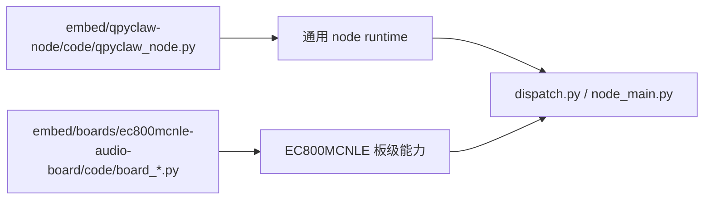

# EC800MCNLE Audio Board Code

这个目录只放 `EC800MCNLE` 语音开发板的板级代码，不放通用 `qpyclaw-node` runtime。

## 目录职责

1. 音频采集、播放、录音流格式适配。
2. 屏幕、表情 UI、电源控制、按键处理。
3. 语音会话控制，包括 KWS/VAD、转写、回复播放。
4. 把板级能力挂接到 `qpyclaw_node.create_runtime(extension=...)`。

## 当前文件

1. `board_bootstrap.py`
2. `board_audio.py`
3. `board_display.py`
4. `board_power.py`
5. `board_ui.py`
6. `board_voice_controller.py`
7. `board_remote_asr.py`
8. `board_remote_tts.py`

## 与通用 runtime 的关系

可以这样理解：

1. 通用 runtime 在 `embed/qpyclaw-node/code/`，最终部署到设备 `/usr`。
2. 板级代码在当前目录，最终部署到设备 `/usr/board`。
3. `dispatch.py` 和 `node_main.py` 负责把两者组装起来运行。

## 设备部署约定

1. 本目录下的 `.py` 文件同步到 `/usr/board/`。
2. 表情资源从 `../resource/ui/emoji/` 同步到 `U:/media/`。
3. `board_ui.py` 以 `U:/media/` 为主路径，同时兼容 `/usr/media/` 回退。

## 入口与调试

推荐入口：

1. `/usr/_main.py` -> `dispatch.main()`
2. `/usr/dispatch.py` -> 后台启动 `node_main.main()`
3. `/usr/node_main.py` -> 创建 board extension 并运行 runtime 主循环

常用主机工具：

1. `tools/host/qpy_board_code_sync.py --profile ec800mcnle-audio-board`
2. `tools/host/qpy_board_media_sync.py --profile ec800mcnle-audio-board`
3. `tools/host/qpy_board_runtime_probe.py --port <COM> --json`
4. `tools/host/qpy_board_voice_smoke.py --port <COM> --mode text --json`

## 设计边界

这里不放：

1. OpenClaw 协议与 WebSocket 通信核心。
2. 通用文件系统、网络诊断、工具目录。
3. 与具体板型无关的 runtime 状态机。

这些内容统一留在 `embed/qpyclaw-node/code/` 与 `embed/components/`。
