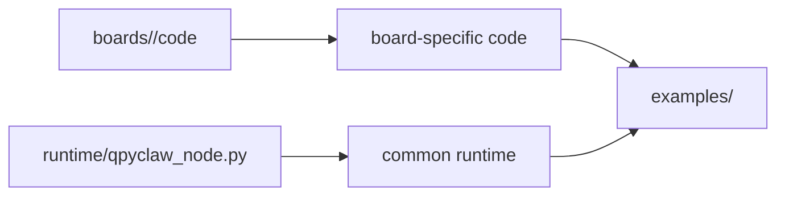

# qpyclaw-node examples

这个目录只放 `qpyclaw-node` 的板型组合示例。

## 目录原则

1. 一个板型一个子目录，例如 `ec800kcnlc-dev-board/`
2. 示例目录放样例配置、组合说明、示例入口
3. 板级专有代码不放这里，放到 `boards/<board>/code/`
4. 通用 runtime 不放这里，放到 `../runtime/`

## 当前规划

| 目录 | 作用 |
| --- | --- |
| `ec800kcnlc-dev-board/` | 当前无外设主线开发板示例 |
| `ec800mcnle-audio-board/` | 音频板示例，组合音频板专有代码与通用 node runtime，并包含文本语音 smoke 与板级语音会话控制器示例 |

## 三层关系

